# Core Components

## Gearboxes, Transmissions, Torque Converters

## Couplings, Drive Shafts, CV Shafts
### Couplings

#### What it is
##### Description
A coupling is a device that joins two rotating shafts or driveline components so torque can pass from the driving side to the driven side.
- A **rigid coupling** holds two shafts in a fixed relationship and needs accurate alignment. A **flexible coupling** contains a sliding, bending or elastic element that permits a small amount of axial, parallel or angular misalignment.
- An elastomer coupling also twists slightly under load. This cushions sudden torque changes and reduces the vibration and noise passed between components.
- A coupling is not the same as a clutch. A normal shaft coupling stays connected while running, while a clutch is designed to engage and disengage power. It is also not a replacement for a universal or CV joint when the shafts operate at a large or continuously changing angle.
In a common configuration:
- Flexible jaw coupling:
	- 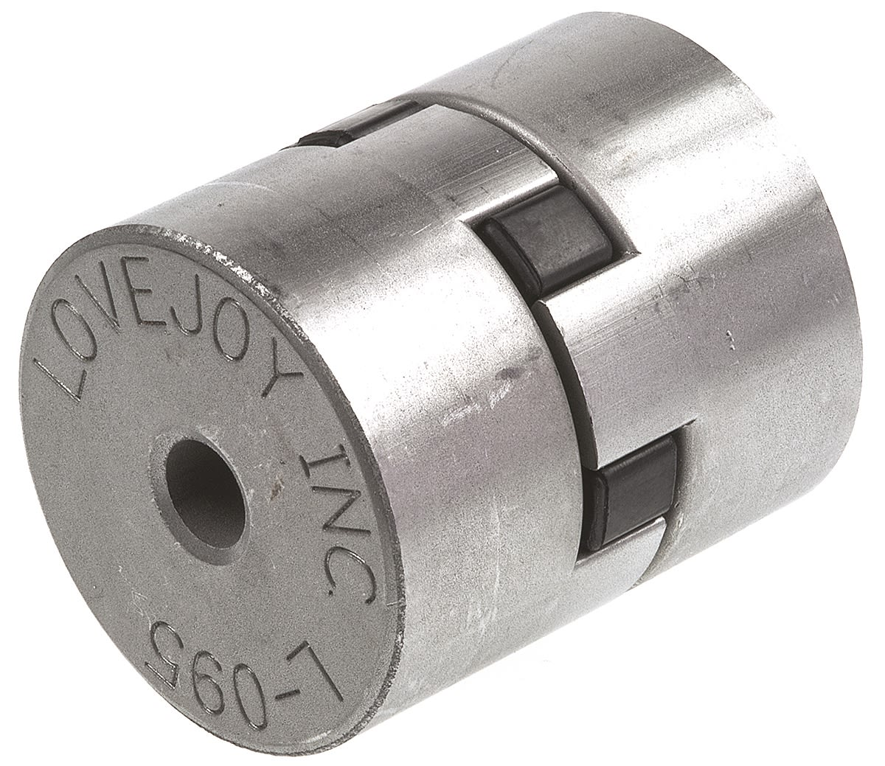
	- One hub is fixed to the input shaft and the other is fixed to the output shaft. The jaws do not touch each other directly; the input jaws compress the dark elastomer spider visible between the hubs, which pushes the output jaws and transmits torque. The spider deforms enough to absorb shock and small alignment errors. 
##### Types of Couplings

| Coupling Type                    | Common Use                                                        | Advantage                                                                                               | Disadvantage                                                                                                                        | Image                                      |
| -------------------------------- | ----------------------------------------------------------------- | ------------------------------------------------------------------------------------------------------- | ----------------------------------------------------------------------------------------------------------------------------------- | ------------------------------------------ |
| Rigid sleeve / flange            | Accurately aligned shafts, test rigs, fixed gearbox connections   | Simple, compact, inexpensive and has no intentional backlash                                            | Cannot absorb misalignment or vibration; poor alignment puts bending load on shafts/bearings                                        | 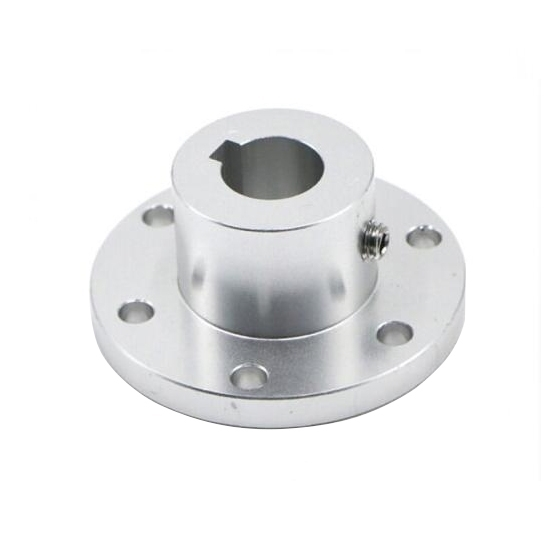 |
| Jaw / spider                     | Electric motors, pumps                                            | Simple three-piece design; damps shock and vibration; tolerates small alignment errors                  | Elastomer spider wears and can create backlash; limited angle and temperature                                                       |    |
| Flexible rubber disc (flex disc) | Automotive propeller shafts and some steering columns             | Absorbs torsional shock and noise; allows small axial, radial and angular displacement                  | Rubber cracks with age, heat or oil; larger angles still require a universal or CV joint                                            | 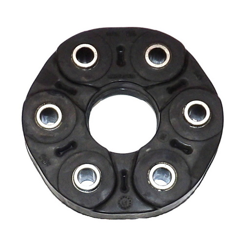    |
| Oldham                           | Servo drives, encoders and compact mechanisms with offset shafts  | Floating centre disc makes parallel misalignment easy to see; compact and nearly backlash-free when new | Centre disc slides on every turn, so it wears; limited torque and high-speed capability                                             | 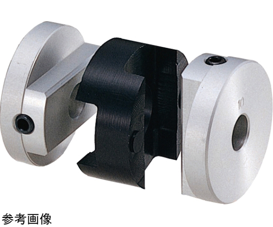       |
| Beam / helical                   | Encoders, sensors and small electric motors                       | One-piece construction; no lubrication; low backlash; accepts small angular and axial error             | Low torque capacity; repeated bending can cause fatigue                                                                             | 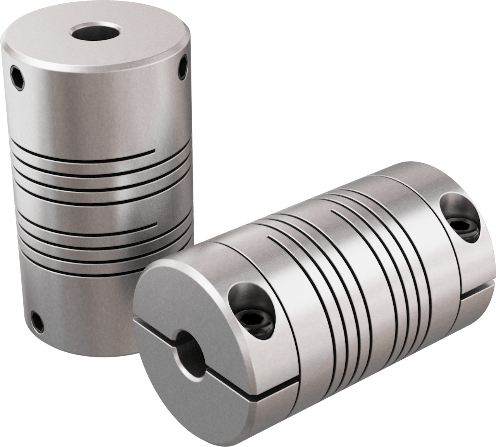         |
| Disc / bellows                   | High-speed or high-precision motor-to-gearbox connections         | Torsionally stiff, low backlash and no lubrication; tolerates heat better than elastomers               | More expensive; thin metal elements can fatigue if misalignment exceeds their rating                                                | 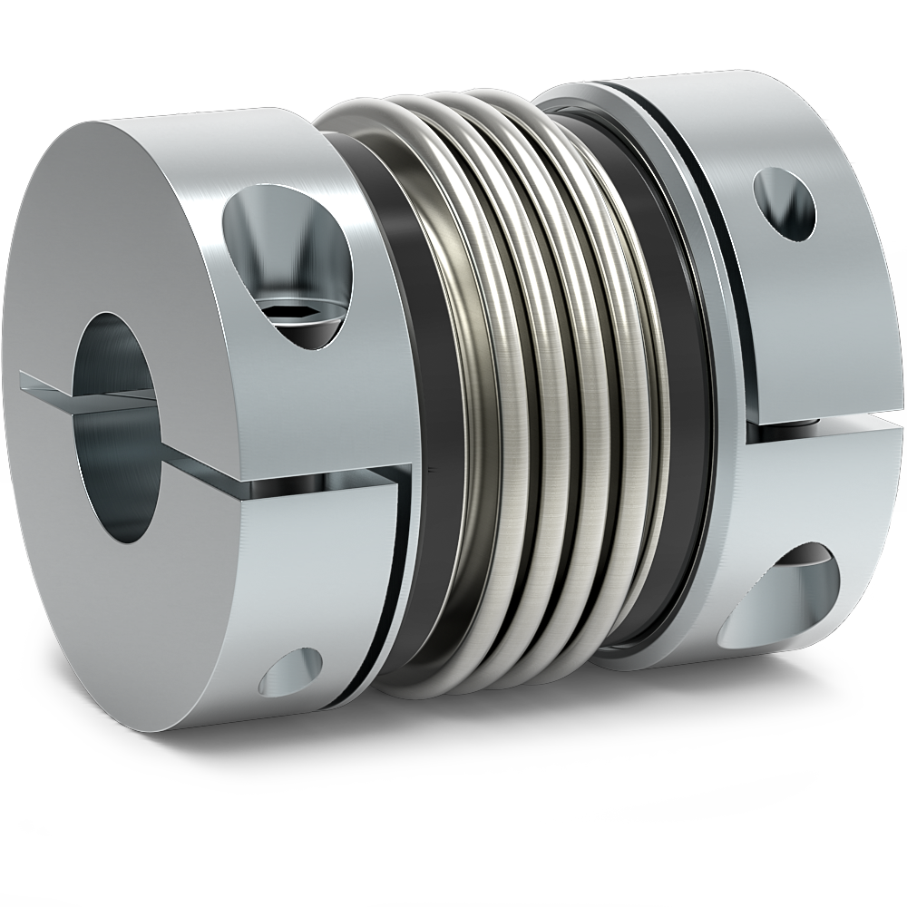      |
| Splined / slip coupling          | Vehicle drive shafts, half shafts and telescoping steering shafts | High torque capacity; sliding splines allow the shaft length to change as suspension or mounts move     | Needs lubrication and usually a seal/boot; spline clearance creates some backlash; does not accommodate a large angle by itself     | 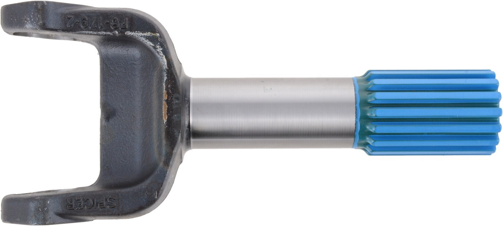  |
| Fluid coupling                   | Smooth starting of heavy vehicles and industrial machinery        | No direct mechanical contact between input and output; gives smooth starts and overload protection      | Always has some slip and heat loss; needs fluid and a sealed housing; a torque converter is more complex and also multiplies torque | 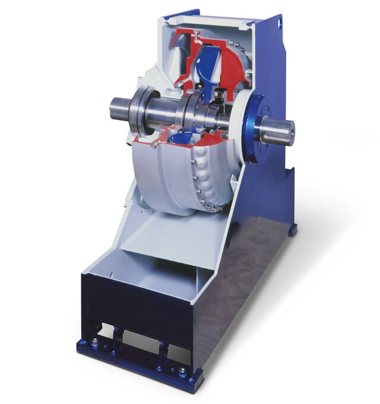        |

##### Part List

| Make (3D print / laser cut)                              | Buy                                                        |
| -------------------------------------------------------- | ---------------------------------------------------------- |
| Two coupling hubs with jaws                              | Steel input and output shafts (D-shaft or keyed)           |
| Interchangeable centre elements (rigid, soft and medium) | Elastomer spider or rubber insert                          |
| Clear safety guard and mounting brackets                 | Ball bearings / pillow blocks                              |
| Adjustable motor and load plates                         | Shaft collars, keys, set screws and fasteners              |
| Alignment blocks or sliding offset stage                 | Optional commercial jaw or Oldham coupling for comparison |

#### Teaching Platform
Manufacture
- Easy to print and CAD: 
	- Rigid sleeve coupling
	- Jaw coupling (Spider should be bought probably)
	- Oldham coupling (surface finish matters)
- Printed bores and set-screw threads wear quickly.
- A fluid coupling needs a leak-proof housing, balanced impellers and fluid. 
- Metal disc or bellows couplings need thin fatigue-resistant parts.
Demonstratability
- No fluid or special tools are needed for a jaw or Oldham coupling. It can be turned by hand or driven slowly with a small electric motor.
- Mount one bearing block on slots so the input and output shafts can be moved out of alignment by a measured amount.
- Easy to see in action:
  - Start with a rigid coupling and offset one shaft slightly: the assembly becomes hard to turn and the shafts/bearings deflect.
  - Replace it with a jaw coupling: the elastomer deforms and the output continues to turn with less vibration.
  - Fit spiders made from different TPU hardnesses: a softer spider twists more and cushions shock, while a harder spider gives a more immediate output response.
  - Apply a sudden load to the output: mark both hubs to show the small torsional deflection across the elastomer.
  - Use an Oldham coupling with two visibly offset shafts: the centre disc slides in two perpendicular directions during each revolution.
Works with what
- **Gearboxes / transmissions / torque converters**: joins a motor or engine simulator to the gearbox input, or the gearbox output to the next shaft. A flexible coupling protects gears and bearings from small alignment errors and torque shock.
- **Drive shafts / CV shafts**: flange, flexible-disc and splined couplings attach shafts to the transmission, transfer case or differential. The joints on the shaft handle the larger operating angles.
- **Differentials**: connects the drive shaft or motor output to the differential pinion/input shaft.
- **Transfer cases**: flange or splined couplings connect the transmission input and front/rear drive-shaft outputs.
- **Brakes and clutches**: a fixed coupling cannot disconnect power. Add a clutch when the platform must start, stop or change modes without stopping the motor.
- **Steering and suspension**: flexible or splined steering-shaft couplings reduce vibration and allow small movement; suspension travel changes shaft length and angle, so driven wheels still need plunging CV joints or slip splines.
- **FWD**: the engine and transaxle are normally bolted together; splines couple the differential side gears to the two CV half shafts.
- **RWD**: a flange, flexible disc or splined slip joint connects the transmission to the propeller shaft, which then connects to the rear differential.
- **AWD / 4x4**: needs additional flange and spline connections around the transfer case, front/rear drive shafts and differentials. Some on-demand AWD systems also use an electronically controlled multi-plate coupling to connect the second axle.
- **Single-motor, single-axle EV**: a short rigid or flexible coupling can connect the motor to a reduction gearbox/differential when they are separate units.
- **Dual-motor, single-axle EV**: each motor needs its own coupling or geared connection to its wheel/half shaft.
- **Dual-motor, dual-axle EV**: each motor-to-reduction-unit connection can use the same coupling design; no centre drive-shaft coupling is needed when the axles are independent.
- **Torque vectoring**: clutch couplings can vary how much torque reaches each axle or wheel; separate wheel motors replace these mechanical couplings with electronic motor control.
- **ABS and traction control**: no direct link for a fixed shaft coupling, but an active AWD coupling can be commanded open during some ABS or stability-control events.

### Drive Shafts

#### What it is
##### Description
A drive shaft (propeller shaft, propshaft or Cardan shaft) is a long rotating shaft that carries torque between driveline parts that are too far apart to bolt together, most often from the transmission or transfer case to a differential.
- It is loaded mainly in torsion. 
- The axle moves up and down with the suspension, so the shaft's **angle and length keep changing**. A universal joint (U-joint) at each end handles the angle, and a sliding spline (slip yoke) handles the length.
- **A single U-joint at an angle does not turn at a constant speed.** With a steady input, the output speeds up and slows down twice per revolution, more the bigger the angle. Two U-joints with equal angles and their yokes lined up (in phase) cancel this out, so the output matches the input.
- A long, thin shaft whips and vibrates badly at its **critical speed**. The critical speed goes down as the shaft gets longer and up as it gets larger in diameter or stiffer for its weight.
In a common configuration:
- On a machine:
	- 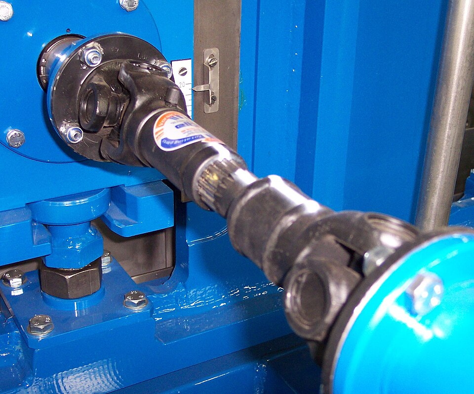
	- Tube with a U-joint at each end, bolted to the driving and driven flanges.
- Universal joint:
	- 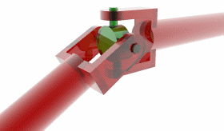
	- Two yokes at 90° to each other are joined by a cross (spider) that pivots on bearings, so the shaft can turn through an angle.
- Complete shaft with slip joint:
	- 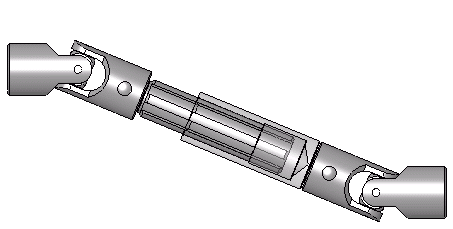
	- U-joints at both ends with a splined section in the middle that slides in and out as the ends move. Both yokes on the middle shaft line up, so the speed changes of the two joints cancel.
##### Types of Drive Shafts

| Drive Shaft Type                      | Common Use                                         | Advantage                                                                                                          | Disadvantage                                                            | Image                                    |
| ------------------------------------- | -------------------------------------------------- | ------------------------------------------------------------------------------------------------------------------ | ----------------------------------------------------------------------- | ---------------------------------------- |
| One-piece steel tube                  | Most RWD cars and short-wheelbase pickups and SUVs | Cheap, strong and simple                                                                                           | Heaviest; length limited by critical speed                              |      |
| Two-piece with centre support bearing | Long-wheelbase trucks and vans                     | Each section is shorter, so critical speed is higher; can follow a lower path under the floor                      | More joints and parts; centre bearing rubber wears and causes vibration |  |
| Double cardan (CV) shaft              | Lifted 4x4s with steep drive shaft angles          | Two U-joints back to back at one end give near-constant speed even at large angles                                 | Bulkier and more expensive; more joints to wear                         | 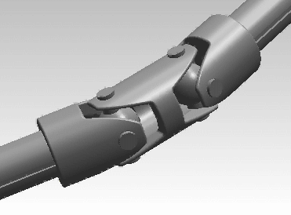    |
| Torque tube                           | Ford Model T, Chevrolet Corvette (C5 and later)    | Shaft runs inside a rigid tube that holds the axle in place (no axle wrap) or joins the engine to a rear transaxle | Heavier; harder to service; limits suspension design                    |                                          |
##### Part List

| Make (3D print / laser cut)                                  | Buy                                                             |
| ------------------------------------------------------------ | --------------------------------------------------------------- |
| Input and output stands with adjustable angle (and angle scale) | Small steel universal joints (2–3)                           |
| Yokes / end adapters                                         | Aluminium or steel tube / rod for the shaft                     |
| Slip joint (hex, D-profile or spline telescoping section)    | Ball bearings or pillow blocks                                  |
| Centre support bracket (two-piece version)                   | Centre support bearing (two-piece version)                      |
| Pointer dials on input and output shafts                     | Motor (or hand crank), shaft collars, set screws, fasteners     |
| Clear safety guard                                           | Optional: encoders or a tachometer to measure input/output speed |

#### Teaching Platform
Manufacture
- Easy to CAD: it is mostly a tube with two joints, and small steel U-joints are cheap standard parts.
- Printed yokes and dials are fine, but printed U-joint crosses wear quickly, so buy the joints.
- Use a metal tube or rod for the shaft itself; a long printed shaft twists and sags.
- A telescoping slip joint is easy to print as a hex or D-shaped profile, but it needs enough clearance to slide under load without jamming.
- The shaft must be straight and balanced if driven by a motor; keep the speed low and use a guard.
Demonstratability
- No fluids needed; can be turned by hand or by a small electric motor.
- Easy to see in action:
  - One U-joint at 30–45°: turn the input steadily and watch the output dial run ahead and fall behind twice per turn.
  - Add a second joint with equal angles and yokes in phase: the output dial now matches the input exactly.
  - Turn one yoke 90° out of phase: the speed change gets worse instead of cancelling.
  - Move the output stand up and down (like an axle on its suspension): the angle changes and the slip joint slides in and out.
  - Compare a solid rod and a hollow tube of similar weight: the tube is much harder to twist.
Works with what
- **Gearboxes / transmissions / torque converters**: the drive shaft connects to the transmission output, usually through a slip yoke that slides on the output shaft splines.
- **Couplings, CV shafts**: flange, flex-disc or splined couplings attach the shaft ends; CV joints replace U-joints where the angle is large or the wheels steer (half shafts).
- **Differentials**: the rear end of the shaft drives the differential pinion.
- **Transfer cases**: a 4x4 needs two drive shafts from the transfer case, one to each axle; a divorced transfer case needs an extra short shaft from the transmission.
- **Brakes and clutches**: some trucks and 4x4s (e.g. Land Rover Defender) have a parking brake drum on the transmission output that brakes the drive shaft.
- **Steering and suspension**: with a solid rear axle, the axle moves, so the shaft angle and length change; with independent suspension the differential is fixed to the body, so the shaft angle barely changes and the half shafts take the movement.
- **FWD**: no long drive shaft; the transaxle drives the front wheels directly through CV half shafts.
- **RWD**: one drive shaft from the front-mounted transmission to the rear differential.
- **AWD**: FWD-based AWD adds a drive shaft to the rear axle; RWD-based AWD adds one to the front axle.
- **4x4**: two drive shafts from the transfer case; the front one is short and steep, and lifted trucks often use a double cardan joint there.
- **Single-motor, single-axle EV**: not needed, the motor, reduction gear and differential are one unit on the driven axle.
- **Dual-motor, single-axle EV**: not needed, the motors sit on the driven axle.
- **Dual-motor, dual-axle EV**: not needed, a motor on each axle replaces the front-to-rear drive shaft, which frees the floor for the battery.
- **Torque vectoring**: no direct link, torque vectoring happens at the differentials or couplings.
- **ABS and traction control**: no direct link, wheel speed sensors are at the wheels, not on the drive shaft.

### CV Shafts

#### What it is
##### Description
A CV shaft (CV axle or half shaft) is a short shaft with a constant-velocity (CV) joint at each end. It carries torque from the differential to a wheel while the wheel moves up and down and, at the front, steers.
- A **CV joint** keeps the output turning at exactly the same speed as the input even when the two shafts are at an angle. A single U-joint can't do this (its output speeds up and slows down twice per turn), so CV joints are used where the angle is large or keeps changing.
- **Why FWD needs them:** the front wheels both steer and are driven, so the joint at the wheel has to work at large angles (about 45°) while carrying full torque. U-joints at that angle would make the steering shake.
- A CV shaft normally has two different joints:
  - **Outboard (wheel end):** a fixed joint (usually Rzeppa) that handles the large steering angle but can't change length.
  - **Inboard (differential end):** a plunging joint (usually tripod) with a smaller angle that can slide in and out, because the distance to the wheel changes as the suspension moves.
In a common configuration:
- Complete CV shaft:
	- 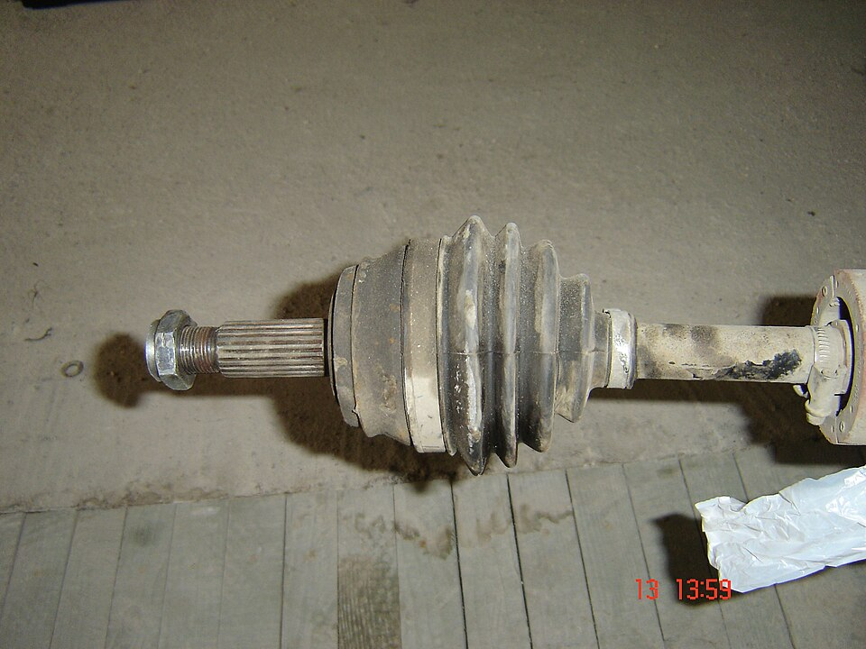
- On the car (driven front wheel):
	- 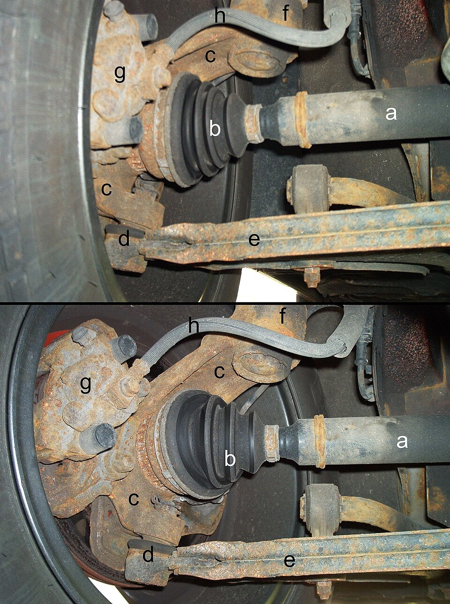
	- (a) CV shaft, (b) CV boot, (c) steering knuckle, (d) ball joint, (e) control arm, (f) strut, (g) brake caliper, (h) brake hose. Top: wheels straight. Bottom: steered, and the outboard joint bends to follow the knuckle.
- Rzeppa joint:
	- 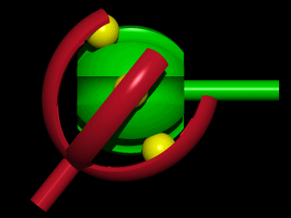
	- Six steel balls sit in grooves between an inner race (on the shaft) and an outer housing (on the wheel), held in place by a cage. The balls always stay in the plane that splits the angle between the two shafts in half, which is what keeps the speed constant.
##### Types of CV Joints

| CV Joint Type            | Common Use                                                                | Advantage                                                                                                   | Disadvantage                                                                        | Image                                 |
| ------------------------ | ------------------------------------------------------------------------- | ----------------------------------------------------------------------------------------------------------- | ----------------------------------------------------------------------------------- | ------------------------------------- |
| Rzeppa / Birfield (ball) | Outboard (wheel end) joint of almost every FWD and AWD car                | Large angle (about 45°–48°); smooth and strong                                                              | Little or no plunge; complex, precise hardened parts; needs its boot and grease     |    |
| Tripod (tripode)         | Inboard (differential end) joint of FWD cars; rear independent suspension | Simple and cheap; slides in and out by up to about 50 mm                                                    | Angle limited to about 22°–26°, so it can't be used at the steered wheel            | 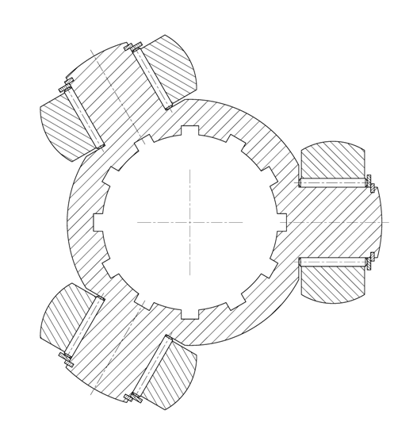        |
| Double offset (DOJ)      | Inboard joint, often on heavier or AWD vehicles                           | Ball-type joint that can both bend and plunge                                                               | Angle about 22°; less plunge than a tripod                                          |                                       |
| Cross groove             | Inboard joints and propshafts on RWD / AWD cars                           | Compact and light; plunges with little play (backlash)                                                      | Small angle and plunge; only used inboard                                           |                                       |
| Double cardan            | Steering columns; 4x4 drive shafts and some solid front axles             | Two U-joints back to back; handles large angles and shock loads with simple, cheap parts                    | Only close to constant velocity; bulky; vibrates at high speed                      |  |
| Tracta                   | Early FWD cars (e.g. 1931 DKW F1)                                         | Sliding tongue-and-groove parts instead of balls; strong                                                    | Sliding contact makes more friction and wear; replaced by Rzeppa joints             | 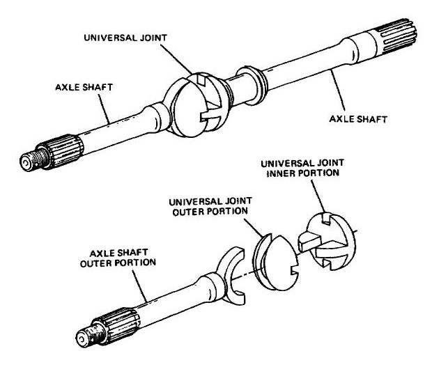        |
| Thompson coupling        | Specialised uses                                                          | Two U-joints kept aligned by a scissor linkage, with no shaft between them; true constant velocity; compact | Complex; wears quickly if run perfectly straight (needs at least about 2° of angle) | 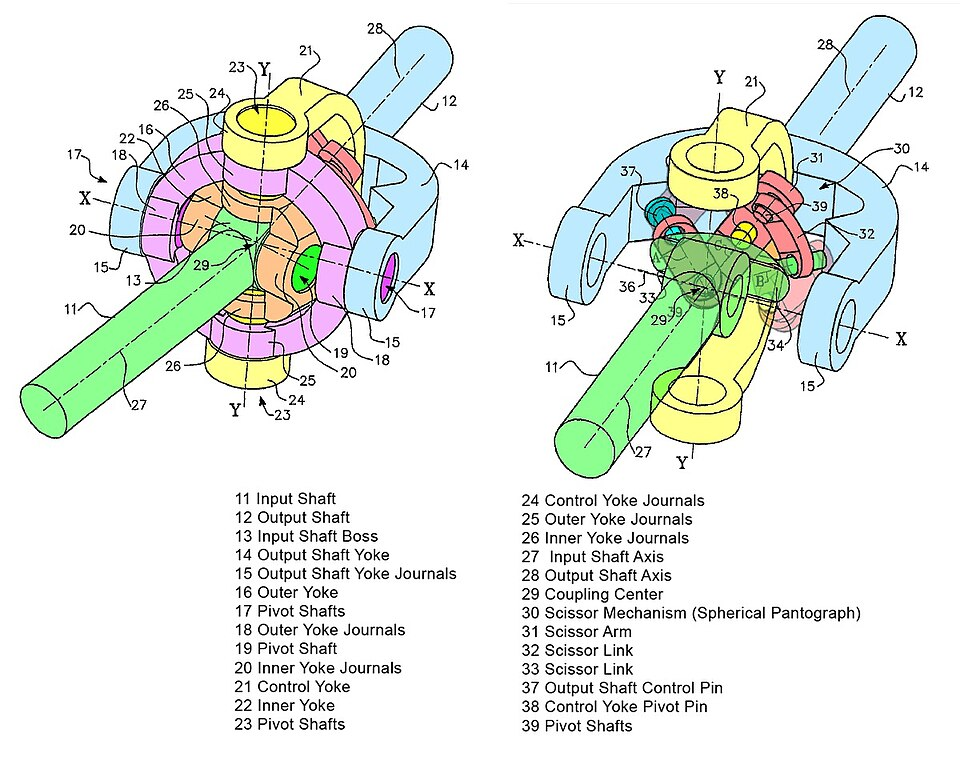      |
##### Part List

| Make (3D print / laser cut)                                     | Buy                                                                  |
| --------------------------------------------------------------- | -------------------------------------------------------------------- |
| Outboard joint housing and inner race (large-scale Rzeppa model) | Steel balls (6 per Rzeppa joint)                                    |
| Ball cage                                                       | Ready-made small CV joints or CV axles (e.g. 1/10 RC car parts)       |
| Tripod spider and grooved cup (inboard joint)                   | Small bearings or rollers for the tripod                              |
| Steering knuckle / hub, and a stand that steers and moves up/down | Steel bar for the shaft, splined or D-shaft ends                   |
| Pointer dials on input and output                               | Ball bearings, shaft collars, set screws, fasteners                   |
| Clear cover or boot (optional)                                  | Grease; optional U-joint to compare against                           |

#### Teaching Platform
Manufacture
- A tripod joint is fairly easy to print: a three-armed spider with rollers inside a cup with three straight grooves.
- A Rzeppa joint is much harder: the ball grooves are curved, the cage must fit closely, and tolerances matter. 
Demonstratability
- No fluids needed; can be turned by hand or by a small electric motor.
- Easy to see in action:
  - Put a pointer dial on the input and the output. Set the joint to 30–45° and turn the input steadily: the output dial stays exactly in step.
  - Swap in a single U-joint at the same angle: the output dial runs ahead and falls behind twice per turn.
  - Steer the knuckle while turning the input: the outboard joint keeps driving the wheel at full lock.
  - Move the wheel up and down: the inboard tripod joint slides in and out.
  - Open a large printed Rzeppa model: the balls stay in the plane halfway between the two shafts.
Works with what
- **Gearboxes / transmissions / torque converters**: in a FWD transaxle the CV shafts plug straight into the transmission/differential housing.
- **Couplings, drive shafts**: the shaft ends are splined into the differential and wheel hub; CV joints are also used on some drive shafts in place of U-joints.
- **Differentials**: the inboard joints connect to the differential side gears, one CV shaft per wheel.
- **Transfer cases**: a 4x4 with independent front suspension needs CV shafts from the front differential to the wheels.
- **Brakes and clutches**: the outboard joint sits inside the wheel hub next to the brakes, and the wheel hub/bearing is splined onto the CV shaft.
- **Steering and suspension**: the main reason CV shafts exist; the outboard joint follows the steering and both joints follow the suspension travel.
- **FWD**: two CV shafts, one to each front wheel; this is where CV shafts are used the most.
- **RWD**: needed only with independent rear suspension; a solid rear axle uses straight axle shafts instead.
- **AWD**: CV shafts on every driven wheel that has independent suspension (usually all four).
- **4x4**: CV shafts at the front with independent front suspension; a solid front axle uses U-joints or a Birfield joint in the axle housing instead.
- **Single-motor, single-axle EV**: two CV shafts from the motor/differential unit to the driven wheels.
- **Dual-motor, single-axle EV**: each motor drives its own wheel through its own CV shaft.
- **Dual-motor, dual-axle EV**: two CV shafts on each axle, one to each wheel.
- **Torque vectoring**: a torque vectoring differential or separate motors change how much torque goes down each CV shaft.
- **ABS and traction control**: the ABS tone ring is often mounted on the outboard CV joint, next to the wheel speed sensor.
## Differentials, Transfer Cases, CVTs
### Differentials

#### What it is
##### Description
A differential is a set of gears with 3 drive shafts that allows you to turn the rotational speed of one shaft as the average speed of the others. 
- In cars, a differential allow wheels on either end of a drive axle (both back wheels for example) to rotate at different speeds. This helps with cornering because the outer wheel of a vehicle travels more distance than the inner wheels (difference in radius).  
- If you do not have a differential (like go-karts), you will have to rely on wheel slip when cornering. 
In a common configuration:
- Driving in a straight line:
	- 
	- Input applied to the purple gear, rotating it at one speed. In a straight line the resistance from both wheels are equal. The green ("planet") gear doesn't rotate on its axis. Meaning the sun gears (red and yellow, connected to wheels) rotate at the same speed. 
- Turning (left):
	- 
	- Ring gear (purple) gets input, rotating the purple gear at one speed. Left sun gear (red) has more resistance than the right sun gear (yellow). Difference in resistance causes planet gear (green) to spin, leading to slower rotation in the left sun gear than the right, meaning the right wheel would travel further. 
##### Types of Differentials

| Differential Type | Common Use                                           | Advantage                                                                    | Disadvantage                                                              | Image                                    |
| ----------------- | ---------------------------------------------------- | ---------------------------------------------------------------------------- | ------------------------------------------------------------------------- | ---------------------------------------- |
| Ring-and-pinion   | RWD                                                  | Simple; turns drive 90° (propshaft to half shafts) and adds a gear reduction | Can send most power to the wheel with less grip, causing wheelspin        |  |
| Epicyclic Design  | AWD                                                  | Compact width; can split torque unevenly between front and rear axles        | High bearing loads, needs constant lubrication, complex to design         |  |
| Spur-gear         | Some FWD cars                                        | Only spur gears on parallel shafts (no bevel gears)                          | Open type, so same wheelspin problem on a low-grip wheel                  |  |
| Locking           | Off-road vehicles                                    | Both wheels driven regardless of traction; unlocks to act as open            | Tire scrub, understeer and heavier steering when locked; can slide on ice |  |
| Limited-slip      | Low-grip road driving; AWD crossovers (viscous type) | Limits power difference between wheels, less wheelspin on low-grip side      | No full lockup; viscous type loses power and wears to open-diff behaviour |  |
##### Part List

| Make (3D print / laser cut)                 | Buy                                     |
| ------------------------------------------- | --------------------------------------- |
| Carrier / case (usually two halves)         | Ball bearings for carrier and axles     |
| Ring gear and pinion (or a spur input gear) | Steel cross pin (a bolt or dowel works) |
| 2 side gears + 2–4 spider gears             | Steel output shafts (D-shaft or keyed)  |
| Housing / chassis mount, axle couplers      | Fasteners, set screws, grease           |

#### Teaching Platform
Manufacture
- 3D printed bevel gears have some limitations, if you want it to be durable 3D printed you cannot make it too small and there are also some angle limitations for the gear.
- Will probably have to work with steel axle parts.
- Otherwise its mostly simple 3D printing. 
Demonstratability
- No need for external tools, can be powered by an electric motor or simply by hand
- Easy to see in action:
  - Lift one wheel and turn the input: the free wheel spins twice as fast.
  - Hold the carrier still and turn one wheel: the other turns the opposite way.
  - Put one wheel on a slippery surface to show the open differential's traction problem.
Works with what
- **Gearboxes / transmissions (incl. CVTs)**: the differential takes its input from the transmission output.
- **Couplings, drive shafts, CV shafts**: a drive shaft brings power in (RWD) and two half shafts take it out to the wheels; CV shafts are needed if the wheels steer or the suspension moves.
- **Transfer cases**: in a 4x4, the transfer case sends drive to a front and a rear axle, and each axle needs its own differential.
- **Brakes and clutches**: clutch-type limited-slip differentials use clutch packs to limit slip.
- **Steering and suspension**: a locked front differential causes understeer and heavier steering.
- **FWD**: the differential drives the steered front wheels; some FWD cars use a spur-gear differential.
- **RWD**: ring-and-pinion differential on the rear axle.
- **AWD**: an epicyclic centre differential splits torque between front and rear, plus a differential on each axle.
- **4x4**: locking differentials for off-road traction.
- **Single-motor, single-axle EV**: one differential on the driven axle.
- **Dual-motor, single-axle EV**: one motor per wheel, so no mechanical differential is needed.
- **Dual-motor, dual-axle EV**: one motor per axle, so no centre differential; each axle still needs its own differential.
- **Torque vectoring**: varies torque to each half shaft electronically, either through a torque vectoring differential or separate motors.
- **ABS and traction control**: traction control brakes the slipping wheel, which sends more power through an open differential to the wheel with grip.

### Transfer Cases

#### What it is
##### Description
A transfer case is an intermediate gearbox that takes power from the transmission and sends it through drive shafts to the front and rear axles of a 4WD / AWD vehicle.
- It can send power to both axles or to just one (usually the rear). On off-road vehicles the driver picks 2WD or 4WD with a lever or an electronic switch.
- Many contain low range gears for off-road use. The vehicle drives slower while the engine stays in its usable RPM range, which increases torque at the axles.
- The front and rear wheels never turn at exactly the same speed (different tire wear, slightly different front and rear differential ratios). Transfer cases meant for road use let the axles turn at different speeds, the same way a differential does across one axle. A case that locks them together binds on dry pavement (driveline windup).
In a common configuration:
- In the vehicle:
	- 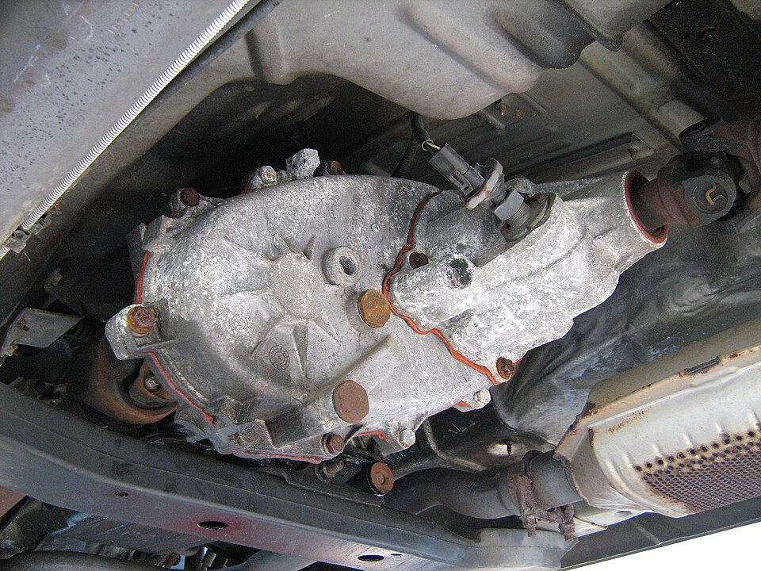
	- Power comes in from the transmission and leaves through two output shafts, one drive shaft to the rear axle and one to the front axle.
- Inside (chain-driven, part-time):
	- 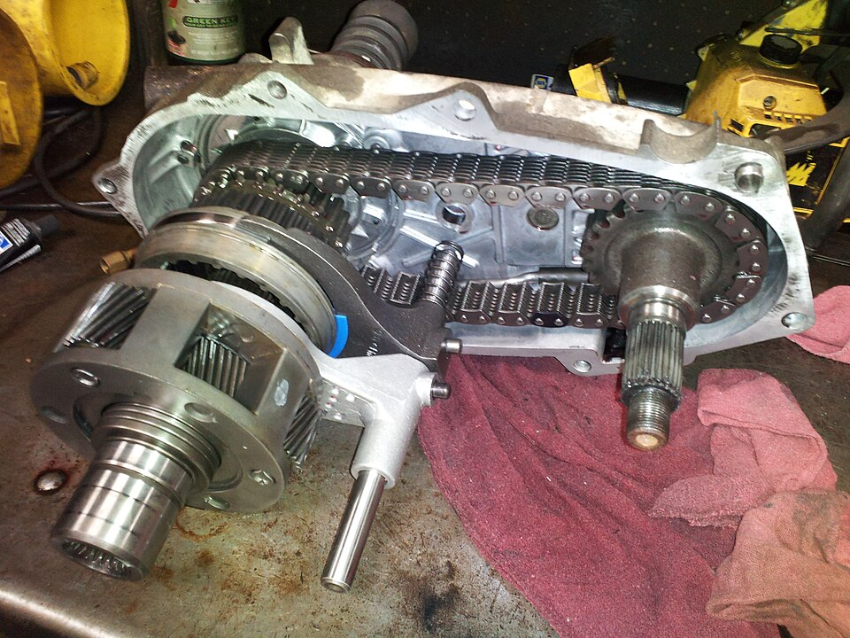
	- Input goes through a planetary gear set (sun, planets, ring gear fixed to the housing) that gives the low range. The shift fork slides a range sleeve to pick high (input connected straight through) or low (drive goes through the planetary). A chain and two sprockets carry drive from the rear output over to the front output, and a mode sleeve connects or disconnects it for 2WD or 4WD.
##### Types of Transfer Cases

| Transfer Case Type          | Common Use                                                   | Advantage                                                                                          | Disadvantage                                                                             | Image                                        |
| --------------------------- | ------------------------------------------------------------ | -------------------------------------------------------------------------------------------------- | ---------------------------------------------------------------------------------------- | -------------------------------------------- |
| Part-time                   | 4x4 trucks, off-road and military vehicles                   | Driver picks 2WD/4WD and high/low range; axles locked together for off-road traction               | No centre differential, so it binds (driveline windup) on dry pavement                   |      |
| Full-time                   | AWD sports cars, performance sedans, SUVs                    | Centre differential lets the axles turn at different speeds, so 4WD works on any surface           | Open centre diff sends power to a slipping wheel unless locked; low range often left out |      |
| Part-/full-time hybrid      | e.g. Mitsubishi Super Select (Pajero)                        | Runs 2WD, full-time 4WD (open centre diff) and part-time 4WD (locked), in high and low range       | Locked modes still bind on pavement; low range can only be engaged when stopped          |      |
| Gear-driven                 | Large trucks, some passenger cars                            | Strong                                                                                             | Heavy and noisy                                                                          | 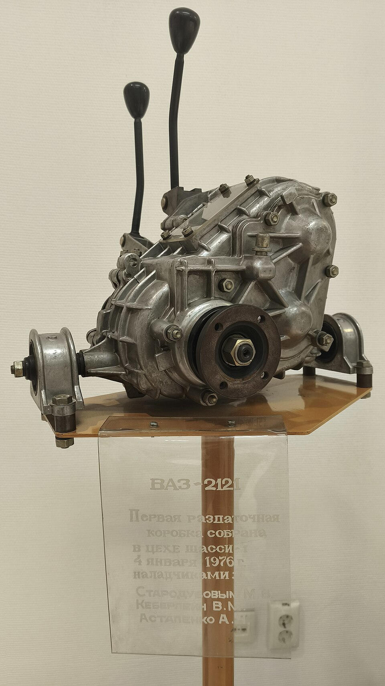             |
| Chain-driven                | Compact and full-size trucks, Jeeps, SUVs                    | Quieter and lighter than gear-driven                                                               | Not as strong; chain can stretch under heavy torque                                      | 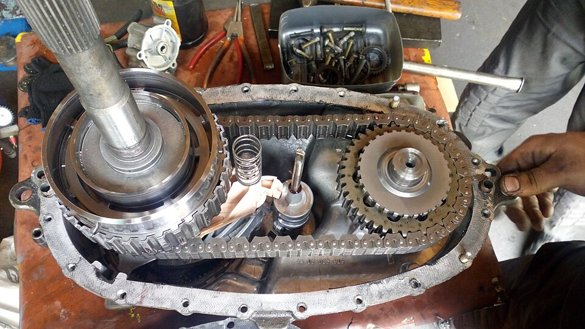          |
| Married                     | AWD cars (e.g. Subaru, shares the transmission housing)      | Bolted straight to the transmission, no extra drive shaft                                          | Harder to change the engine or transmission separately                                   | 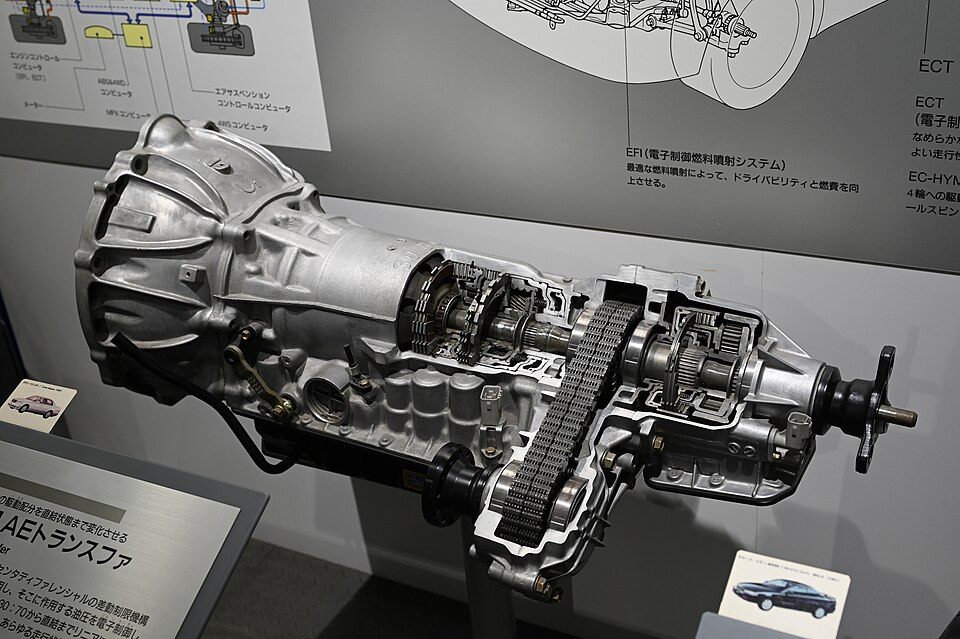 |
| Divorced / independent      | Long wheelbase commercial and military trucks, modified 4x4s | Separate from the transmission, so engine/transmission can be changed while keeping the 4WD system | Needs an extra short drive shaft from the transmission                                   |                                              |
| Manual shift on-the-fly     | Pickups (e.g. 2004 Toyota Tacoma)                            | Mechanical floor lever, no transfer case motor; 4WD high engages while moving slowly               | Must stop and shift to neutral to engage 4WD low                                         |                                              |
| Electronic shift on-the-fly | Pickups (e.g. 2026 Toyota Tacoma)                            | Dash switch or buttons instead of a lever                                                          | Needs a transfer case motor; must still stop and shift to neutral for 4WD low            |      |
##### Part List

| Make (3D print / laser cut)                           | Buy                                             |
| ----------------------------------------------------- | ----------------------------------------------- |
| Housing / case (two halves)                           | Ball bearings for all shafts                    |
| Input gear and front/rear output gears (or sprockets) | Steel shafts (input, front output, rear output) |
| Low-range gear set (planetary or a second gear pair)  | Chain and sprockets (if chain-driven)           |
| Sliding range/mode collar (dog clutch) and shift fork | Steel shift rod (a dowel works)                 |
| Shift lever and mount                                 | Fasteners, set screws, grease                   |

#### Teaching Platform
Manufacture
- A gear-driven case uses spur/helical gears on parallel shafts, which is easier to 3D print than the bevel gears in a differential.
- A planetary low range is the hardest part to print (small planet gears, tight tolerances). A second gear pair on a countershaft can give the low range instead.
- Chain and sprockets are easier to buy than print.
- Sliding collars and shift forks need enough clearance to slide without jamming, so tolerances matter.
Demonstratability
- No fluids or external power needed, can be turned by hand or by a small electric motor.
- Easy to see in action:
  - Shift from 2WD to 4WD: the front output starts turning.
  - Shift from high to low: the outputs turn noticeably slower than the input (about half as fast for a ~2:1 low range).
  - With 4WD locked, try to turn the front and rear outputs at different speeds: they can't, which shows why part-time 4WD binds on pavement.
Works with what
- **Gearboxes / transmissions (incl. CVTs)**: the transfer case takes its input from the transmission output, either bolted on (married) or through a short drive shaft (divorced).
- **Couplings, drive shafts, CV shafts**: drive shafts carry power from the two outputs to the front and rear axles.
- **Differentials**: each driven axle needs its own differential; full-time transfer cases also contain a centre differential.
- **Brakes and clutches**: shifting between ranges and modes uses sliding dog clutches; on-demand systems use a transfer clutch to send torque to the second axle.
- **Steering and suspension**: turning on dry pavement in part-time 4WD causes binding and hopping, because the front and rear axles can't turn at different speeds.
- **FWD / RWD**: not needed, a transfer case is only used when both axles are driven.
- **AWD**: full-time transfer case with a centre differential, often married to the transmission.
- **4x4**: part-time transfer case with 2WD/4WD and high/low range is the standard for 4x4 trucks.
- **Single-motor, single-axle EV**: not needed, only one axle is driven.
- **Dual-motor, single-axle EV**: not needed, both motors drive the same axle.
- **Dual-motor, dual-axle EV**: not needed, one motor per axle replaces the transfer case and centre differential, and the front/rear torque split is controlled electronically.
- **Torque vectoring**: in AWD, a torque vectoring system can shift torque between front and rear (e.g. from 90:10 to 50:50) when needed.
- **ABS and traction control**: some full-time systems with a non-locking centre differential use traction control (through ABS) to brake a slipping wheel instead of locking the centre diff.

### CVTs

#### What it is
##### Description
A continuously variable transmission (CVT) is a transmission that can change its gear ratio smoothly through any value between a lowest and a highest ratio, instead of stepping between a fixed set of gears.
- In cars, this lets the engine stay at its most efficient (or most powerful) RPM while the vehicle speeds up or slows down, which improves fuel economy and gives smooth acceleration with **no gear shifts**.
- The most common type uses two variable-diameter pulleys joined by a belt or chain. Each pulley is two cones (sheaves) facing each other. Pushing the cones together forces the belt to ride higher (larger radius); pulling them apart lets it sink lower (smaller radius). **The belt length is fixed**, so when one pulley gets bigger the other gets smaller.
- The ratio is the driven pulley radius divided by the driver pulley radius. Small driver and large driven is a "low gear" (more torque, less speed); large driver and small driven is an "overdrive" (less torque, more speed).
- **A belt CVT can't reverse or start from a stop on its own**, so car CVTs also have a launch device (torque converter or clutch) and a small planetary gear set for reverse.
In a common configuration:
- Pulley-based:
	- 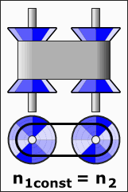
	- Input (engine) spins the left pulley at a constant speed. As the left sheaves close and the right sheaves open, the belt climbs on the left and drops on the right, so the output speeds up without any change in input speed.
- Inside a car CVT:
	- 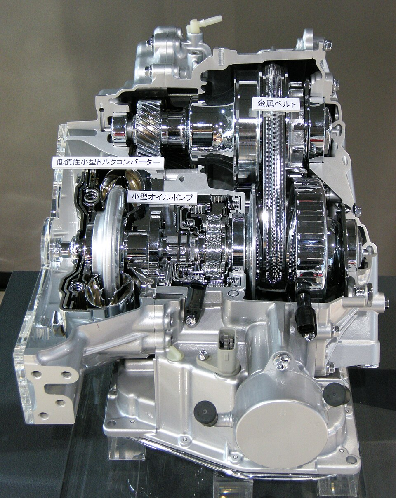
	- Toyota Super CVT-i, cut away. Power goes through a small torque converter, a forward/reverse planetary set, then the two pulleys and a steel belt. An oil pump supplies the hydraulic pressure that squeezes the sheaves to set the ratio and clamp the belt.
##### Types of CVTs

| CVT Type                    | Common Use                                                                | Advantage                                                                                                  | Disadvantage                                                                               | Image                                           |
| --------------------------- | ------------------------------------------------------------------------- | ---------------------------------------------------------------------------------------------------------- | ------------------------------------------------------------------------------------------ | ----------------------------------------------- |
| Rubber V-belt (centrifugal) | Scooters, snowmobiles, UTVs, go-karts ("torque converter"), riding mowers | Simple and cheap; shifts itself using centrifugal weights (driver) and a spring (driven), no electronics   | Belt wears, stretches and slips; limited torque                                            | 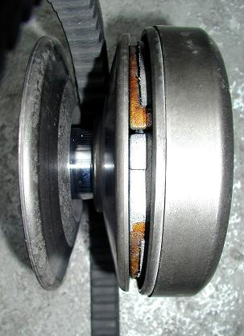           |
| Steel push-belt             | Most CVT cars (e.g. Nissan, Honda, Toyota)                                | Hydraulic clamping handles car-level torque; keeps the engine at its most efficient RPM                    | ~88% efficient (less than a manual); needs an oil pump and special fluid; torque limit     |       |
| Chain                       | Audi Multitronic, Subaru Lineartronic                                     | Handles more torque than a push-belt                                                                       | Noisier; same pulley losses; expensive to repair                                           | 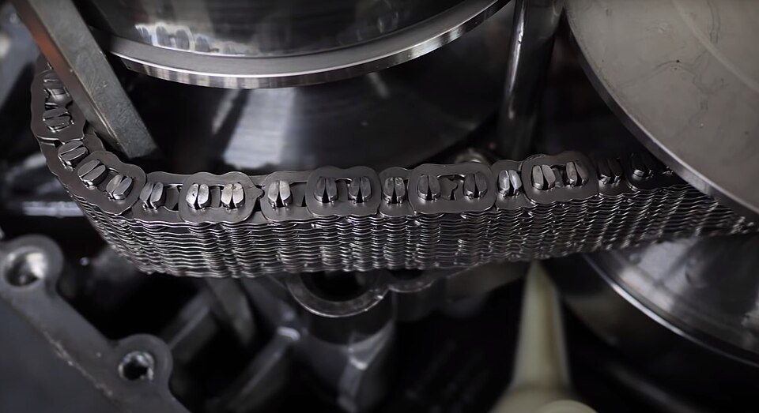 |
| Toroidal                    | Nissan Cedric / Gloria (Extroid CVT)                                      | Rollers between two doughnut-shaped discs; handles higher torque than belts                                | Needs traction fluid and very hard, precise parts; heavy and expensive                     | 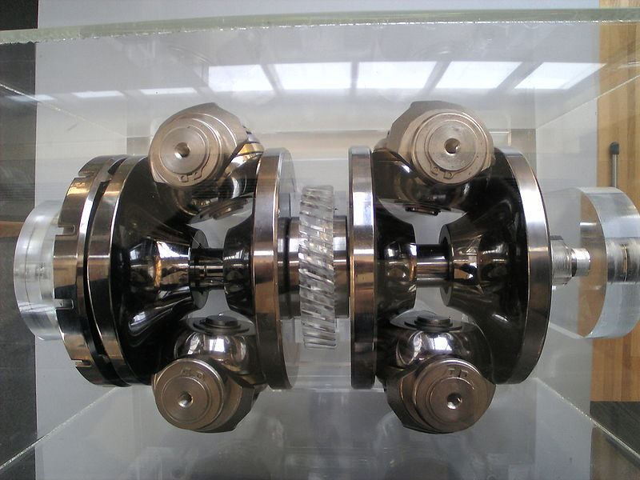       |
| Cone / friction             | Old line-shaft machine drives (Evans), simple demonstration models        | Simplest to understand; slide a belt or ring along two opposite cones to change ratio                      | Power only carried by friction, so it slips and wears; low torque                          | 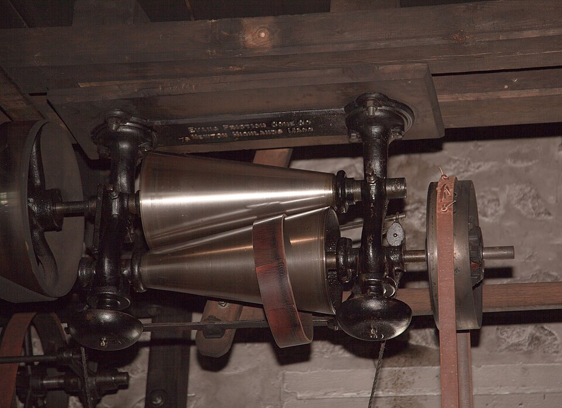             |
| Planetary ball (NuVinci)    | Bicycle and e-bike hubs                                                   | Sealed and compact; ratio can be changed while stopped                                                     | Heavier and less efficient than a derailleur; needs traction fluid                         | 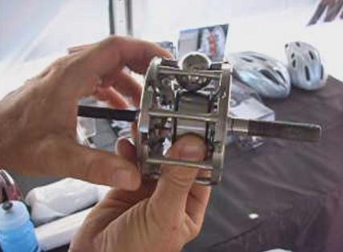      |
| Hydrostatic                 | Lawn tractors, zero-turn mowers, combine harvesters                       | Engine-driven pump feeds hydraulic motors; easy to control, reverses easily, one motor per wheel can steer | Often under 65% efficient; needs hydraulic fluid; heavy and costly                         |                                                 |
| Ratcheting                  | Rare, mostly experimental                                                 | One-way clutches instead of friction, so no slip; can reach zero output speed (IVT)                        | Vibration from the ratcheting motion                                                       |         |
| eCVT (power-split)          | Hybrids (e.g. Toyota Prius, Ford Escape Hybrid)                           | No belt; a planetary gear set blends engine and two motor-generators; very durable                         | Needs two motor-generators, a battery and electronic control; only makes sense in a hybrid | 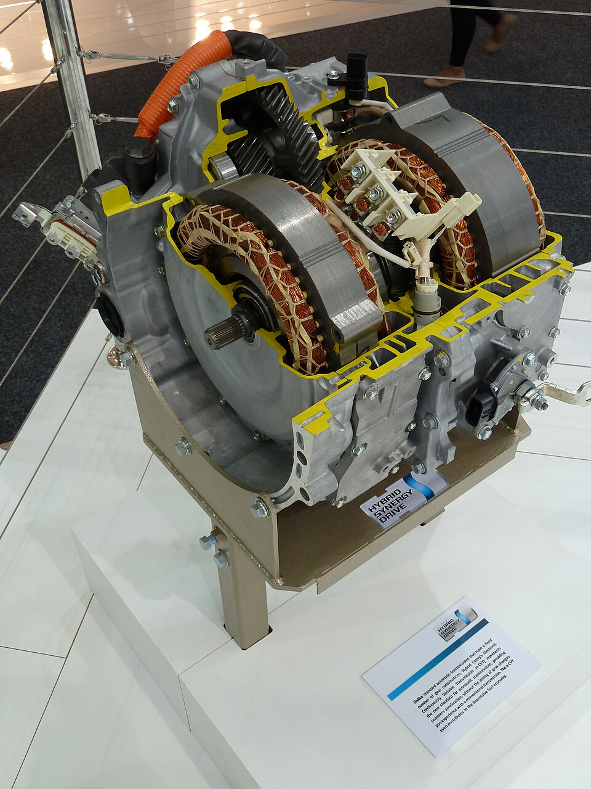            |
##### Part List

| Make (3D print / laser cut)                                  | Buy                                                            |
| ------------------------------------------------------------ | -------------------------------------------------------------- |
| Driver pulley: fixed sheave + sliding sheave                 | Rubber V-belt (small V-belt or go-kart/scooter CVT belt)       |
| Driven pulley: fixed sheave + sliding sheave                 | Compression spring for the driven pulley                       |
| Roller/weight ramp plate for the driver (centrifugal version) | Rollers or weights (steel balls or scooter variator rollers)  |
| Torque cam / spring seat for the driven pulley               | Ball bearings, steel shafts (keyed or D-shaft)                 |
| Frame / housing (open or clear sides)                        | Sliding bushings for the moving sheaves                        |
| Shift lever or knob (manual version)                         | Fasteners, set screws                                          |

#### Teaching Platform
Manufacture
- Sheaves are simple cones and easy to 3D print, but the belt rides on the cone faces, so layer lines should be sanded smooth.
- The sliding sheave has to slide along the shaft while still turning with it, so it needs a key, spline or D-shaft and a bushing. Tolerances matter or it will jam.
- Belt friction makes heat; PLA softens at around 60 °C, so PETG, ABS/ASA or nylon is better for the sheaves.
- Buy the belt instead of printing it (a printed TPU belt stretches).
- A cone CVT (rubber band between two printed cones) is the easiest version, and free 3D-printable models already exist. Toroidal, chain and steel push-belt types need precision metal parts; hydrostatic needs fluids; eCVT needs motors and control electronics.
Demonstratability
- Belt and cone types need no fluids, and can be turned by hand or by a small electric motor.
- An open frame or clear sides lets students see the belt ride up and down the pulleys.
- Easy to see in action:
  - Set a low ratio and turn the input: the output turns slower than the input. Move to a high ratio: the output turns faster. Count turns to measure each ratio.
  - Change the ratio while turning the input at a steady speed: the output speed changes smoothly with no steps.
  - Centrifugal version with a motor: speed up the motor and the belt climbs the driver pulley by itself.
  - Hold the output back by hand: the driven pulley's spring/cam shifts to a lower ratio, like a car going up a hill.
- Toroidal and hydrostatic types need fluids, and eCVT needs electronics, so they are harder to demonstrate.
Works with what
- **Gearboxes / transmissions / torque converters**: a CVT replaces the stepped gearbox, but car CVTs still use a torque converter or clutch to launch and a planetary set for reverse.
- **Couplings, drive shafts, CV shafts**: the output goes to the wheels through a drive shaft (RWD) or CV half shafts (FWD transaxle).
- **Differentials**: the CVT output goes through a final drive reduction and differential, usually in the same housing.
- **Transfer cases**: in AWD (e.g. Subaru Lineartronic), the CVT output also feeds a transfer clutch that sends torque to the rear axle.
- **Brakes and clutches**: needs a launch device (centrifugal clutch on scooters and go-karts, torque converter or wet clutch in cars), and a clutch and brake in the forward/reverse planetary set.
- **Steering and suspension**: no direct link.
- **FWD**: most CVT cars are FWD, with the CVT and differential in one transaxle.
- **RWD**: rare; the toroidal Nissan Extroid was used in RWD cars.
- **AWD**: used in some AWD cars (e.g. Subaru), with a transfer clutch after the CVT.
- **4x4**: rare in road 4x4s because of the torque limit; UTVs use a rubber belt CVT followed by a gearbox with high/low range.
- **Single-motor, single-axle EV**: not needed, an electric motor works over a wide speed range, so a single-speed reduction gear is used.
- **Dual-motor, single-axle EV**: not needed, same reason.
- **Dual-motor, dual-axle EV**: not needed, same reason.
- **Torque vectoring**: no direct link, torque vectoring happens after the CVT (in the differential or couplings).
- **ABS and traction control**: traction control cuts engine torque when a wheel slips; the CVT has to keep the belt clamped hard enough that it doesn't slip when the spinning wheel suddenly grips again.

## Brakes and Clutches

## Steering and Suspension
### Steering
The three subjects are related, but they are not the same component. They are researched separately below:

- A **gearbox** is the gears-and-shafts mechanism that changes speed, torque or direction.
- A **transmission** is the complete vehicle unit that selects and controls ratios. It contains a gearbox plus items such as clutches, selectors, bearings, lubrication and controls.
- A **torque converter** is a hydrodynamic input device used ahead of many automatic transmissions. It transfers engine power through fluid and is not itself a gearbox.

---

### Gearboxes

#### What it is

##### Description and rough working principle

A gearbox passes rotation through meshing gears. Changing the relative tooth counts changes output speed and torque:

- For a simple gear pair, `reduction ratio = driven gear teeth / driving gear teeth`.
- A 15-tooth driving gear turning a 45-tooth driven gear gives a 3:1 reduction: the output turns once for every three input turns.
- Ignoring losses, the 3:1 reduction produces about three times the input torque at one-third of the speed.
- Two external gears reverse direction. Adding another external idler gear reverses it again, which is useful for a vehicle's reverse gear.
- A multi-ratio gearbox places several gear pairs on shafts and selects which pair carries torque.
- A planetary gearbox uses a central sun gear, planet gears on a carrier and an internal ring gear. Holding, driving and taking output from different members produces different ratios from one compact coaxial set.[^1]

##### Why a car needs a gearbox

- **Launch and climbing:** reduction multiplies torque at the wheels.
- **Speed range:** an internal-combustion engine cannot operate efficiently from zero wheel speed to highway speed using one direct ratio.
- **Efficient cruising:** a taller ratio lowers engine speed, noise and fuel use at road speed.
- **Direction:** the gear train can provide reverse without reversing engine rotation.
- **Packaging:** planetary gearsets provide several ratios on one axis; a fixed reduction lets a high-speed EV motor drive the wheels at a practical speed.

##### Representative gearbox architectures

The five entries below are representative architectures selected for comparison; they are not an exhaustive list of every gearbox design.

| Gearbox Type | Common Use | Advantage | Disadvantage | Image |
| --- | --- | --- | --- | --- |
| Single-stage spur/helical reduction | EV drive units, final reductions, simple teaching rigs | Few parts; efficient; easiest to understand, print and CAD | Only one ratio; external gears reverse direction; helical gears add axial bearing load |  |
| Two-stage compound reduction | EV e-axles, compact reducers and teaching rigs needing a larger overall ratio | Multiplies two stage ratios in a compact package; each gear pair remains easy to understand | More bearings and alignment points than one stage; efficiency losses and backlash accumulate | 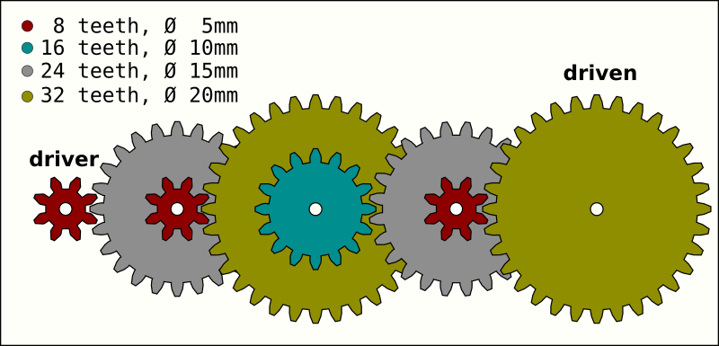 |
| Parallel-shaft, constant-mesh multi-ratio | Manual transmissions, DCT gear-train halves | Several ratios using familiar gear pairs; power flow is visible | Needs accurate shaft spacing, selectors and axial packaging; more gears rotate even when not selected |  |
| Planetary / epicyclic | Conventional automatic transmissions, hybrid power-split devices | Compact and coaxial; several ratios by holding different members; load shared by multiple planets | Ring gear and carrier are harder to manufacture; ratio combinations and clutch logic are less intuitive |  |
| Bevel / hypoid final-drive gearbox | Rear-drive axles, differentials and transfer/final-drive units | Turns the power path through approximately 90° while providing final reduction; hypoid offset can improve packaging | Curved tooth geometry, contact pattern, bearing preload and lubrication are difficult to manufacture and set correctly[^24] | 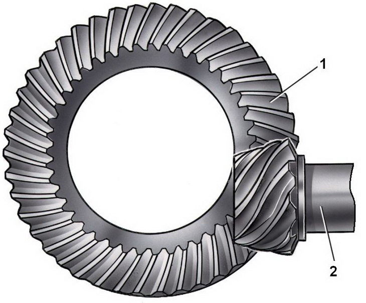 |

#### Part List

For a printable gearbox teaching module:

| Make (3D print / laser cut) | Buy |
| --- | --- |
| Two or three interchangeable spur-gear pairs | Steel input, counter and output shafts (D-shaft or keyed) |
| Optional sun, planet, ring and carrier set | Ball bearings or low-friction bushings |
| Split housing with removable clear acrylic cover | Shaft collars, keys, retaining rings and spacers |
| Sliding dog sleeve and simple selector fork | Fasteners and metal dowel pins |
| Input/output direction and ratio indicator discs | Small amount of plastic-safe grease |
| Motor/hand-crank and output-load mounting plates | Hand crank or low-speed geared DC motor |

#### Teaching Platform

##### 3D printing / manufacturing easiness

- **Single spur reduction — easy:** large printed teeth and purchased shafts/bearings are enough for a low-speed model.
- **Two-stage compound reduction — easy to moderate:** the gears are simple, but both centre distances and the compound shaft must remain aligned.
- **Two-/three-ratio constant-mesh gearbox — easy to moderate:** the main challenges are centre distance, backlash, shaft support and complete dog-clutch engagement.
- **Simple planetary gearbox — moderate:** the sun, ring and carrier must be concentric; planet gears must be evenly spaced and supported on both sides.
- **Bevel/hypoid final drive — hard:** a visual approximation can be printed, but realistic curved teeth and their contact pattern need specialist gear design and machining.
- **Working synchromesh — hard:** friction cones, blocker-ring clearance, splines, small dog teeth and detents need close tolerances.
- Print gears flat where possible for consistent teeth. Use metal shafts and through-fasteners instead of printed threads.
- PLA/PETG is suitable only for slow, low-load demonstrations—not vehicle loads or high rotational speed.

##### Demonstratability

- Excellent for demonstration; no fluid or special external tool is needed.
- Turn the input by hand and count input/output revolutions to measure each ratio.
- Mark one tooth on every gear and use different colours for the input, idler and output gears.
- Add a small friction brake or hanging-weight drum to the output so students can feel increased torque in a lower ratio.
- Move the selector to neutral to show that gears may spin while no torque reaches the output.
- Add/remove a reverse idler to make the output direction change visibly.
- On the planetary module, use removable locking pins to hold the sun, ring or carrier and compare the resulting ratios.

##### Works with what

- **Input:** hand crank, geared electric motor or engine simulator.
- **Output:** coupling, drive shaft, differential/final drive or wheel module.
- **Support:** shafts, bearings/bushings, housing, lubrication and a clear safety guard.
- **For multiple ratios:** selector sleeve/dog clutch and shift fork; a real vehicle also needs a clutch or another way to unload the gears during a shift.
- **For a planetary set:** brakes/clutches or removable holding pins must control which member is fixed, driven and used as output.

##### CAD easiness

- **Easy:** single-stage spur reduction using an involute-gear generator.
- **Easy–moderate:** parallel-shaft multi-ratio gearbox; add axial spacing, selector travel, shaft retention and backlash checks.
- **Moderate:** planetary gearbox. For a simple set with equal gear module, `ring teeth = sun teeth + 2 × planet teeth`.
- **Hard:** realistic synchromesh or compact vehicle-grade helical gearbox because tolerances, splines, bearings and lubrication paths all interact.

##### Recommended gearbox demonstrator

Use a modular three-shaft constant-mesh gearbox with two forward ratios, neutral and reverse, plus a separate planetary module with removable holding pins. It is printable, visually clear, easy to operate by hand and useful with the later transmission and differential demonstrations.

---

### Transmissions

#### What it is

##### Description and rough working principle

A vehicle transmission is the complete system that accepts power from the engine or traction motor, selects an appropriate ratio and sends controlled output to the rest of the drivetrain.

- A **manual transmission** uses a driver-operated clutch and shift lever. Constant-mesh gears rotate on the shafts; synchronizers match speed before a sleeve locks the chosen gear to the output shaft.[^2]
- A **torque-converter automatic** uses a torque converter for launch, planetary gearsets for ratios and hydraulically applied clutches/brakes to select the power path. A transmission control unit commands valves or solenoids.[^3][^4]
- A **dual-clutch transmission (DCT)** has two manual-like gear-train halves and two clutches. One half carries the current gear while the next gear can be preselected on the other; the controls swap clutches for a rapid shift.[^5]
- A **single-speed EV transmission** normally combines one fixed reduction gearset, bearings, differential/final drive and lubrication in a compact drive unit.

##### Why a car needs a transmission

- It keeps the engine or motor in a usable speed/torque range while road speed changes.
- It provides launch, acceleration, cruising, neutral and reverse functions.
- It gives the driver or controller a safe, repeatable way to select ratios.
- It supports and lubricates the rotating parts and connects the power source to the final drive.
- In an EV, the transmission may have only one fixed ratio, but the reduction, housing, bearings, differential and lubricant are still required.

##### Representative transmission systems

These four systems cover the transmission principles assigned to this section.

| Transmission Type | Common Use | Advantage | Disadvantage | Image |
| --- | --- | --- | --- | --- |
| Manual synchromesh | Manual passenger cars, sports cars, trucks | Efficient; direct driver control; internal power path is comparatively easy to trace | Driver must operate clutch and lever; shift interrupts torque; synchronizers and linkages require accurate fits |  |
| Torque-converter automatic | Most conventional automatic passenger cars and many trucks | Smooth launch; shifts under load; controller chooses ratios automatically | Many precision parts; needs fluid pump, clutch packs, valve/solenoid control and cooling |  |
| Dual-clutch transmission (DCT) | Performance and efficient automated vehicles | Preselects the next gear; fast shifts; mostly mechanical power path | Two clutches, concentric shafts, actuators and control timing make design difficult; clutch heat/wear at low speed | 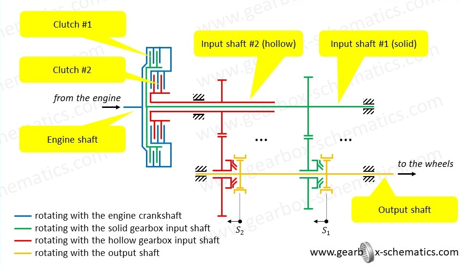 |
| Single-speed EV reduction transmission | Most battery-electric vehicles | Few parts; compact, efficient and no shift mechanism | One ratio must satisfy launch torque and maximum motor speed; does not demonstrate gear changing |  |

#### Part List

For a simplified selectable-ratio transmission demonstrator:

| Make (3D print / laser cut) | Buy |
| --- | --- |
| Gearbox housing and removable transparent cover | Steel shafts, bearings/bushings and shaft collars |
| Two forward gear pairs, reverse idler and sliding dog selector | Small geared DC motor or hand crank |
| Shift fork, guide rail, lever and detent plate | Flexible shaft coupling and fasteners |
| Simplified dry clutch disc/pressure plate display | Low-voltage speed controller if motor-driven |
| Motor, transmission and load mounting brackets | Optical tachometers/encoders (optional) |
| Ratio labels, power-flow arrows and safety guard | Adjustable friction load or small brake |

A realistic automatic or DCT would additionally require clutch packs, seals, hydraulic passages, a pump, valves/solenoids, speed sensors and an electronic controller. Those systems are better shown with a cutaway or schematic than reproduced as a working student-built mechanism.

#### Teaching Platform

##### 3D printing / manufacturing easiness

| Transmission Demonstrator | Manufacturing Difficulty | Reason |
| --- | --- | --- |
| Single-speed EV reduction | **Easy** | One gear pair, fixed shafts and no selector |
| Simplified dog-shift manual | **Moderate** | Several ratios plus shift sleeve/fork and axial retention |
| True synchromesh manual | **Hard** | Friction cones, blocker rings, splines and tight clearances |
| DCT | **Very hard** | Two clutches, two gear-train halves, concentric shafts and actuators |
| Hydraulic planetary automatic | **Very hard** | Multiple clutch packs, fluid circuits, valve control and precise shift timing |

##### Demonstratability

- A simplified manual is the clearest working model: use a hand crank or low-speed motor and a transparent cover.
- Select first, second, neutral and reverse while coloured arrows show the active power path.
- Use two tachometers or count turns to compare ratios quantitatively.
- A removable clutch model can show why torque must be interrupted before a manual shift.
- A DCT schematic can show odd/even gear paths, but a realistic working model needs two controlled clutches and synchronized actuators.
- A conventional automatic is difficult to see internally while running. A cutaway plus removable locking pins on a separate planetary module communicates the gear logic more clearly than a sealed hydraulic replica.
- No fluid is needed for the recommended manual/dog-shift model. A realistic automatic needs transmission fluid, a pump, control pressure and cooling.

##### Works with what

- **Before the transmission:** engine or motor, flywheel/flexplate and a clutch or torque converter depending on type.
- **After the transmission:** coupling/drive shaft and differential/final drive; a FWD transaxle packages the differential in the same housing.
- **Manual:** clutch, shift linkage and driver input.
- **Torque-converter automatic:** torque converter, automatic-transmission fluid, oil pump, clutch packs, valve body/solenoids, cooler and transmission controller.
- **DCT:** two clutches, electromechanical or electrohydraulic actuators, speed/position sensors and controller.
- **EV reduction:** traction motor, inverter/controller, final drive/differential and lubricated bearings/gears.
- **Teaching rig:** clear guard, low-speed drive and adjustable output load.

##### CAD easiness

- **Easy:** single-speed EV reduction transmission.
- **Moderate:** simplified two-speed dog-shift manual with large printed components.
- **Hard:** true synchromesh because selector travel, cone engagement, dog teeth, splines and detents must all align.
- **Very hard:** DCT or hydraulic automatic because CAD must coordinate many coaxial components, clutches, actuators and fluid/control hardware.

##### Recommended transmission demonstrator

Build a two-speed dog-shift manual transmission with neutral and reverse. Keep the synchronizer as a separate enlarged cutaway/display piece instead of making it load-bearing. Use the automatic and DCT images to compare architectures without adding their hydraulic and control complexity to the working rig.

---

### Torque Converters

#### What it is

##### Description and rough working principle

A torque converter is a sealed hydrodynamic device between an internal-combustion engine and a conventional automatic transmission. It transfers power through automatic-transmission fluid rather than through a continuously engaged dry friction clutch.[^4][^6]

The labelled cross-section shows the three main rotating-flow elements:

- **Pump/impeller (A):** fixed to the converter cover and engine input (D). It throws fluid outward and toward the turbine.
- **Turbine (C):** connected to the transmission input shaft (E). Moving fluid pushes its blades and produces output torque.
- **Stator (B):** mounted on a one-way clutch between pump and turbine. At low turbine speed it redirects returning fluid so it assists the pump instead of opposing it; this produces torque multiplication.
- **Lock-up clutch:** not shown in this simplified diagram. At cruise it mechanically connects input and output to eliminate most converter slip and heat.

##### Operating stages

| Stage | What Happens | Result |
| --- | --- | --- |
| Stall / launch | Engine turns the pump while the turbine is stopped or very slow; stator locks and redirects return flow | Maximum torque multiplication, maximum slip and rapid heat generation |
| Acceleration | Turbine speed rises; speed difference and multiplication gradually decrease | Smooth non-contact power transfer while the car accelerates |
| Coupling | Pump and turbine speeds become closer; stator freewheels | Converter behaves mainly as a fluid coupling, with some remaining slip |
| Lock-up | A friction clutch connects converter cover to turbine/input shaft | Near-direct mechanical drive, less heat and better efficiency |

##### Why a car needs a torque converter

- It lets an automatic-transmission vehicle stop in gear while the engine continues idling.
- It provides smooth launch without the driver operating a clutch pedal.
- It multiplies torque when starting and when the turbine is much slower than the pump.
- Fluid slip and internal damping absorb engine torsional vibration and driveline shock.
- The lock-up clutch restores efficiency once continuous slip is no longer needed.[^4]

#### Part List

##### Real automotive torque converter

| Main Part | Function |
| --- | --- |
| Welded converter cover and engine drive hub | Sealed rotating housing connected to flexplate/crankshaft |
| Pump/impeller | Adds energy to the fluid |
| Turbine and turbine hub | Converts fluid momentum back into output-shaft torque |
| Stator and one-way clutch | Redirects return flow during launch; freewheels near coupling speed |
| Lock-up clutch and torsional damper | Connects input/output mechanically and filters vibration |
| Bearings/thrust washers and seals | Maintain alignment and contain fluid |
| Automatic-transmission fluid | Working medium, lubrication and heat transport |

##### Teaching demonstrator

| Make (3D print / laser cut) | Buy |
| --- | --- |
| Enlarged dry pump, turbine and stator shapes | Used/cutaway torque converter for visual comparison |
| Transparent housing/display shell that does not hold pressure | Two small guarded electric fans for a dry airflow analogy |
| Fixed guide-vane/stator insert | Low-voltage power supply and speed controller |
| Colour-coded flow arrows and labelled cross-section stand | Clear safety guard, fasteners and bearings |
| Catch tray and mounting frame if any fluid demo is attempted | Suitable fluid, shaft seals and commercial one-way bearing for an advanced fluid model |

#### Teaching Platform

##### 3D printing / manufacturing easiness

- **Static cutaway/display — moderate:** the three elements can be enlarged and printed separately so blade direction is visible.
- **Dry two-fan analogy — moderate:** easy to assemble, but guide vanes and guards must be securely mounted.
- **Working fluid model — very hard and not recommended as the first build:** it needs curved blades, rotor balance, a leak-proof case, seals, one-way stator clutch, fill/bleed ports and fluid compatibility.
- A printed high-speed rotor can fail dangerously. Operate only a guarded, low-speed model and never treat printed parts as vehicle components.

##### Demonstratability

- A real converter is difficult to observe because it is opaque, sealed and full of fluid.
- A transparent fluid model needs external fluid, sealing, sufficient input speed, a load and a catch tray. Aeration and leaks can obscure the result.
- A cutaway is best for identifying parts but cannot demonstrate power transfer while open.
- Two guarded fans facing each other provide a clean analogy for non-contact fluid power transfer. Adding fixed guide vanes suggests the stator's role, but air fans do **not** reproduce an automotive converter's exact oil flow or torque ratio.
- The labelled diagram should remain beside the demo so students can connect pump, stator, turbine, input and output.

##### Works with what

- **Engine side:** engine crankshaft/flexplate and converter cover.
- **Transmission side:** input shaft and usually a planetary automatic transmission.
- **Fluid system:** automatic-transmission fluid, transmission oil pump, sump/filter and cooler/heat exchanger.[^6]
- **Controls:** lock-up clutch valve/solenoid and transmission control unit.
- **Supporting parts:** stator support and one-way clutch, bearings/thrust washers and seals.
- It normally replaces the launch clutch of a conventional automatic; it is not required with a normal manual transmission and is commonly replaced by clutches or an electric motor in DCT/hybrid architectures.

##### CAD easiness

- **Easy:** simplified labelled cross-section or non-rotating display shell.
- **Moderate:** enlarged dry pump/turbine/stator shapes for visual teaching.
- **Very hard:** functional converter. Blade angles, toroidal flow passages, clearances, balance, seals, stator one-way clutch and lock-up clutch require specialist design and manufacturing. Research measurements show the internal three-dimensional flow is highly unsteady and complex.[^7]

##### Recommended torque-converter demonstrator

Use the labelled cross-section plus a purchased used/cutaway converter. If motion is required, add a separate guarded two-fan airflow analogy. Do not make a high-speed fluid-filled printed converter unless leak containment, rotor balance and overspeed protection can be engineered and tested properly.

---

### Sources and Image Credits

#### Technical sources

[^1]: ZF, [Coaxial reduction gear](https://press.zf.com/press/en/media/media_57732.html), an EV reduction unit using two planetary gearsets and an integrated differential.
[^2]: U.S. educational manual-transmission unit, [Manual Transmission](https://files.eric.ed.gov/fulltext/ED204627.pdf), covering power flow, constant-mesh gears, synchronizers, shafts, bearings and lubrication.
[^3]: MIT 2.972, [How an Automatic Transmission Works](https://web.mit.edu/2.972/www/reports/automatic_transmission/automatic_transmission.html), describing the torque converter and planetary gearbox power path.
[^4]: ZF, [Torque Converter](https://www.zf.com/products/en/cars/products_65854.html), including hydrodynamic circuits, lock-up clutches and torsional damping.
[^5]: Volkswagen service training document hosted by NHTSA, [The 02E Direct Shift Gearbox](https://static.nhtsa.gov/odi/tsbs/2012/MC-10157658-9999.pdf), describing two independent gear-train halves, two clutches and preselection of the next gear.
[^6]: ZF PowerLine maintenance guide, [8-speed automatic transmission](https://www.zf.com/products/media/automotive/cv/literature_downloads_wna/truck_solutions/PowerLine_Maintenance_Guide.pdf), describing a torque converter with lock-up clutch, downstream planetary gearset, oil system and cooler connections.
[^7]: SAE Technical Paper 960721, [The Flow Field Inside an Automotive Torque Converter](https://doi.org/10.4271/960721), reporting measured three-dimensional, unsteady flow in the pump, turbine and stator.
[^24]: Dana, [Beam Axles](https://www.dana.com/product/light-vehicle/beam-axles/), describing automotive hypoid gearing, differential options and axle applications.

#### Image credits

- [Two spur gears 1:3](https://commons.wikimedia.org/wiki/File:Two_spur_gears_1_3.svg) by Jahobr, CC0.
- [Manual transmission cutaway](https://commons.wikimedia.org/wiki/File:Engine_and_Gearbox_cutaway-001.jpg) by NJR ZA, CC BY-SA 3.0.
- [Planetary gearset schematic](https://commons.wikimedia.org/wiki/File:Planetary_gear_set_schematic.svg) by DaveRcWiki, CC0.
- [Eight-speed automatic transmission cutaway](https://commons.wikimedia.org/wiki/File:Lexus_IS_F_08.JPG) by Hatsukari715, public domain.
- [Two-shaft DCT gearbox layout](https://www.gearbox-schematics.com/basics/dct-home/dct-gearbox/) by Gearbox Schematics, used for educational explanation with source attribution.
- [Aisin integrated electric drive unit](https://commons.wikimedia.org/wiki/File:Aisin_Xin1_Electric_Drive_Unit.jpg) by TTTNIS, CC0.
- [Torque-converter cross-section](https://commons.wikimedia.org/wiki/File:Torque_converter_a_cross_section.png) by Toshinori baba, CC BY-SA 4.0.
- [Compound gear train](https://commons.wikimedia.org/wiki/File:Example_of_a_Compound_Gear_Train.png) by Manuel Bieling, CC0.
- [Hypoid gear pair](https://commons.wikimedia.org/wiki/File:Hypoid_gear.jpg) by Sam novo, public domain.

---

## Brakes and Clutches

Brakes and clutches both use controlled friction, but they do different jobs. A **brake** connects a rotating part to the stationary vehicle structure so the vehicle slows or stops. A **clutch** connects or disconnects two rotating parts so engine torque can be transmitted smoothly or interrupted.

---

### Brakes

#### What it is

##### Description and rough working principle

A vehicle brake converts the vehicle's kinetic energy into another form so wheel speed decreases.

- In a hydraulic **disc brake**, the pedal moves a master-cylinder piston. Brake-fluid pressure travels through the lines to the caliper pistons, which squeeze two pads against a rotor fixed to the wheel. Friction produces braking torque and heat.[^8]
- In a **drum brake**, a hydraulic wheel cylinder pushes two curved shoes outward against the inside of a rotating drum. Return springs retract the shoes when pressure is released.[^9]
- In an EV or hybrid, **regenerative braking** makes the traction motor operate as a generator. Vehicle energy is converted to electrical energy and returned to the high-voltage battery; friction brakes still provide stronger braking, very-low-speed braking and stationary holding.[^10]
- ABS can rapidly reduce and restore hydraulic pressure at an individual wheel to prevent sustained wheel lock. ABS changes how braking force is controlled; it does not replace the service brake.
- Heavy commercial vehicles often use **compressed-air service brakes**. A compressor fills reservoirs; the pedal valve meters pressure to brake chambers, which apply the wheel brakes.[^27]
- An **electric parking brake (EPB)** replaces the hand lever and cable with a switch, controller and electromechanical actuator that creates holding clamp force.[^28]

##### Why a car needs brakes

- Slow the vehicle predictably and stop it within a safe distance.
- Hold the vehicle stationary when parked or stopped on a slope.
- Control speed on descents and during manoeuvres.
- Provide the wheel-torque control used by ABS, traction control and stability control.
- In an EV or hybrid, recover some energy while retaining a friction-brake backup when regeneration is unavailable or insufficient.

##### Representative brake systems

These five rows deliberately mix energy-conversion and actuation categories so the project can compare service braking, energy recovery and stationary holding. They are representative examples, not a complete brake taxonomy.

| Brake Type | Common Use | Advantage | Disadvantage | Image |
| --- | --- | --- | --- | --- |
| Hydraulic disc brake | Front brakes on most passenger cars; often all four wheels | Good heat rejection; pads are accessible; clamping action is easy to see and demonstrate | Rotor and caliper must be aligned; a realistic hydraulic model needs fluid, seals and bleeding |  |
| Drum brake | Rear brakes on some small cars and trucks; parking-brake duty | Compact parking-brake integration; large friction area; self-energising shoe geometry can reduce actuation force | Enclosed drum retains heat; springs and adjuster are less visible and more complicated to assemble |  |
| Regenerative brake | Battery-electric and hybrid vehicles | Recovers energy; reduces friction-pad wear; motor torque is electronically controllable | Braking depends on motor, inverter, battery limits and vehicle speed; friction brakes are still required |  |
| Compressed-air service brake | Heavy trucks, buses and trailers | Stored air provides robust multi-axle actuation; leakage does not immediately remove all braking capability | Compressor, dryer, reservoirs, valves and chambers add weight and response delay; a working model needs pressure-rated hardware | 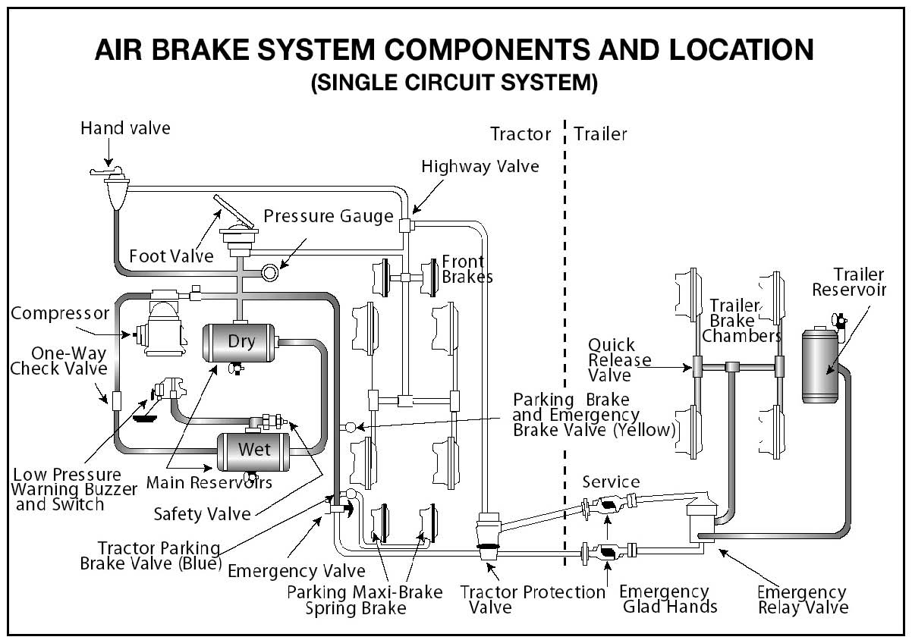 |
| Electric parking brake (EPB) | Modern passenger-car rear disc or drum brakes | Compact cabin control; automatic apply/release and integration with hill-hold functions | Needs motor, reduction gear, sensors, wiring and fail-safe release; it is primarily a holding brake, not a substitute for the service brake | 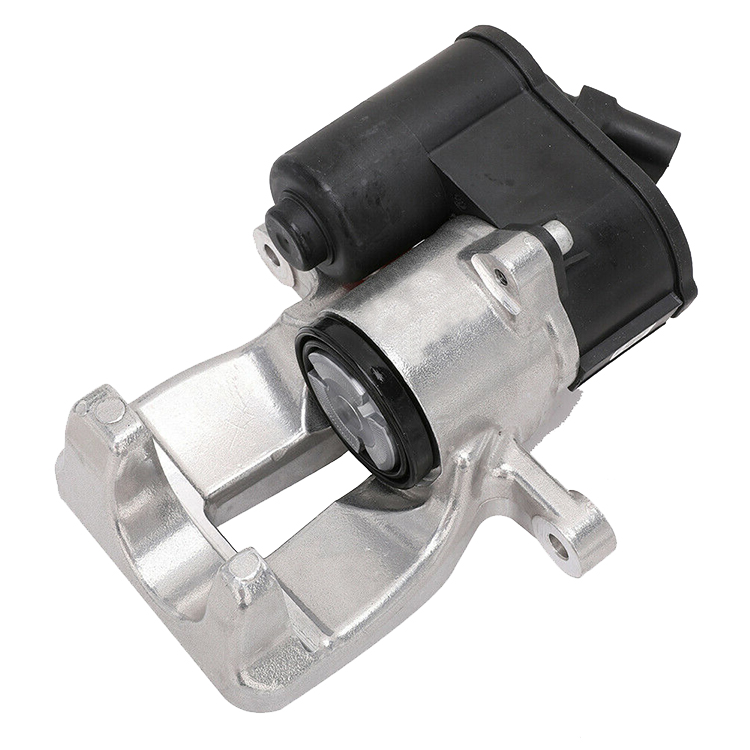 |

#### Part List

##### Main parts in a road-car brake system

| Main Part | Function |
| --- | --- |
| Brake pedal, booster and master cylinder | Create and amplify the driver's hydraulic command |
| Reservoir, brake fluid, rigid lines and flexible hoses | Store and transmit hydraulic pressure |
| Rotor and caliper, or drum and wheel cylinder | Convert hydraulic force into friction torque at each wheel |
| Pads or shoes and friction lining | Provide the replaceable friction surfaces |
| Return springs, slide pins and adjusters | Release the brake and maintain operating clearance |
| Parking-brake lever/actuator and cable or motor | Hold the vehicle independently of the normal pedal system |
| Wheel-speed sensors, ABS modulator and controller | Detect wheel slip and modulate individual brake pressure |
| EV motor, inverter and high-voltage battery | Provide and absorb regenerative braking power where fitted |

##### Teaching demonstrator

| Make (3D print / laser cut) | Buy |
| --- | --- |
| Large rotor, caliper shell and replaceable pad carriers | Steel input shaft, bearings/pillow blocks and shaft collars |
| Cable- or screw-operated piston/lever mechanism | Commercial friction material or small bicycle brake pads |
| Pedal/hand lever, mounting plate and adjustable pad-clearance features | Bowden cable, springs, fasteners and threaded inserts |
| Colour-coded pressure/force arrows and wheel-speed markers | Clear polycarbonate guard and low-speed hand crank or geared motor |
| Optional drum, shoes and removable cover for comparison | Optional master/slave cylinder set, compatible brake fluid and catch tray |

#### Teaching Platform

##### 3D printing / manufacturing easiness

- **Dry mechanical disc-brake model — easy to moderate:** the rotor, caliper body, pad carriers and lever can be printed. Flatness, concentricity and sufficient shaft support matter more than fine surface detail.
- **Drum-brake model — moderate:** the circular parts are easy to CAD, but shoe pivots, return springs and the adjuster add small parts and assembly work.
- **Hydraulic disc-brake model — moderate to hard:** use commercial cylinders, hose and seals. Printed pressure-containing parts can leak or fail and should not be used.
- **Regenerative-brake rig — hard:** it needs a motor/generator, drive electronics, a safe electrical load or battery, sensing and control logic.
- **Air-brake or EPB rig — moderate to hard:** use certified pneumatic or electromechanical actuators; do not print pressure vessels or safety-critical load paths.
- A printed demonstrator is for low-speed teaching only and must never be installed on a vehicle.

##### Demonstratability

- The simplest demonstration needs **no external fluid**: turn a guarded rotor by hand or with a low-speed motor, pull a cable/screw actuator and observe the pads clamp the rotor.
- Put coloured marks on the shaft and rotor, and add a spring scale at the lever to compare input force with braking effect.
- A hydraulic demonstration does require compatible brake fluid, sealed commercial cylinders, hose, bleeding equipment and a catch tray.
- A drum model should use a removable or transparent cover so shoe movement remains visible.
- Regenerative braking needs a motor/generator, controller and electrical load or battery; an energy meter makes recovered power visible.
- An air-brake model needs a regulated low-pressure source, gauge, reservoir and commercial valves/chambers. An EPB model needs only low-voltage power and a current-limited switch/controller if a purchased actuator is used.

##### Works with what

- **Wheel end:** wheel hub, rotor or drum, bearings and tyre-road contact.
- **Driver input:** pedal, booster, master cylinder and hydraulic lines, or an electronic brake-by-wire command.
- **Control systems:** wheel-speed sensors, ABS hydraulic modulator, traction control and stability control.
- **Parking system:** cable or electric parking-brake actuator and a mechanical holding feature.
- **Commercial air system:** compressor, dryer, reservoirs, protection/relay valves, chambers and mechanical wheel brakes.
- **EV/hybrid system:** traction motor, inverter, battery-management limits and blended-braking controller; friction brakes remain necessary.[^10]

##### CAD easiness

- **Easy:** simplified rotor, pads, cable lever, mounting plate and open caliper shell.
- **Moderate:** drum shoes, adjuster, return-spring anchors and a visually accurate floating caliper.
- **Hard:** pressure-tight hydraulics or pneumatics, ABS modulator, production EPB screw drive or a functional regenerative/brake-blending system.
- For a clear teaching model, enlarge pad travel and clearances slightly, use different colours for fixed and moving parts, and expose the force path.

##### Recommended brake demonstrator

Build a large, guarded **dry disc-brake model** with a hand crank or low-speed geared motor and a cable- or screw-operated caliper. It is easy to print and CAD, shows the braking action immediately, and needs no fluid. Add a removable drum-brake model or a separate motor/generator rig only if the project needs a comparison.

---

### Clutches

#### What it is

##### Description and rough working principle

A clutch is a controllable connection between a driving shaft and a driven shaft.

- In a conventional single-plate dry clutch, a diaphragm spring pushes the pressure plate against the clutch disc and flywheel. Friction locks the three together so engine torque reaches the gearbox input shaft.[^11]
- Pressing the clutch pedal moves a cable or hydraulic release system. The release bearing deflects the diaphragm spring, the pressure plate unloads the disc and the engine can rotate independently of the gearbox.
- During launch the disc is allowed to slip briefly, letting the engine and stationary drivetrain approach the same speed smoothly. A torsional damper in the disc reduces vibration and shock.[^12]
- Multi-plate clutches stack alternating driving and driven plates to obtain more torque capacity in a small diameter. Centrifugal clutches use speed-sensitive shoes or weights to engage automatically.
- A **dog clutch** locks matching teeth without controlled slip; a **one-way clutch** wedges only in one direction; an **electromagnetic clutch** uses a powered coil to pull friction faces together.[^29][^30][^31]

##### Why a car needs a clutch

- Disconnect the engine from the drivetrain while starting, stopping or selecting a gear.
- Allow controlled slip when launching from rest so the engine does not stall and the vehicle does not jerk.
- Reconnect power smoothly after a gear change.
- Reduce torsional shock and protect gears, shafts and joints from sudden torque changes.
- In DCTs, hybrids and automatic transmissions, multiple controlled clutches select power paths even though the driver may not operate a clutch pedal.

##### Representative clutch mechanisms

The six mechanisms below engage torque in different ways: friction, centrifugal force, positive teeth, wedging elements or electromagnetic force.

| Clutch Type                       | Common Use                                                                           | Advantage                                                                                     | Disadvantage                                                                                                       | Image                                                                                                   |
| --------------------------------- | ------------------------------------------------------------------------------------ | --------------------------------------------------------------------------------------------- | ------------------------------------------------------------------------------------------------------------------ | ------------------------------------------------------------------------------------------------------- |
| Single-plate dry diaphragm clutch | Manual-transmission passenger cars and light trucks                                  | Compact; efficient when fully engaged; operation and release mechanism are easy to understand | Friction lining wears; poor control causes heat, judder or stalling; needs axial release travel                    |  |
| Multi-plate wet or dry clutch     | Motorcycles, dual-clutch transmissions, automatic transmissions and performance cars | High torque capacity in a small diameter; several interfaces share the load                   | More plates, tight tolerances and heat management; a wet clutch needs oil, sealing and drag control                |                             |
| Centrifugal clutch                | Scooters, small utility vehicles and simple automatic drives                         | Engages automatically as speed rises; no clutch pedal or external release actuator            | Engagement speed depends on springs, mass and wear; slipping creates heat; guarded rotation is required for a demo |                                 |
| Positive dog clutch | Gear selectors, disconnect units and hybrid/EV driveline couplers | Near-zero slip and high efficiency once teeth are engaged; operation is visually clear | Cannot smoothly launch a vehicle; tooth speeds must be matched and engagement shock controlled[^29] | 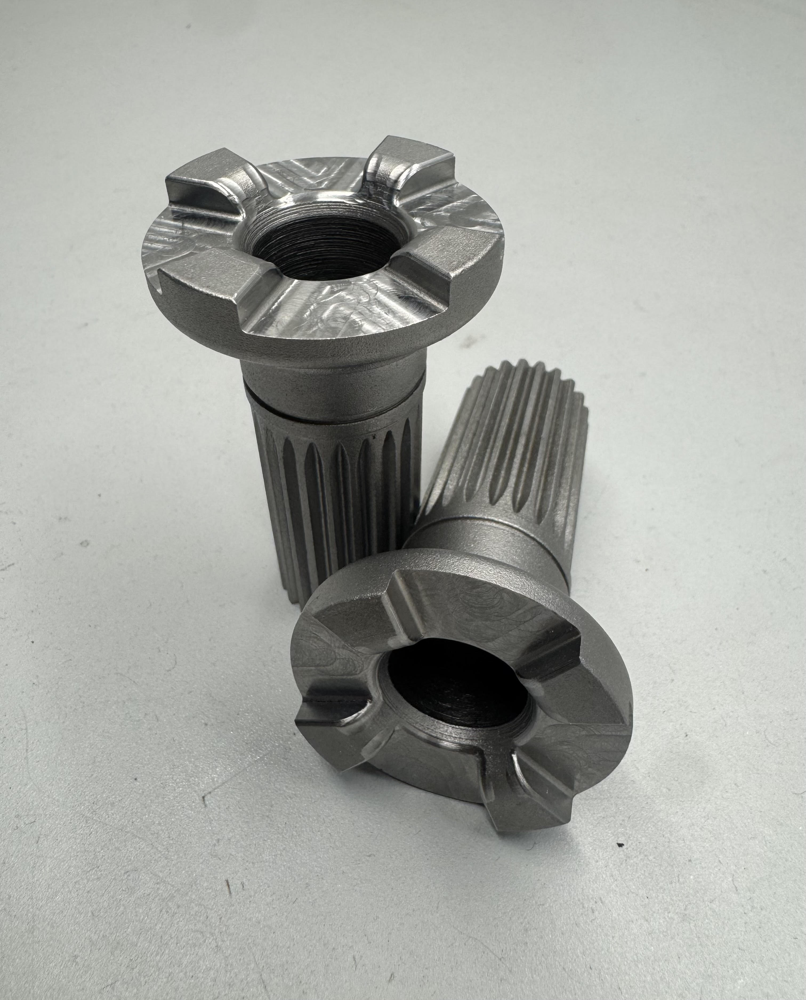 |
| Sprag or roller one-way clutch | Automatic transmissions, starter drives and hybrid power paths | Automatically locks in one direction and freewheels in the other with little control hardware | Direction-specific; wedging geometry, race hardness and tolerances are difficult to manufacture[^30] | 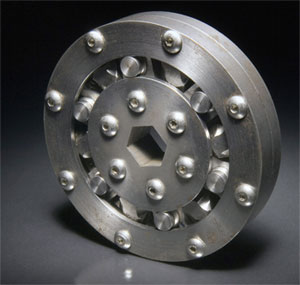 |
| Electromagnetic friction clutch | Engine-driven accessories, pumps, compressors and remotely controlled disconnects | Fast electrical control with no mechanical linkage; easy to switch from a controller | Coil consumes power and produces heat; air gap and friction wear must be controlled[^31] | 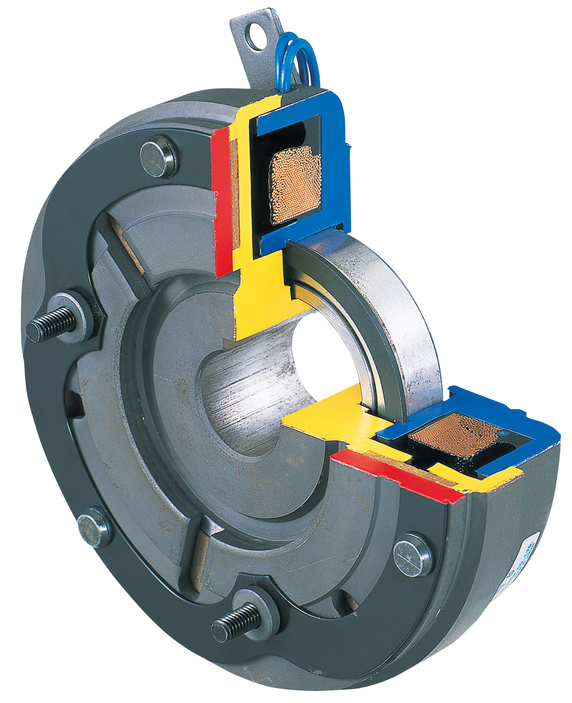 |

#### Part List

##### Main parts in a single-plate automotive clutch

| Main Part | Function |
| --- | --- |
| Flywheel | Provides the engine-side friction surface and rotational inertia |
| Clutch disc, friction linings and splined hub | Carries torque to the gearbox input shaft while permitting axial release |
| Torsional damper springs | Filter engine torque pulses and driveline shock |
| Pressure plate and clutch cover | Clamp the disc to the flywheel |
| Diaphragm spring | Supplies clamp load and acts as the release lever system |
| Release bearing and guide tube | Apply axial force to the diaphragm while allowing rotation |
| Release fork, pedal and cable or hydraulic cylinders | Carry the driver's command to the release bearing |
| Pilot bearing and gearbox input shaft | Support and align the driven shaft |

##### Teaching demonstrator

| Make (3D print / laser cut) | Buy |
| --- | --- |
| Enlarged flywheel, pressure plate, clutch disc and transparent cover | Two steel shafts, bearings/pillow blocks and shaft collars |
| Simplified splined or keyed disc hub | Friction sheet, cork/rubber lining or a small commercial clutch disc |
| Release fork, pedal/hand lever and adjustable pressure-plate guides | Compression springs, thrust bearing, cable and fasteners |
| Colour-coded torsional-damper insert and shaft-speed markers | Hand crank or guarded low-speed geared motor and controllable load |
| Optional interchangeable single- and multi-plate stacks | Clear polycarbonate safety guard and threaded inserts |

#### Teaching Platform

##### 3D printing / manufacturing easiness

- **Simplified single-plate dry clutch — moderate:** large circular parts are easy to print, but the pressure plate must move axially without tilting and the disc must remain centred.
- **Multi-plate dry stack — moderate:** plates are simple, but flatness, alternating tabs and controlled stack clearance matter.
- **Wet multi-plate clutch — hard:** it needs a sealed oil housing, compatible friction material, lubrication and heat management.
- **Centrifugal clutch — moderate to hard:** pivots and shoes are straightforward, but spring selection, balance, engagement speed and containment require care.
- **Dog clutch — easy to moderate:** printable at enlarged scale, but the sleeve needs enough lead-in chamfer and axial travel to engage fully.
- **One-way or electromagnetic clutch — moderate to hard:** a low-load visual model is possible, but realistic sprags, hardened races, magnetic air gaps and heat management are specialist work.
- A real vehicle clutch requires heat-resistant lining, accurately ground surfaces, controlled clamp load and high-speed balance; printed parts are suitable only for a guarded low-speed model.

##### Demonstratability

- The recommended dry model needs **no external fluid**. Turn the input shaft by hand, clamp the disc, and show both shafts rotate together; pull the release lever and show the input turn while the output stops.
- Mark both shafts to make slip, engagement and relative speed visible. An adjustable spring preload can demonstrate the relationship between clamp force and torque capacity.
- Apply a small controllable output load to show why partial engagement slips and generates heat, but keep speed and contact temperature low.
- A wet clutch requires oil and a leak-proof case. A centrifugal clutch requires a motor, speed controller, tachometer and strong transparent guard.
- An enlarged dog clutch and a one-way roller analogy can both be turned by hand with no external fluid. An electromagnetic model additionally needs a current-limited low-voltage supply.
- Do not touch rotating parts or use an unguarded printed flywheel, shoe or pressure plate.

##### Works with what

- **Input side:** engine crankshaft, flywheel and usually a pilot bearing.
- **Output side:** splined gearbox input shaft, transmission gears and the rest of the drivetrain.
- **Release system:** pedal plus cable, or master/slave hydraulic cylinders, release fork and release bearing.
- **Supporting systems:** bellhousing, bearings, mounts and sometimes a dual-mass flywheel.
- **Automated systems:** clutch actuator, transmission control unit and shaft-speed/temperature sensing; a DCT needs two clutches and two gear-train input paths.
- **Special mechanisms:** a dog clutch needs matched shaft speeds or a synchronizer; a one-way clutch needs hardened concentric races; an electromagnetic clutch needs a coil driver and electrical supply.

##### CAD easiness

- **Easy:** non-functional exploded display, flat clutch disc and simple flywheel.
- **Moderate:** moving single-plate model with pressure-plate guides, release lever, keyed hub and adjustable spring preload.
- **Moderate to hard:** multi-plate stack or centrifugal shoes with realistic clearances and balance.
- **Moderate:** enlarged dog-clutch teeth and sliding sleeve; **hard:** sprag geometry or electromagnetic flux/thermal design at realistic scale.
- **Very hard:** vehicle-grade diaphragm-spring geometry, friction/thermal design, torsional damper, spline standards, fatigue life and high-speed containment.

##### Recommended clutch demonstrator

Build a large, guarded **single-plate dry clutch** with two supported shafts, a spring-loaded pressure plate and a hand-operated release fork. Use visible shaft marks and adjustable clamp load. It clearly demonstrates engaged, slipping and disengaged states without oil, hydraulics or specialist tools.

---

### Brakes and Clutches: Sources and Image Credits

#### Technical sources

[^8]: Brembo, [Brake caliper technology and operation](https://www.bremboparts.com/america/en/support/car/insights/brake-caliper-technology-and-operation-324333), describing hydraulic pressure, pistons, pads, rotors and fixed/floating calipers.
[^9]: Continental, [Drum Brakes](https://www.continental-automotive.com/en/components/brake-systems/drum-brakes.html), describing hydraulic wheel-cylinder actuation of brake shoes against a drum.
[^10]: Bosch Mobility, [Regenerative braking systems](https://www.bosch-mobility.com/en/solutions/driving-safety/regenerative-braking-systems/), explaining motor-generator energy recovery and the continuing role of friction brakes.
[^11]: MIT 2.972, [Clutch](https://web.mit.edu/2.972/www/reports/clutch/clutch.html), explaining engagement of the friction disc between flywheel and pressure plate.
[^12]: ZF, [Clutch Systems](https://www.zf.com/products/en/cv/products_65885.html), describing diaphragm-spring clamp load, the clutch disc and torsional vibration damping.
[^27]: ZF, [Engine Driven Compressors](https://www.zf.com/products/en/cv/products_64626.html), explaining that compressors generate pressurised air for commercial-vehicle braking and other pneumatic systems.
[^28]: Continental, [EPB-Si Electric Parking Brake](https://www.continental-automotive.com/en/components/brake-systems/drum-brakes/epb-si.html), explaining switch control and electromechanical actuators that build parking-brake clamp force.
[^29]: Schaeffler, [Hybrid Transmission](https://www.schaeffler.com/remotemedien/media/_shared_media/08_media_library/01_publications/schaeffler_2/symposia_1/downloads_11/schaeffler_kolloquium_2018_en.pdf), showing a dog clutch used to connect or separate a hybrid-transmission variator from the wheel side.
[^30]: BorgWarner, [Transmission Technologies](https://www.borgwarner.com/technologies/transmission-technologies), describing cam, roller and sprag one-way clutches for transmissions and engine start-stop systems.
[^31]: Ogura Industrial, [Electromagnetic Clutches and Brakes](https://ogura-clutch.com/), documenting electrically controlled friction-clutch products for mobile and engine-driven applications.

#### Image credits

- [Hydraulic disc brake diagram](https://commons.wikimedia.org/wiki/File:Hydraulic_disc_brake_diagram.gif) by KDS444, CC BY-SA 3.0.
- [Drum-brake arrangements](https://commons.wikimedia.org/wiki/File:Tipologia_tamburo.svg) by A7N8X, CC BY-SA 4.0.
- [Electric car diagram](https://commons.wikimedia.org/wiki/File:Electric_car_diagram.svg) by Ian Furst, CC BY-SA 4.0.
- [Single-plate diaphragm clutch](https://commons.wikimedia.org/wiki/File:Embrague2.png) by Enrique A. Chaparro, Free Art License.
- [Multiple Disk Clutch](https://commons.wikimedia.org/wiki/File:Multiple_Disk_Clutch.gif) by Oguraclutch, public domain.
- [Centrifugal clutch patent drawing](https://commons.wikimedia.org/wiki/File:US_Patent_598314_detail_centrifugal_clutch.png) by W. A. Crowdus, public domain.
- [Air brake system components and location](https://www.dmv.ca.gov/portal/handbook/commercial-driver-handbook/section-5-air-brakes/) from the California Department of Motor Vehicles Commercial Driver's Handbook.
- [Volkswagen electric parking-brake caliper](https://www.bitautomobile.com/vw-electric-brake-caliper-3c0615404b-product/) product photograph from BIT Automobile.
- [Dog clutch used in a Baja SAE four-wheel-drive system](https://commons.wikimedia.org/wiki/File:Dog_Clutch.jpg) by Ael150, CC0.
- [Sprag one-way bearing](https://commons.wikimedia.org/wiki/File:Sprag_one-way_bearing.jpg) by NASA Goddard Space Center, public domain.
- [Ogura electromagnetic clutch cutaway](https://commons.wikimedia.org/wiki/File:A-2_Ogura_VCEH_clutch.jpg) by Oguraclutch, CC BY-SA 3.0 / GFDL.

---

# Drivetrain Layouts

#### What it is
##### Description
A steering system is a set of linkages and gears with one input shaft (the steering column) and two output motions (the left and right front wheels), which converts the rotational motion of the steering wheel into a change in the steering angle of the road wheels.
- In cars, the steering system allows the driver to change the direction of travel. The driver rotates the steering wheel, and through the steering gear and the steering linkage, the front wheels turn left or right.

Youtube: [Understanding your Car's Steering & Power Steering !](https://www.youtube.com/watch?v=em1O8mz7sF0) 3:00-6:40

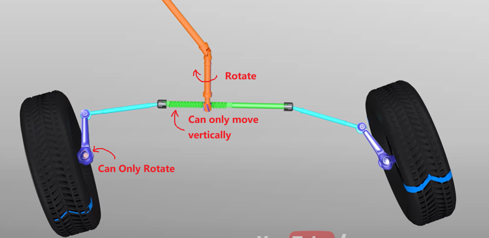

##### Types of Steerings

| Steering Type                  | Common Use                   | Advantage                                                    | Disadvantage                                            | Image                                                |
| ------------------------------ | ---------------------------- | ------------------------------------------------------------ | ------------------------------------------------------- | ---------------------------------------------------- |
| Rack-and-pinion                | Most passenger cars          | Simple; few parts; direct feel; easy to add power assistance | Limited maximum steering angle; wears under high loads  |  |
| Recirculating ball             | Trucks, off-road, older cars | Low friction; long life; high gear ratio for heavy vehicles  | Complex; many parts; bulky; internal motion not visible |  |
| Hydraulic power steering (HPS) | Older passenger cars, trucks | High assist force; good road feel                            | Needs pump, fluid, hoses, seals; leaks; engine-driven   |  |
| Electric power steering (EPS)  | Modern passenger cars        | No fluid; engine-independent; tunable assist                 | Needs motor, ECU, sensors; complex control              |  |
##### Part List

| Make (3D print / laser cut)               | Buy                                      |
| ----------------------------------------- | ---------------------------------------- |
| Steering gear housing / case              | Pinion and rack (small gear set)         |
| Steering column mounts, dashboard bracket | Ball bearings for pinion and rack ends   |
| Tie rod ends (simple clevis type)         | Ball joints / spherical rod ends         |
| Steering knuckle (if not bought)          | Steel shafts (steering column, tie rods) |
| Wheel hubs, axle mounts                   | Fasteners, set screws, grease            |
| Chassis mounting plate                    | Steering wheel (or make a simple one)    |
##### Teaching Platform
**Manufacture**

- 3D printed gears for the rack-and-pinion are possible, but the pinion and rack mesh must be accurate. If printed too small, the teeth wear quickly and the steering feels loose. A bought pinion-and-rack set is more reliable.
- The steering knuckle and tie rods can be 3D printed or laser cut, but they carry bending loads. Use thicker sections or steel inserts at the pivot points.
- Ball joints and rod ends should be bought, not printed. They need to rotate freely in multiple axes and take both push and pull loads.
- Otherwise it is mostly simple 3D printing and laser cutting for the housing, brackets, and mounting plates.

**Demonstratability**

- No need for external tools. Can be powered by hand or by a small electric motor.
- Easy to see in action:
    - Turn the steering wheel: the rack moves sideways and the front wheels turn left or right.
    - Turn the wheel fully left and fully right: the inner wheel and outer wheel turn by different angles (Ackermann effect).
    - Hold one wheel fixed and turn the steering wheel: the other wheel still moves, showing the linkage motion.
    - Push the steering wheel to full lock: the rack stops, showing the travel limit.

Works with what
- **Gearboxes / transmissions / torque converters**: no direct link. The steering system is driven by the driver, not by the transmission. But in FWD cars, the steering knuckle must fit around the transaxle and the CV half shafts, so the gearbox layout affects the steering geometry.
- **Couplings, drive shafts, CV shafts**: in FWD cars, the front wheels both steer and drive, so the half shafts must use CV joints to allow the wheels to turn while transmitting torque. In RWD cars, the front wheels only steer, so no CV shafts are needed at the front.
- **Differentials**: in FWD cars, the differential is usually in the same housing as the transaxle, and the CV half shafts pass through the steering knuckle. In RWD cars, the differential is at the rear and has no direct link to the steering system.
- **Transfer cases**: in AWD and 4x4 vehicles, the front axle still steers, so the front differential and CV shafts must fit around the steering linkage and control arms. The transfer case itself has no direct link to the steering.
- **Brakes and clutches**: the brake caliper and disc mount on the steering knuckle, so the knuckle must carry both steering loads and braking torque. The steering column is separate from the clutch and brake pedals, but the driver uses all three together.
- **Steering and suspension**: the steering knuckle and tie rod connect directly to the suspension upright. The suspension geometry (camber, caster, kingpin inclination, bump steer) determines how the wheel behaves as it steers and moves up and down.
- **FWD**: the steering knuckle also carries the drive shaft and CV joint, so it is more complex. The steering rack is often mounted behind the engine, and the tie rods connect to the knuckle at a point that must clear the CV boot.
- **RWD**: the steering knuckle only carries the wheel hub and brake, so it is simpler. The steering rack can be mounted in front of or behind the front axle line, depending on the suspension layout.
- **AWD**: the front axle still steers, so the front differential and CV shafts must fit around the steering linkage. The steering system is the same as FWD at the front, with the rear axle driven separately.
- **4x4**: same as AWD at the front. In off-road use, the steering system must handle larger wheel travel and higher loads, so the tie rods and ball joints are usually stronger.
- **Single-motor, single-axle EV**: if the motor drives the front axle, the layout is the same as FWD, with CV shafts through the steering knuckle. If it drives the rear axle, the front wheels only steer, so the layout is the same as RWD.
- **Dual-motor, single-axle EV**: same as single-motor, single-axle. The steering system is unchanged; the motors only affect the drivetrain.
- **Dual-motor, dual-axle EV**: each axle can drive independently, but the front wheels still steer. The steering system is still needed for the front wheels, and the front knuckles must accommodate both steering and drive.
- **Torque vectoring**: independent motors or torque vectoring differentials can change wheel speed left and right, but they do not replace the steering system. Steering still sets the wheel angle; torque vectoring only adjusts the yaw moment after the wheels are turned.
- **ABS and traction control**: these systems brake individual wheels, but they do not steer. The steering system remains the driver's main directional control. ABS and traction control work best when the steering geometry is correct and the tires maintain contact with the road.
### Suspension
#### What it is
##### Description
A suspension system is a set of springs, dampers, and linkages with one connection to the chassis (or frame) and one connection to each wheel, which allows the wheels to move up and down relative to the body while keeping the tires in contact with the road.

- In cars, the suspension system serves three main functions: supporting the vehicle weight, absorbing road impacts, and controlling wheel motion so the tires stay planted. 

The working principle relies on two components working together:

- **Springs** absorb the energy from road impacts by compressing and extending. They store this energy temporarily but do not dissipate it — a spring alone would bounce forever.
    
- **Dampers (shock absorbers)** convert the spring‘s oscillation energy into heat through hydraulic resistance. They control the rate at which the spring returns to its resting position, preventing endless bouncing.
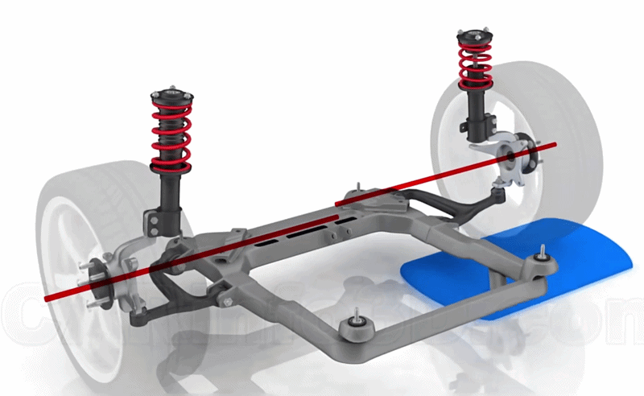
##### Types of Suspension

| Suspension Type           | Common Use                             | Advantage                                                              | Disadvantage                                                       | Image                                                |
| ------------------------- | -------------------------------------- | ---------------------------------------------------------------------- | ------------------------------------------------------------------ | ---------------------------------------------------- |
| MacPherson strut          | Most passenger car front suspensions   | Simple; compact; low cost; light weight                                | Limited camber control; poor lateral stiffness under cornering     |  |
| Double wishbone           | Performance cars, SUVs, FSAE race cars | Excellent camber control; high lateral rigidity; precise steering feel | Complex; more parts; higher cost; requires careful geometry design |  |
| Multilink                 | Luxury car rear suspensions            | Excellent ride comfort; good handling; adjustable alignment            | Very complex; large space requirement; high cost                   |  |
| Trailing arm / twist beam | Budget car rear suspensions            | Simple; low cost; compact; durable                                     | Wheels are not fully independent; limited ride quality             |  |
##### Types of Springs

| Spring Type               | Common Use                                        | Advantage                                                                   | Disadvantage                                                                | Image                                                |
| ------------------------- | ------------------------------------------------- | --------------------------------------------------------------------------- | --------------------------------------------------------------------------- | ---------------------------------------------------- |
| Coil spring               | Most passenger car suspensions                    | Simple; compact; wide range of rates; easy to replace; cheap                | Carries only vertical load; needs separate location linkage                 |  |
| Leaf spring               | Trucks, older RWD cars, trailers                  | Simple; carries load and locates the axle; cheap; durable                   | Heavy; poor ride comfort; limited geometry control; friction between leaves |  |
| Torsion bar               | Some trucks, older cars, performance applications | Compact; adjustable ride height via anchor bolt; no coil bind               | Needs a reaction point; limited travel; harder to package                   |  |
| Air spring                | Luxury cars, buses, trucks, some SUVs             | Adjustable ride height and stiffness; excellent load levelling; smooth ride | Needs compressor, air lines, valves; leaks; complex control                 |  |
##### Part List

|Make (3D print / laser cut)|Buy|
|---|---|
|Upper and lower control arms (A-arms)|Coilover springs and dampers|
|Steering knuckle / upright|Ball joints (spherical rod ends)|
|Chassis mounting brackets|Steel shafts (arm pivots)|
|Arm bushings / spacers|Fasteners, bolts, nuts|
|Wheel hub adapters|Wheel bearings (if using real wheels)|
##### Teaching Platform
**Manufacture**
- 3D printed control arms are possible, but they carry bending and buckling loads. Use thick cross-sections, print orientation along the load path, and consider steel inserts at the ball joint mounting points.
- The steering knuckle is a highly stressed part — it carries both suspension loads and steering loads. 3D printed plastic may work for a hand-operated demo but should be over-designed.
- Ball joints and rod ends should be bought, not printed. They need to rotate freely in multiple axes and withstand repeated cycling without loosening.
- Otherwise it is mostly simple 3D printing and laser cutting for the brackets, spacers, and mounting plates.
**Demonstratability**
- No need for external tools. Can be operated by hand or with a simple fixture.
- Easy to see in action:
    - Push one wheel up: the spring compresses, the damper resists, and the upper and lower arms pivot.
    - Watch the camber angle: as the wheel moves up, the top of the wheel tilts inward or outward depending on the arm lengths.
    - Compare left and right sides: pushing one wheel does not affect the other (independent suspension).
    - Compress and release: the damper prevents the spring from bouncing endlessly.
**Works with what**
- **Gearboxes / transmissions / torque converters**: no direct link. The suspension holds the wheels and the drivetrain, but the transmission itself does not connect to the suspension. However, the weight of the gearbox affects the sprung mass and therefore the spring and damper tuning.
- **Couplings, drive shafts, CV shafts**: in FWD and AWD cars, the front suspension must accommodate the CV half shafts, which pass through the steering knuckle and move with the suspension. The suspension travel must not pull the CV joint apart or cause the shaft to bind.
- **Differentials**: in RWD cars, the rear differential is mounted on the chassis or the axle, and the suspension must control the axle position. In FWD cars, the differential is in the transaxle, and the CV shafts connect to the front hubs through the suspension.
- **Transfer cases**: in AWD and 4x4 vehicles, the transfer case sends drive to the front and rear axles. Each axle has its own suspension, and the suspension must allow enough wheel travel for off-road use without causing the drive shafts to bind or the CV joints to over-angle.
- **Brakes and clutches**: the brake caliper mounts on the steering knuckle or upright, so the suspension must carry braking torque as well as suspension loads. Brake dive and squat are controlled by the springs and dampers. The clutch is unrelated to the suspension.
- **Steering and suspension**: the steering knuckle and tie rod connect directly to the suspension upright. The suspension geometry (camber, caster, kingpin inclination, roll center) affects steering feel, returnability, and bump steer. The steering rack is usually mounted on the chassis or subframe, and the tie rods must follow the suspension motion without binding.
- **FWD**: the front suspension must accommodate both steering and drive, so the knuckle is complex and the CV shafts must pass through it. The rear suspension is often simpler (twist beam or multilink) because it only carries the load.
- **RWD**: the front suspension only steers, so the knuckle is simpler. The rear suspension carries the drive axle, so it must control axle position under acceleration and braking. Double wishbone or multilink rear suspensions are common in performance cars.
- **AWD**: both front and rear suspensions carry drive loads, so both knuckles (or uprights) need provisions for CV joints. The suspension must allow enough travel for all four wheels to stay in contact with the road.
- **4x4**: the suspension must handle large wheel travel and high loads. Solid axles are common at the rear (and sometimes the front) because they are strong and simple, but they give a harsher ride and less precise geometry than independent suspension.
- **Single-motor, single-axle EV**: the suspension layout matches the equivalent FWD or RWD setup. The battery weight is low and central, so the springs are often stiffer to handle the extra mass and keep ride height consistent.
- **Dual-motor, single-axle EV**: same as single-motor, single-axle. The suspension is unchanged; the motors only affect the drivetrain.
- **Dual-motor, dual-axle EV**: each axle has its own motor, but the suspension geometry remains similar. The extra weight of the motors may require stiffer springs and dampers.
- **Torque vectoring**: independent motors can change wheel speed left and right, but the suspension still controls wheel position and camber. Torque vectoring works best when the suspension keeps the tires flat on the road.
- **ABS and traction control**: these systems rely on consistent tire contact, which depends on proper suspension function. Worn dampers or bushings degrade ABS and traction control performance because the wheel can lose contact with the road under braking or acceleration.
# Drivetrain Layouts

## Front-Wheel Drive

## Rear-Wheel Drive
### What it is
##### Description
Rear-wheel drive (RWD) is a drivetrain layout in which the engine drives the rear wheels only, while the front wheels are free to steer. The most common form is front-engine, rear-wheel drive (FR).

**How it works (roughly):**
Engine → clutch/torque converter → gearbox → propshaft → rear differential → half shafts → rear wheels
- The engine produces torque.
- The clutch or torque converter connects the engine to the gearbox.
- The gearbox changes speed and torque ratio.
- The propshaft carries torque from the gearbox to the rear differential, using universal joints to handle suspension movement.
- The rear differential turns the drive 90° and allows the left and right rear wheels to rotate at different speeds when cornering.
- The half shafts carry torque from the differential to the rear wheels.

**Why a car needs it:**
RWD separates steering from driving: the front wheels only steer, the rear wheels only drive. This lets each pair be optimised for its job — front for cornering feel, rear for acceleration traction. Under acceleration, weight transfers to the rear, which helps RWD put power down. It also avoids **torque steer**, a problem in high-power FWD cars.
The trade-off is extra weight, cost, a centre tunnel that takes cabin space, and worse traction in snow or mud compared to FWD or AWD.
##### Types of RWD Layouts

| RWD Layout            | Common Use                                      | Advantage                                                | Disadvantage                                            | Image                                                |
| --------------------- | ----------------------------------------------- | -------------------------------------------------------- | ------------------------------------------------------- | ---------------------------------------------------- |
| Front-engine RWD (FR) | Most classic sports cars, sedans, pickup trucks | Good weight distribution; simple layout; easy to service | Long propshaft; heavy; centre tunnel takes cabin space  | .png)        |
| Mid-engine RWD (MR)   | Supercars, some sports cars                     | Excellent weight distribution; sharp handling            | Very little cargo or rear seat space; complex packaging |  |
| Rear-engine RWD (RR)  | Porsche 911, some city cars, buses              | Compact drivetrain; good traction under acceleration     | Rear-biased weight; tricky handling at the limit        |  |
| Solid axle RWD        | Trucks, muscle cars, some SUVs                  | Strong; simple; cheap; good for heavy loads              | Heavy; poor ride comfort; limited geometry control      |                                                      |
| Independent rear RWD  | Modern sports cars, luxury sedans               | Better ride and handling; precise camber control         | More complex; more parts; higher cost                   |                                                      |
##### Part List

| Make (3D print / laser cut)        | Buy                                               |
| ---------------------------------- | ------------------------------------------------- |
| Chassis / frame                    | Electric motor or small engine                    |
| Motor mounts, gearbox mounts       | Gearbox / transmission (or simple gear reduction) |
| Propshaft bearing supports, mounts | Drive shaft (or steel rod / tube)                 |
| Differential housing / case        | Differential gear set (bevel gears)               |
| Half shaft couplers, wheel hubs    | Bearings, ball joints, fasteners                  |
| Suspension arms, brackets          | Wheels and tires                                  |
#### Teaching Platform
**3D printing / manufacturing easiness:**
- **Easy:** chassis, mounts, brackets, spacers, differential housing — all simple 3D prints or laser-cut parts.
- **Medium:** propshaft and half shafts carry torque. A 3D printed shaft with a steel core works for low-speed demo; a plain plastic shaft may twist or strip.
- **Hard:** differential gear set. Printed bevel gears wear quickly and are difficult to print with good tooth accuracy. Buy a small bevel gear set instead.
**Overall:** easy to manufacture, as long as gears and bearings are bought and only the structure is printed.
**Demonstratability:**
- **External tools / consumables:** none for a hand-operated demo. With an electric motor, only a power supply is needed — no fluids, compressed air, or special gases.
- **Intuitive to demonstrate:** yes. The power flow is visible:
    - Run the motor: propshaft spins, differential turns the half shafts, rear wheels rotate.
    - Hold one rear wheel: the other spins twice as fast (open differential).
    - Hold the propshaft and turn one wheel: the other turns in the opposite direction.
    - Put one wheel on a low-friction surface: the free wheel spins and the car does not move.
    - Compare with a locked differential: both wheels turn together, but the car cannot corner smoothly.
**Works with what (what else must be included):**
- **Gearboxes / transmissions / torque converters**: the gearbox changes speed and torque ratio; its output goes to the propshaft. A clutch or torque converter connects the engine.
- **Couplings, drive shafts, CV shafts**: the propshaft carries torque from the gearbox to the rear differential. The half shafts carry torque from the differential to the rear wheels; independent rear suspension needs CV joints.
- **Differentials**: the rear differential is the core of the RWD layout. It turns the drive 90° and allows the rear wheels to rotate at different speeds.
- **Transfer cases**: not used in pure RWD. Only needed in AWD or 4x4.
- **Brakes and clutches**: the clutch connects the engine to the gearbox in a manual RWD car. The brakes mount on the rear knuckles or axle ends.
- **Steering and suspension**: the front wheels only steer, so the front knuckle is simpler than in FWD. The rear suspension must control the rear axle position under acceleration and braking.
- **FWD**: not applicable. RWD and FWD are different layouts.
- **RWD**: the layout described here.
- **AWD**: can be based on a RWD layout, with a transfer case or centre coupling that also sends torque to the front axle.
- **4x4**: usually based on a RWD layout with a transfer case that can engage the front axle.
- **Single-motor, single-axle EV**: if the motor drives the rear axle, the layout is similar to RWD but without engine, clutch, gearbox, or propshaft.
- **Dual-motor, single-axle EV**: two motors drive the same axle, one per wheel, so no mechanical differential is needed.
- **Dual-motor, dual-axle EV**: one motor per axle. No centre differential is needed, but each axle still needs its own differential or independent motors.
- **Torque vectoring**: in RWD, done with a torque vectoring differential or independent rear motors.
- **ABS and traction control**: these systems brake individual wheels to control slip. In RWD, traction control is important because the rear wheels can lose grip under acceleration.
## All-Wheel Drive

#### What it is
##### Description
All-wheel drive (AWD) is a drivetrain layout in which all four wheels can receive engine torque. Unlike 4x4, AWD is usually designed for on-road use and can vary the torque split between the front and rear axles automatically.

**How it works (roughly):**
Engine → clutch/torque converter → gearbox → centre coupling or centre differential → front and rear differentials → half shafts → all four wheels

In many modern AWD cars, the centre coupling is normally disengaged or sends most torque to one axle, and only sends torque to the other axle when slip is detected. This saves fuel compared to permanent AWD.

**Why a car needs it:**
AWD improves traction by driving all four wheels instead of two. On low-grip surfaces (rain, snow, gravel), more driven wheels means more grip for acceleration and less wheelspin. This helps everyday driving in bad weather and lets high-power cars put power down without spinning.

The trade-off is extra weight, cost, complexity, and slightly higher fuel consumption compared to FWD or RWD.
##### Types of AWD Layouts

| AWD Layout           | Common Use                             | Advantage                                                           | Disadvantage                                                       | Image                                                |
| -------------------- | -------------------------------------- | ------------------------------------------------------------------- | ------------------------------------------------------------------ | ---------------------------------------------------- |
| Part-time AWD        | Some SUVs and crossovers               | Simple; saves fuel when not needed                                  | Only engages when slip is detected; reactive rather than proactive |  |
| Full-time AWD        | Subaru, Audi Quattro, some luxury cars | Always drives all four wheels; consistent traction                  | More complex; higher fuel consumption                              |  |
| Torque-vectoring AWD | High-performance cars                  | Can send more torque to the outside wheel to help turn              | Very complex; expensive                                            |                                                      |
| Hybrid AWD           | Some hybrid and electric cars          | No mechanical centre coupling; rear axle driven by a separate motor | Only works when the motor has power; limited continuous output     |                                                      |
 Note: For a teaching platform, **part-time AWD with a simple centre coupling** is the easiest to build and demonstrate.
##### Part List

|Make (3D print / laser cut)|Buy|
|---|---|
|Chassis / frame|Electric motor or small engine|
|Motor mounts, gearbox mounts|Gearbox / transmission (or simple gear reduction)|
|Centre coupling housing, mounts|Centre coupling or centre differential|
|Front and rear differential housings|Differential gear sets (bevel gears)|
|Propshaft supports, half shaft couplers|Drive shafts, bearings, fasteners|
|Suspension arms, brackets|Wheels and tires|
#### Teaching Platform

**3D printing / manufacturing easiness:**
- **Easy:** chassis, mounts, brackets, differential housings — all simple 3D prints or laser-cut parts.
- **Medium:** propshafts and half shafts carry torque. A 3D printed shaft with a steel core works for low-speed demo.
- **Hard:** differential gear sets and the centre coupling. Printed gears wear quickly; buy these instead.

**Overall:** more parts than RWD or FWD, but each part is still simple. The main challenge is fitting two differentials and a centre coupling into the chassis.

**Demonstratability:**
- **External tools / consumables:** none for a hand-operated demo. With an electric motor, only a power supply is needed.
- **Intuitive to demonstrate:** yes, but more complex than RWD:
    - Run the motor: all four wheels rotate.
    - Hold one wheel: the others keep turning, and the centre coupling sends more torque to the axle with grip.
    - Compare with RWD: with only two driven wheels, one wheel losing grip can stop the car. With AWD, the other axle still drives.
    - Show the centre coupling: with it locked, front and rear axles turn together; with it open, they can turn at different speeds.
**Works with what (what else must be included):**
- **Gearboxes / transmissions / torque converters**: the gearbox output goes to the centre coupling or centre differential, not directly to one axle.
- **Couplings, drive shafts, CV shafts**: AWD needs a propshaft to the rear axle and half shafts to all four wheels. If the front wheels steer, the front half shafts need CV joints.
- **Differentials**: AWD needs at least two differentials — one on each axle — plus a centre coupling or centre differential to split torque between them.
- **Transfer cases**: in a 4x4, the transfer case does the same job as the centre coupling but is usually selectable and has a low-range gear. AWD is essentially a permanent or automatic version of this.
- **Brakes and clutches**: the clutch connects the engine to the gearbox. The brakes mount on all four knuckles or axle ends.
- **Steering and suspension**: the front wheels steer and drive, so the front knuckles need CV joints and must fit around the steering linkage.
- **FWD**: not applicable. AWD drives all four wheels.
- **RWD**: an AWD car can be based on a RWD layout with an added front drive system.
- **AWD**: the layout described here.
- **4x4**: similar layout, but the transfer case is selectable and often has a low range. 4x4 is designed for off-road use; AWD is designed for on-road use.
- **Single-motor, single-axle EV**: not applicable. An AWD EV needs at least two motors, or one motor with a mechanical centre coupling.
- **Dual-motor, single-axle EV**: not applicable. Both motors drive the same axle.
- **Dual-motor, dual-axle EV**: one motor per axle. This is the electric equivalent of AWD, with no mechanical centre coupling needed.
- **Torque vectoring**: in AWD, torque vectoring can send more torque to the outside wheel to help the car turn. It can be done with a special centre coupling or with independent motors.
- **ABS and traction control**: these systems brake individual wheels to control slip. In AWD, traction control works with the centre coupling to send torque to the axle with grip.

**How easy is it to design / CAD:**
- **Modeling difficulty:** medium to high. The layout needs careful alignment: propshaft in line with gearbox output and rear differential pinion; front differential aligned with the front half shafts; centre coupling positioned between the gearbox and both axles.
- **Assembly complexity:** high. More parts than RWD or FWD, and the centre coupling adds a step. The front axle must accommodate both steering and drive.
- **Availability of standard parts:** good. Small motors, gearboxes, differential gear sets, centre couplings, bearings, shafts, and wheels are available from hobby suppliers.
- **CAD tips:** model the chassis first, place the motor and gearbox as reference components, then position the centre coupling and both differentials. Use the propshafts as alignment axes, and keep the front and rear axles parallel.

## 4x4 (4-Wheel) Drive

### What it is
#### Description
A 4x4 (four-wheel drive, 4WD) is a drivetrain layout where the engine can drive all four wheels. It is built mainly for off-road and low-grip driving.
- **4x4 vs AWD:** a 4x4 usually has a transfer case, lets the driver pick 2WD or 4WD, and has a low range. AWD is always on and is tuned for grip on the road, not for off-road use.
- Power flow: engine → transmission → transfer case → front and rear drive shafts → front and rear differentials → half shafts → wheels.
- Most 4x4s drive only the rear wheels in normal driving (2H). The front axle is added when needed (4H), and the low range (4L, typically about 2:1 to 4:1) gives much more torque at the wheels for steep, slow off-road driving.
- **Why it exists:** off-road, one or more wheels often lose grip (mud, snow, loose rock, a wheel in the air). Driving both axles, and locking the differentials, keeps the vehicle moving as long as some wheels still have grip.
In a common configuration:
- Layout (part-time 4x4):
	- 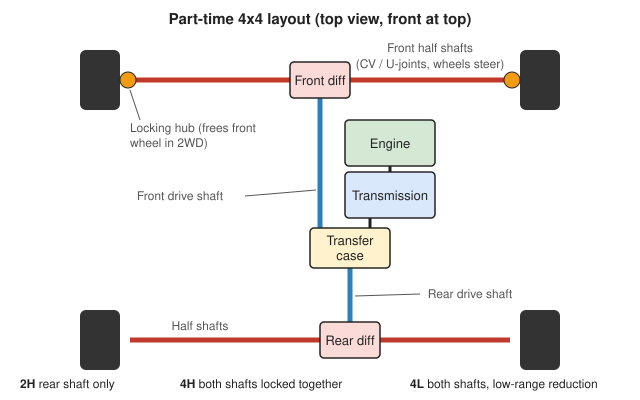
	- The transfer case sits behind the transmission. In 2H only the rear drive shaft turns. In 4H the transfer case locks the front drive shaft to the rear one, so both axles turn at the same speed. Locking hubs on the front wheels connect or disconnect the wheels from the front axle.
##### Types of 4x4 Systems

| 4x4 System Type                      | Common Use                                                                    | Advantage                                                                                                        | Disadvantage                                                                                                 | Image                                       |
| ------------------------------------ | ----------------------------------------------------------------------------- | ---------------------------------------------------------------------------------------------------------------- | ------------------------------------------------------------------------------------------------------------ | ------------------------------------------- |
| Part-time 4WD                        | Most 4x4 pickups and off-roaders (e.g. Jeep Wrangler, Toyota Tacoma)          | Simple and strong; axles locked together for maximum off-road traction; runs as RWD on the road to save fuel     | No center differential, so 4WD can't be used on dry pavement (driveline windup); driver has to pick the mode |     |
| Full-time 4WD                        | e.g. Toyota Land Cruiser, Mercedes G-Class, Jeep Grand Cherokee (Quadra-Trac) | Centre differential lets 4WD run on any surface; centre diff can be locked for off-road                          | Always driving both axles, so more drivetrain losses; open centre diff needs locking or traction control     |     |
| Automatic / on-demand 4WD (4A)       | Full-size pickups (e.g. Ford F-150 "4A", Chevrolet Silverado "Auto")          | Runs RWD until the rear slips, then a clutch in the transfer case sends torque to the front; still has 4H and 4L | Clutch can overheat with heavy use; needs sensors and electronic control                                     |                                             |
| Selectable (part-/full-time)         | e.g. Mitsubishi Pajero (Super Select), Jeep Grand Cherokee (Selec-Trac)       | 2WD, full-time 4WD and locked part-time 4WD all in one vehicle                                                   | More complex and expensive transfer case                                                                     |                                             |
| Manual locking hubs                  | Older 4x4 trucks and SUVs (e.g. Toyota Land Cruiser J60)                      | In 2WD the front axle shafts and differential stop turning: less wear, better fuel economy; simple and robust    | Driver has to get out and turn each hub before using 4WD                                                     | 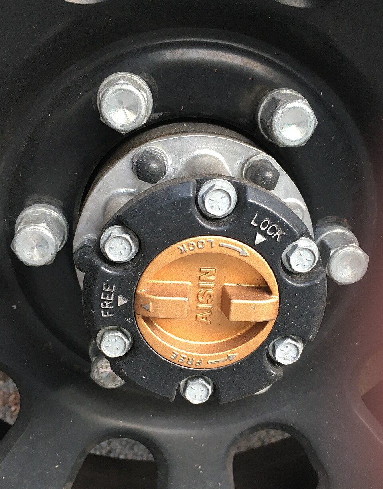         |
| Automatic locking hubs               | 1980s–90s pickups and SUVs (e.g. Mitsubishi Pajero)                           | Lock by themselves when 4WD is selected, no need to leave the vehicle                                            | Often need to drive a short distance (sometimes backward) to lock or unlock; may not lock once already stuck |                                             |
| Axle lockers (locking differentials) | Serious off-roaders (e.g. Jeep Wrangler Rubicon, Mercedes G-Class)            | Both wheels on an axle turn together, so a wheel in the air doesn't stop the vehicle                             | Hard to steer with the front locked; only for slow off-road driving                                          | 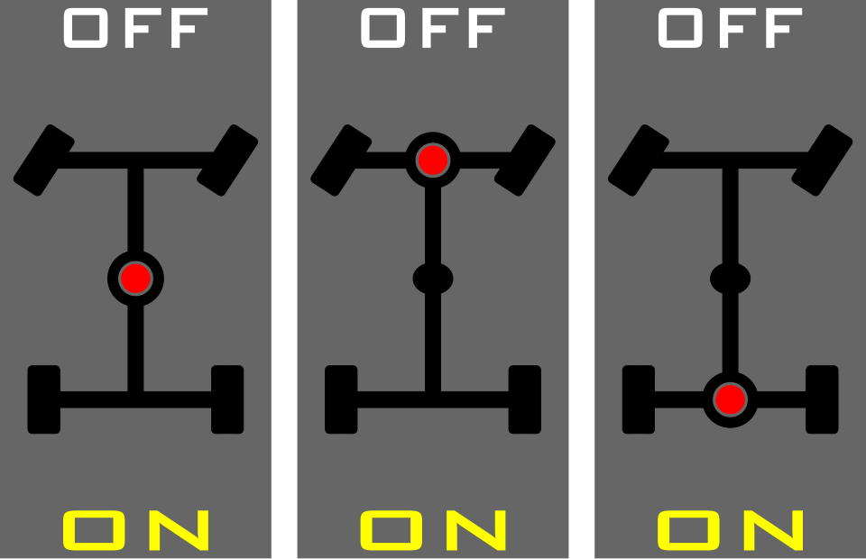 |
##### Part List

| Make (3D print / laser cut)                                   | Buy                                                                   |
| ------------------------------------------------------------- | --------------------------------------------------------------------- |
| Chassis / frame plate (laser cut)                             | Motor + gearbox (or a hand crank) for the "engine"                     |
| Transfer case housing, gears and shift collar                 | Steel shafts for the drive shafts and half shafts                     |
| Front and rear differential housings and gears                | Universal joints for the drive shafts                                 |
| Front steering knuckles / uprights                            | CV joints or small U-joints for the steered front wheels              |
| Locking hub dials (dog clutch between axle and wheel hub)     | Ball bearings, wheels and tires                                       |
| Axle housings, suspension links and mounts                    | Fasteners, set screws, grease (or RC crawler axles and transfer case) |

#### Teaching Platform
Manufacture
- A 4x4 is not a stand-alone system, so it is the transfer case and two differentials put together. 
- The front axle has to both steer and be driven, so it needs CV or universal joints at the knuckles. 
- It is a full vehicle model, so it is bigger than a single component. 
Demonstratability
- No fluids needed; one motor or a hand crank can drive the whole model.
- Easy to see in action:
  - In 2H only the rear wheels are driven; shift to 4H and the front drive shaft and front wheels start turning.
  - Shift to 4L: the wheels turn noticeably slower for the same input. Count turns to measure the low range ratio.
  - Put one wheel on a slippery surface or lift it off the ground: with open differentials the model stops; lock the differentials and it keeps going.
  - In 4H on a grippy surface, steer and push the model: the tires scrub and hop, which shows driveline windup.
  - Unlock the front hubs in 2H: the front wheels roll freely while the front axle stays still.
Works with what
- **Gearboxes / transmissions (incl. CVTs)**: a manual or automatic transmission sits before the transfer case; CVTs are rare in 4x4s because of their torque limit, except in UTVs.
- **Couplings, drive shafts, CV shafts**: needs front and rear drive shafts with universal joints, and CV or universal joints on the front half shafts because the front wheels steer.
- **Differentials**: one on each axle, often with lockers; full-time 4WD also needs a centre differential.
- **Transfer cases**: required, it is the core of the layout (part-time case with 2H/4H/4L).
- **Brakes and clutches**: dog clutches in the transfer case and locking hubs; automatic 4WD uses a clutch pack; the low range gives more engine braking going downhill.
- **Steering and suspension**: the front axle steers and is driven. Solid axles (e.g. Jeep Wrangler) are strong and let the wheels travel far; independent front suspension (most pickups) rides better. Locked 4WD makes tight turns hard on pavement.
- **FWD**: not used, 4x4s are built on a RWD layout.
- **RWD**: a part-time 4x4 in 2H is a RWD vehicle.
- **AWD**: similar hardware, but AWD is always on and usually has no low range; full-time 4WD sits between the two.
- **Single-motor, single-axle EV**: not a 4x4, only one axle is driven.
- **Dual-motor, single-axle EV**: not a 4x4, only one axle is driven.
- **Dual-motor, dual-axle EV**: electric 4x4s (e.g. Rivian R1T) use a motor on each axle instead of a transfer case, and need no low range because motors give full torque from zero speed.
- **Torque vectoring**: some electric 4x4s with a motor per wheel (e.g. Rivian quad-motor) vary torque between wheels to steer and climb.
- **ABS and traction control**: brake-based traction control (e.g. Toyota A-TRAC) brakes a spinning wheel to act like a locker; stability control is often reduced or turned off in 4L.

# EV Configurations

## Single-Motor, Single-Axle (FWD — SM1ST, SM2ST, etc.)

### What it is

#### Description
Single-motor, single-axle is an EV configuration where one electric motor drives one axle. The motor can be mounted on the front axle (FWD) or rear axle (RWD). "SM1ST" typically refers to a single-motor, single-speed transmission layout, while "SM2ST" refers to a single-motor, two-speed transmission layout.

**How it works (roughly):**
Battery → inverter → electric motor → reduction gearbox → differential → half shafts → wheels
- The battery stores energy as DC current. The inverter converts DC to AC and controls motor speed. The electric motor produces torque across a wide speed range (from zero to around 18,000 rpm). A single-speed reduction gearbox (or two-speed in SM2ST) reduces motor speed and multiplies torque. The differential allows left and right wheels to rotate at different speeds when cornering. Half shafts carry torque to the driven wheels.

**Why a car needs it / why it exists:**
This is the simplest and most common EV drivetrain layout. Electric motors have a wide efficient operating range, so a single-speed gearbox is usually enough. A two-speed (SM2ST) improves efficiency but adds complexity and cost.

Compared to dual-motor configurations, single-motor is lighter, cheaper, and simpler. It is used in many mainstream EVs: Tesla Model 3 RWD, Hyundai Ioniq 5 RWD, and Smart #1 all use a single rear motor with a single-speed transmission.
#### Types of Single-Motor Layouts

| Layout               | Common Use                           | Advantage                                           | Disadvantage                                               |
| -------------------- | ------------------------------------ | --------------------------------------------------- | ---------------------------------------------------------- |
| Single-motor FWD     | Entry-level EVs, conversions         | Simple; compact; low cost                           | Traction limits under hard acceleration; torque steer risk |
| Single-motor RWD     | Tesla Model 3, Ioniq 5 RWD, Smart #1 | Better traction under acceleration; no torque steer | Slightly more complex packaging than FWD                   |
| Single-speed (SM1ST) | Most production EVs                  | Simplest; lightest; cheapest; reliable              | Motor operates outside optimal efficiency at some speeds   |
| Two-speed (SM2ST)    | Some performance EVs                 | Better efficiency and acceleration balance          | More complex; added cost and weight                        |
Note: For a teaching platform, **single-motor RWD with single-speed** is the clearest and simplest to demonstrate.
#### Part List

|Make (3D print / laser cut)|Buy|
|---|---|
|Motor mounts, brackets|Electric motor (BLDC or PMSM)|
|Reduction gear housing|Reduction gear set (or buy a complete gearbox)|
|Differential housing / case|Differential gear set (bevel gears)|
|Chassis mounting plate|Bearings, fasteners|
|Wheel hubs, half shaft couplers|Wheels and tires|
#### Teaching Platform
**3D printing / manufacturing easiness:**
- **Easy:** motor mounts, brackets, housings — all simple 3D prints or laser-cut parts.
- **Medium:** the reduction gearbox. A simple spur gear pair can be 3D printed for low-speed demo, but printed gears wear quickly under load.
- **Hard:** the electric motor and differential gear set. Buy these; printed versions are unreliable.
**Overall:** easy to manufacture, as long as the motor and gears are bought and only the structure is printed.
**Demonstratability:**
- **External tools / consumables:** none required. If using an electric motor, only a power supply (battery or bench supply) is needed.
- **Intuitive to demonstrate:** yes. The power flow is simple and visible:
    - Apply power: the motor spins, the reduction gear turns, the differential drives the half shafts, and the wheels rotate.
    - Hold one wheel: the other spins twice as fast (open differential behaviour).
    - Reverse polarity: the motor spins the other way, and the car moves backward.
    - Compare single-speed vs two-speed: if you build an SM2ST, show how shifting changes wheel speed for the same motor rpm.
**Works with what (what else must be included):**
- **Gearboxes / transmissions / torque converters**: not needed in the traditional sense. A single-speed reduction gear replaces the multi-speed gearbox. A two-speed version (SM2ST) adds one shift mechanism.
- **Couplings, drive shafts, CV shafts**: the motor output goes through the reduction gear to the differential, then half shafts to the wheels. If the driven wheels steer (FWD), CV joints are needed.
- **Differentials**: required. The differential allows left and right wheels to rotate at different speeds when cornering.
- **Transfer cases**: not used in single-axle configuration. Only needed for AWD.
- **Brakes and clutches**: no clutch needed (electric motor can start from zero rpm). Regenerative braking can replace some mechanical braking.
- **Steering and suspension**: if the driven axle is also the steering axle (FWD), the knuckle must accommodate both steering and drive, and the half shafts need CV joints.
- **FWD**: the motor drives the front wheels, which also steer. The knuckle is complex (steering + drive).
- **RWD**: the motor drives the rear wheels, which only drive. The front wheels only steer, so the front knuckle is simpler.
- **AWD**: not applicable. AWD requires either dual motors (one per axle) or a mechanical centre coupling.
- **4x4**: not applicable. 4x4 requires a transfer case and two driven axles.
- **Single-motor, single-axle EV**: the layout described here.
- **Dual-motor, single-axle EV**: two motors drive the same axle, one per wheel. No mechanical differential needed.
- **Dual-motor, dual-axle EV**: one motor per axle. No centre coupling needed, but each axle has its own motor.
- **Torque vectoring**: not possible with a single motor and open differential. Requires independent motors or a special differential.
- **ABS and traction control**: these systems brake individual wheels to control slip. In a single-motor EV, traction control reduces motor torque when a wheel slips.
**How easy is it to design / CAD:**
- **Modeling difficulty:** low. The layout is simple: motor → reduction gear → differential → half shafts. Align the motor shaft with the reduction gear input, and the differential output with the half shafts.
- **Assembly complexity:** low. Fewer parts than any other EV configuration. The main alignment is between the motor, gearbox, and differential.
- **Availability of standard parts:** good. Small electric motors, gear sets, differentials, bearings, and wheels are available from hobby suppliers.
- **CAD tips:** model the chassis first, place the motor as a reference, then position the reduction gear and differential. Keep the half shafts equal length if the differential is centred. Leave adjustment slots for motor mounting to tension any belt or chain drive.

### What it is

#### Description and rough working principle

Front-wheel drive (FWD) means that propulsion torque is delivered to the two front wheels. Those wheels must drive the vehicle while also steering and moving through the suspension travel.

- In a conventional FWD car, the engine sends torque through a clutch or torque converter into a **transaxle**. The transaxle combines the transmission, final reduction and differential in one compact front-mounted assembly.[^13]
- The final-drive gears reduce speed and increase torque. The differential then divides torque between the left and right front outputs while allowing the two wheels to rotate at different speeds in a turn.
- Two short half-shafts carry torque from the differential to the wheel hubs. Each normally has an inboard plunging CV joint and an outboard fixed CV joint, so it can transmit torque while the suspension moves and the wheels steer.[^14]
- A battery-electric FWD vehicle replaces the engine and multi-ratio transmission with a front electric drive unit. The motor, power electronics, reduction gears, differential and drive shafts may be integrated into one e-axle or electric transaxle.[^15][^16]

The power path is:

**engine or motor → clutch/torque converter or inverter control → transmission/reduction gear → final drive and differential → CV half-shafts → front hubs → front tyres**

#### Why a car needs or uses front-wheel drive

- Packages the power unit, transmission and driven axle together at the front, leaving more cabin and luggage space and usually avoiding a long propeller shaft and rear differential.
- Reduces the number, mass and cost of separate driveline assemblies in many small and medium passenger cars.
- Places the powertrain mass over the driven wheels, which can help launch traction on low- or moderate-grip surfaces.
- Produces predictable understeer near the handling limit, which is generally easier for an average driver to manage than sudden oversteer.
- Works well with transverse engines and compact electric drive units.

FWD also has compromises: the front tyres share acceleration, steering and most braking work; hard acceleration transfers load rearward; unequal half-shafts and suspension geometry can contribute to torque steer; and tight packaging can make service difficult.

#### Types of Front-Wheel-Drive Layouts

| FWD Layout | Common Use | Advantage | Disadvantage | Image |
| --- | --- | --- | --- | --- |
| Transverse-engine FWD | Most modern compact and mid-size combustion-engine cars; manual, automatic, DCT or CVT transaxles | Very compact front power module; short vehicle length; no longitudinal propeller shaft | Crowded engine bay; unequal half-shaft lengths can worsen torque steer; engine width limits packaging |  |
| Longitudinal-engine FWD | Less common passenger-car platforms and some historic designs | Engine and gearbox lie along the vehicle centreline; can suit long engines and platform families related to AWD | Longer front overhang and more complex final-drive packaging; uncommon and less suitable for a simple model |  |
| Single-motor electric FWD | Compact and mass-market battery-electric vehicles | Motor, inverter, reduction gear and differential can form one compact unit; no clutch or multi-speed gearbox is normally required | Front tyres still handle drive and steering; high-voltage controls and cooling make a realistic working model difficult |  |

### Part List

#### Main parts in a road-car FWD system

| Main Part | Function |
| --- | --- |
| Engine or electric motor | Produces the input torque |
| Clutch and flywheel, or torque converter | Connects a combustion engine to the transaxle and permits launch |
| Transmission or EV reduction gears | Match power-unit speed and torque to road requirements |
| Final drive and differential | Provide the last reduction and divide torque between the front wheels |
| Left and right half-shafts | Carry torque from the differential to the wheel hubs |
| Inboard plunging CV joints | Allow half-shaft length change as the suspension moves |
| Outboard fixed CV joints | Transmit torque through the large angle required for steering |
| Wheel hubs, bearings and steering knuckles | Support the driven wheels and connect drivetrain, steering and suspension |
| Engine/transaxle mounts or e-drive mounts | React drive torque and locate the power unit in the chassis |
| Lubricant, seals and CV boots | Lubricate gears/joints and exclude dirt while retaining oil or grease |

#### Teaching demonstrator

| Make (3D print / laser cut) | Buy |
| --- | --- |
| Transverse motor/transaxle shell and labelled mounting frame | Low-voltage geared motor or hand crank |
| Spur-gear reduction and open bevel-gear differential carrier | Steel shafts, bearings/pillow blocks and shaft collars |
| Two half-shafts with colour-coded input/output markers | Small commercial CV joints, universal joints or model-car drive shafts |
| Steerable knuckles, hubs and adjustable steering linkage | Fasteners, threaded inserts, washers and retaining clips |
| Sliding suspension guides and transparent gear guard | Two wheels/tyres and a small controllable output load |
| Optional equal- and unequal-length half-shafts for comparison | Optional commercial model-car differential for validation |

### Teaching Platform

#### 3D printing / manufacturing easiness

- **Static FWD layout — easy:** the engine/motor, transaxle, half-shafts and driven wheels can be simplified into colour-coded blocks and shafts.
- **Working fixed-wheel drivetrain — moderate:** a printed reduction stage and open differential work at low speed, but gear spacing, shaft alignment, bearing fits and backlash must be controlled.
- **Working steerable and suspended front axle — moderate to hard:** both half-shafts need joints that articulate during steering and plunge during suspension travel.
- **Realistic CV joints — hard:** ball tracks, cages, hardened surfaces, grease retention and boots are poor candidates for ordinary FDM printing. Buy small CV joints or use visible universal/sliding joints as a labelled approximation.
- **Road-capable hardware — very hard and unsafe to print:** real shafts, hubs, gears and knuckles carry cyclic torque, bending and impact loads. Printed parts are for guarded low-speed teaching only.

#### Demonstratability

- The recommended model needs **no external fluid**. Use dry printed gears and purchased bearings at hand-crank or low-motor speed.
- Turn the input and show the final reduction, differential, half-shafts and both front wheels rotating. Hold one wheel lightly to show an open differential allowing the other wheel to turn faster.
- Steer the front hubs while rotating them to show why flexible constant-velocity joints are required. Move one hub vertically on a guide to demonstrate suspension travel and inboard plunge.
- Place matching marks on both half-shafts to compare their speed and add arrows showing the complete torque path.
- A realistic transaxle would require lubricant and seals, while a working EV drive would also require an inverter, battery, controller and cooling. Neither is necessary for the basic demonstrator.
- All gears, shafts and joints must be covered by a clear guard when motor-driven.

#### Works with what

- **Power source:** transverse or longitudinal combustion engine, hybrid power unit, or front electric motor/inverter.
- **Torque connection:** manual clutch, DCT clutch, torque converter, or direct EV reduction input.
- **Front transaxle:** transmission/reduction gears, final drive, open or limited-slip differential and parking lock where required.
- **Wheel drive:** left/right half-shafts, inboard plunging joints, outboard fixed CV joints, hubs and wheel bearings.[^14]
- **Steering and suspension:** steering rack/tie rods, knuckles, struts/control arms and geometry that limits CV-joint angles throughout wheel travel.
- **Vehicle control:** ABS/traction-control wheel-speed sensing, engine or inverter torque control and, where fitted, electronic limited-slip braking.
- **Structure:** subframe and powertrain mounts strong enough to react motor/engine torque without excessive movement.

#### CAD easiness

- **Easy:** top-view packaging model with engine/motor, transaxle, half-shafts and front wheels.
- **Moderate:** working spur reduction and bevel-gear open differential with fixed wheel hubs.
- **Moderate to hard:** steerable hubs, unequal half-shafts, sliding joints, suspension motion and a compact transverse housing without interference.
- **Very hard:** true Rzeppa/tripod CV-joint tracks, production gear tooth geometry, bearing preload, lubrication, seals, mount compliance, durability and torque-steer optimisation.
- CAD the assembly from the wheel-centre locations inward. Define steering angle and suspension travel first, then check half-shaft articulation, plunge and interference through the full motion range.

#### Recommended front-wheel-drive demonstrator

Build a guarded, low-speed **transverse FWD module** with a hand crank or geared motor, one visible reduction stage, an open differential, two half-shafts and steerable front hubs. Purchase small model-car CV shafts if available; otherwise use clearly labelled universal-and-sliding joints as an approximation. This model shows the complete power path, differential action, steering articulation and suspension plunge without oil, high voltage or specialist tools.

---

### Front-Wheel Drive: Sources and Image Credits

#### Technical sources

[^13]: West Virginia Department of Transportation, [Crawford's Guide to Beginners Auto Maintenance & Repair](https://transportation.wv.gov/highways/training/TrainingDocuments/Crawfords_Auto_Repair_Guide.pdf), explaining that an FWD transaxle combines the transmission and differential and sends power to the front wheels.
[^14]: GKN Automotive, [Countertrack principle for CV joints explained](https://www.gknautomotive.com/media/woyls0y4/gkn-automotives-countertrack-principle-for-cv-joints-explained.pdf), describing the two CV joints on FWD sideshafts and their rotation, articulation and plunge requirements.
[^15]: Bosch Mobility, [Electric drive](https://www.bosch-mobility.com/en/solutions/powertrain/battery-electric/electric-drive/), describing compact eAxles that combine power electronics, electric motor and transmission.
[^16]: ZF, [Electric Axle Drive 200 kW](https://www.zf.com/products/en/cars/products_79234.html), listing an integrated e-drive system with motor, power electronics, differential and drive shafts.

#### Image credits

- [Transverse engine layout](https://commons.wikimedia.org/wiki/File:Transverse_engine_layout.png) by Hoikka1, CC BY-SA 3.0.
- [Front-mid-engine front-wheel-drive diagram](https://commons.wikimedia.org/wiki/File:Engine_fmf002.svg) by Teccirio and Malyszkz, CC BY 2.5.
- [Nissan Leaf ZE1 powertrain](https://commons.wikimedia.org/wiki/File:Nissan_Leaf_ZE1_powertrain_01.jpg) by TTTNIS, CC0.

---

# EV Configurations

## Dual-Motor, Single-Axle

This is **one complete vehicle configuration**: two traction motors drive the two wheels of the same axle. The driven axle may be the front or rear axle. It is not the common “dual-motor AWD” arrangement in which one motor drives the front axle and the other drives the rear axle.

### What it is

#### Description and rough working principle

The clearest dual-motor, single-axle arrangement gives each driven wheel its own motor and reduction gear.

- The battery supplies DC power to two inverters. Each inverter independently controls the speed and torque of one motor.
- Motor A drives the left wheel through its reduction gears and half-shaft; Motor B independently drives the right wheel through a matching path.
- Because the two wheel speeds are controlled electrically, the axle may not need a conventional mechanical differential. During a turn, the controller commands the outside wheel to rotate faster than the inside wheel.
- The controller can also command different positive or negative torque at each wheel. This is **torque vectoring**: the torque difference can help the car rotate into a corner, remain stable, or regain traction.[^17]
- During regenerative braking, either motor can operate as a generator. A sophisticated system can brake one wheel while continuing to drive the other.[^17]
- Some production systems package two motors, two gearsets and two inverters into one central axle module; others mount one compact drive unit near each wheel or place the motors inside the wheel hubs.[^18][^19][^20]

The power paths are:

- Left: **battery → left inverter → left motor → left reduction gear → left half-shaft/hub → left tyre**
- Right: **battery → right inverter → right motor → right reduction gear → right half-shaft/hub → right tyre**

#### Why a car uses dual motors on one axle

- Provides more axle power and torque than a single motor of similar individual size.
- Allows genuinely independent left/right wheel torque instead of relying only on a mechanical differential or brake intervention.
- Improves cornering response, traction and stability through active torque vectoring.
- Allows independent regenerative braking at the two driven wheels.
- Can remove the conventional differential when each motor has a separate wheel path.
- Lets designers use two small, fast motors and compact gearsets instead of one very large motor.
- May retain limited propulsion if one drive channel is safely shut down, although fault handling depends on the vehicle design.

The disadvantages are additional motor/inverter cost, mass, wiring, cooling and control complexity. Both drive channels must coordinate precisely, and excessive left/right torque difference can destabilise the vehicle.

#### Implementation Styles

| Dual-Motor Single-Axle Style | Common Use | Advantage | Disadvantage | Image |
| --- | --- | --- | --- | --- |
| Independent central/near-wheel motors, one per wheel | Performance EV axles, off-road EVs and research vehicles | Direct left/right torque control; no conventional differential is required; easiest architecture for demonstrating torque vectoring | Requires two motor controls and accurate coordination; duplicated gears, bearings and cooling connections |  |
| Twin compact drive units in one axle package | High-performance road EVs such as a twin rear-drive arrangement | High power density; compact modular units; central mounting keeps motor mass off the wheels | Tight packaging and thermal management; complex mounting, lubrication, software and high-current connections |  |
| Two in-wheel or wheel-end motors | Concept vehicles, urban vehicles and specialised platforms | Removes long half-shafts and gives the most direct independent wheel control | Adds unsprung mass; exposes motors to impact, water and heat; wheel/brake/suspension packaging is difficult |  |

### Part List

#### Main parts in a road-car system

| Main Part | Function |
| --- | --- |
| High-voltage traction battery and contactors | Store energy and safely connect/disconnect the drive system |
| Two traction inverters | Independently convert battery DC into controlled motor current |
| Left and right traction motors | Produce separately controllable wheel torque |
| Two reduction gearsets | Reduce motor speed and multiply torque for the wheels |
| Half-shafts/CV joints or wheel-end couplings | Transfer each motor's torque while allowing suspension movement |
| Wheel hubs, bearings and tyres | Support the vehicle and transmit longitudinal/lateral force to the road |
| Vehicle control unit and torque-vectoring software | Calculate total axle torque and divide it safely between left and right motors |
| Wheel-speed, motor-position, current and temperature sensors | Provide feedback for commutation, traction, stability and protection |
| Cooling circuit | Remove heat from motors, inverters and sometimes gear oil |
| Low-voltage supply and communications bus | Power controllers and exchange commands/status with ABS and stability control |
| Mechanical brakes | Stop and hold the car when regenerative braking is insufficient or unavailable |

#### Teaching demonstrator

| Make (3D print / laser cut) | Buy |
| --- | --- |
| Axle frame, two motor mounts and transparent guards | Two identical low-voltage geared DC motors with encoders if possible |
| Two matching spur-gear reductions and wheel hubs | Two H-bridge motor drivers and a low-voltage DC power supply |
| Two wheels and interchangeable low/high-grip tyre sleeves | Microcontroller, wiring, switches and emergency-stop button |
| Adjustable track-width brackets and small wheel-load arms | Wheel-speed sensors/encoders and current sensors |
| LED torque/speed indicators and labelled left/right power paths | Bearings, steel shafts, shaft collars, fasteners and threaded inserts |
| Optional small turntable or curved guide to represent cornering | Two potentiometers or a steering-angle sensor for command input |

### Teaching Platform

#### 3D printing / manufacturing easiness

- **Static layout model — easy:** motors, inverters, battery and wheel paths can be represented by coloured blocks and two parallel drivetrains.
- **Direct-drive two-motor model — easy to moderate:** use two purchased geared motors connected directly to two printed hubs. Alignment and guarding are the main mechanical tasks.
- **Twin printed reduction gearsets — moderate:** both sides should have equal ratios, centre distances and backlash so differences in wheel behaviour come from control commands rather than mechanical mismatch.
- **Central integrated axle housing — hard:** two motors, gears, bearings, seals, oil paths, inverters and cooling must fit without interference.
- **In-wheel implementation — very hard:** it adds motor electromagnetic design, wheel-bearing loads, sealing, brake packaging and unsprung-mass concerns.
- Printed gears, wheels and mounts are suitable only for a low-voltage, low-speed teaching rig—not a road vehicle.

#### Demonstratability

- No external fluid is needed for the recommended model. It does require a low-voltage power supply, two motor drivers and a controller or two manual speed controls.
- **Straight-line mode:** command equal motor speeds/torques and show both wheels turning together.
- **Cornering/electronic-differential mode:** use a steering knob to slow the inside wheel and speed the outside wheel. LEDs or a display can show both commands and measured speeds.
- **Torque-vectoring mode:** apply more drive torque to the outside wheel and less to the inside wheel; mount the axle module on a low-friction turntable so the yaw reaction is visible.
- **Split-traction mode:** put one wheel on a low-grip roller or smooth sleeve and show the controller limiting that motor while maintaining useful torque at the other wheel.
- **Regeneration analogy:** electrically brake one motor while the other continues to drive. A resistor/LED load can make recovered electrical power visible; charging a battery requires proper battery-management hardware.
- Use an emergency stop, current limits and clear guards. Never run exposed printed gears or wheels at high speed.

#### Works with what

- **Energy system:** traction battery, contactors, fuse, pre-charge circuit and battery-management system.
- **Power electronics:** two inverters or one dual-channel inverter, DC bus and low-voltage control supply.
- **Axle hardware:** two reductions, half-shafts/CV joints or wheel-end drives, hubs, bearings and tyres.
- **Chassis systems:** suspension, steering if fitted to the driven axle, friction brakes and suitable subframe/mounts.
- **Vehicle controls:** accelerator and brake requests, wheel-speed sensors, ABS, traction/stability control and torque-vectoring supervisor.
- **Thermal system:** coolant pump, radiator/chiller, hoses and temperature monitoring for high-output systems.
- The other axle can be non-driven; therefore this configuration by itself remains two-wheel drive, not AWD. A separate drive unit on the second axle would create a three- or four-motor AWD vehicle.

#### CAD easiness

- **Easy:** top-view packaging model showing battery, two motors, two controllers and two driven wheels.
- **Easy to moderate:** direct-drive teaching axle with mirrored motor mounts and adjustable wheel spacing.
- **Moderate:** two equal reduction gearsets, protected cables, sensor mounts and removable transparent guards.
- **Hard:** compact twin-motor housing with realistic bearings, lubrication, cooling and service access.
- **Very hard:** in-wheel motors or vehicle-grade design involving electromagnetic, structural, thermal, sealing, fatigue, NVH and crash-load requirements.
- Model the two sides as linked mirrored subassemblies, but keep motor mounts and cable routing independently editable. Check wheel, suspension and brake clearance through full travel before finalising the housing.

#### Recommended dual-motor, single-axle demonstrator

Build one complete guarded axle with **two identical low-voltage geared motors, one motor per wheel**, controlled by a microcontroller and two motor drivers. Use a steering-angle knob to generate different left/right speed commands, add visible encoder readouts, and provide straight-line, cornering and split-traction modes. This avoids oil, high voltage and difficult CV-joint manufacture while clearly demonstrating why two motors on one axle are different from one motor plus a mechanical differential.

---

### Dual-Motor, Single-Axle: Sources and Image Credits

#### Technical sources

[^17]: Lucid Motors, [Introducing Sapphire: The pinnacle of electric performance](https://lucidmotors.com/de-de/stories/introducing-sapphire-pinnacle-electric-performance), describing a twin rear-drive unit that can drive and regeneratively brake the rear wheels independently for torque vectoring.
[^18]: Rivian, [Investor Day 2024](https://downloads.rivian.com/2md5qhoeajym/29B1jJmErhGosTcyaS5Lci/4c04aba25a22778e3a9516cedaac2ddd/062724_Rivian_InvestorDay.pdf), identifying its Ascent drive unit as a production design with two motors per axle.
[^19]: ZF, [With Integrated Systems in Volume Production, ZF Can Electrify all Vehicle Types](https://press.zf.com/press/en/releases/release_3005.html), describing an electric rear axle with one compact drive unit at each wheel and independent torque distribution.
[^20]: ZF, [AxTrax 2 dual](https://www.zf.com/products/en/cv/products_75904.html), describing an integrated axle containing two motors, two inverters, transmission, actuators and an ECU.

#### Image credits

- [Individual-wheel-drive conceptual block diagram](https://commons.wikimedia.org/wiki/File:20210921_Individual_wheel_drive_-_conceptual_block_diagram.svg) by RCraig09, CC BY-SA 4.0.
- [Lucid Air electric drive unit](https://commons.wikimedia.org/wiki/File:Lucid_Air_Electric_Drive_Unit.jpg) by DutchTreat, CC BY-SA 4.0.
- [Volkswagen eT! concept hub motor](https://commons.wikimedia.org/wiki/File:Volkswagen_eT!_Concept_Hub_motor.JPG) by RudolfSimon, CC BY-SA 3.0.

---

### What it is
#### Description
A dual-motor, dual-axle EV has one electric motor driving the front axle and a second driving the rear axle. It is the standard way electric cars get all-wheel drive.
- Each axle has its own **electric drive unit** (also called an e-axle): a motor, a single-speed reduction gear, an open differential and usually the inverter, all in one housing. CV half shafts take the drive out to the wheels.
- There is **no mechanical link between the axles**: no drive shaft, no transfer case and no centre differential. A controller decides how much torque each axle gets, and can change the split in a few hundredths of a second.
- **Why it exists:**
  - More grip and stability on snow, rain and gravel, like AWD.
  - Faster acceleration, because the torque is spread over four tires.
  - Regenerative braking on both axles recovers more energy.
  - Removing the drive shaft tunnel leaves a flat floor for the battery.
- To save energy, many cars drive mostly on one motor and bring in the other when more torque or grip is needed. The idle motor must not drag; this is why the two motors are often different types, or the front one has a disconnect (see the table).
In a common configuration:
- Layout:
	- 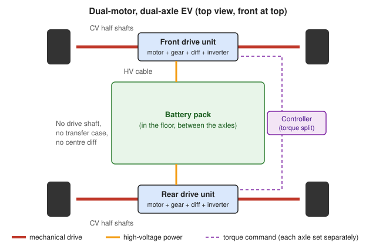
	- The battery sits in the floor between the two drive units. Power goes to each drive unit through high-voltage cables, and the controller sends each one its own torque command.
- In the vehicle:
	- 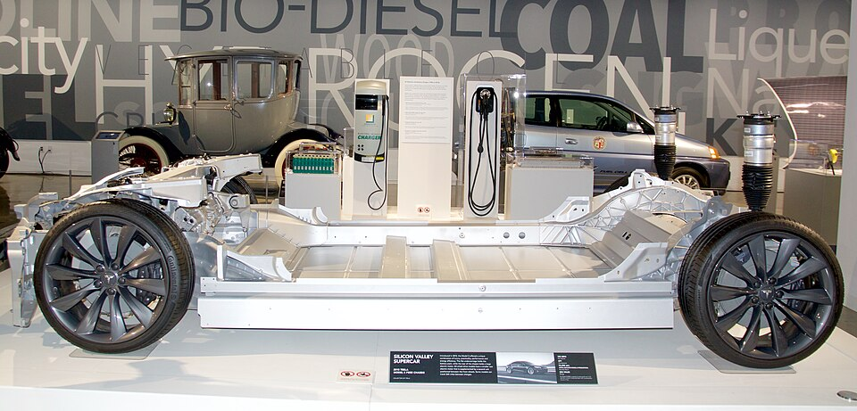
	- Tesla Model S P85D chassis: drive units at the front and rear axles, battery pack filling the floor between them.
- Drive unit:
	- 
	- An e-axle combines the motor, reduction gear, differential and power electronics in one box that bolts in between the wheels.
##### Types of Dual-Motor, Dual-Axle Systems

| System Type                                                 | Common Use                                              | Advantage                                                                                                                  | Disadvantage                                                                                              | Image                                          |
| ----------------------------------------------------------- | ------------------------------------------------------- | -------------------------------------------------------------------------------------------------------------------------- | --------------------------------------------------------------------------------------------------------- | ---------------------------------------------- |
| Permanent-magnet rear + induction front                     | Tesla Model 3 / Y Dual Motor, Volkswagen ID.4 AWD       | Efficient magnet motor does most of the work; unpowered induction motor spins freely with almost no drag, so no clutch needed | Induction motor is less efficient at low speed; two different motor designs to build                      | 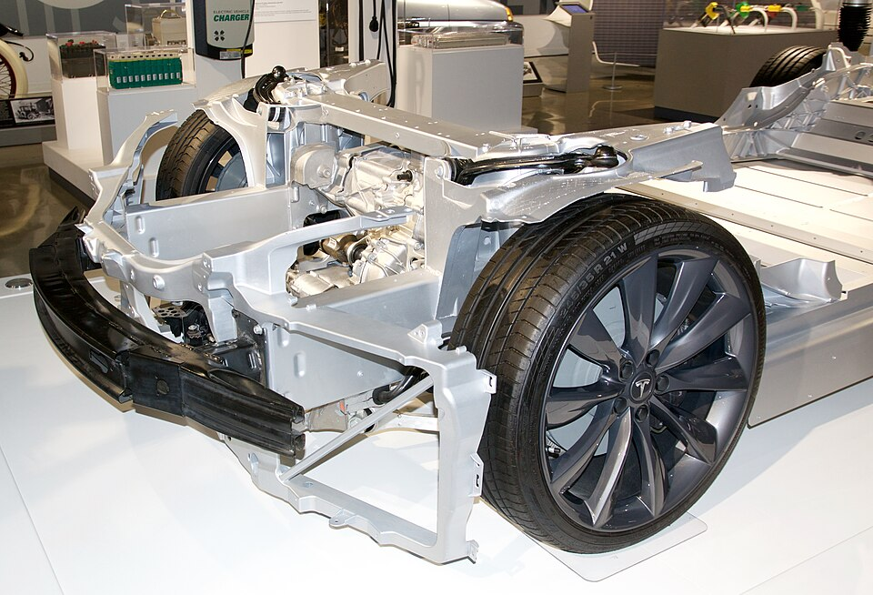 |
| Two permanent-magnet motors with front disconnect           | Hyundai Ioniq 5, Kia EV6 (AWD)                          | Both motors efficient; disconnector unhooks the front motor when not needed, improving efficiency by up to about 7%          | Magnet motors drag when spun unpowered, so the extra disconnect unit (actuator and clutch) is needed      | 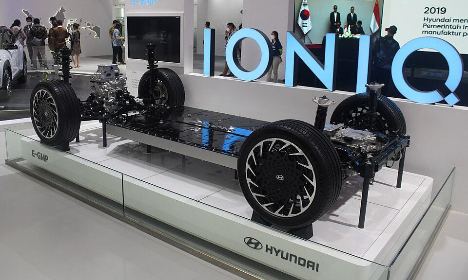           |
| Electrically excited (wound-rotor) motors                   | BMW iX, Nissan Ariya e-4ORCE                            | No rare-earth magnets; the rotor's magnetic field can be turned off, so an idle motor doesn't drag                          | Rotor needs power through brushes / slip rings; rotor coils make heat                                     |                                                |
| Tri- / quad-motor (extension)                               | Tesla Model S Plaid (1 front, 2 rear), Rivian quad-motor | Two motors on one axle can send different torque to each wheel (torque vectoring)                                          | More cost, weight and control complexity                                                                  | 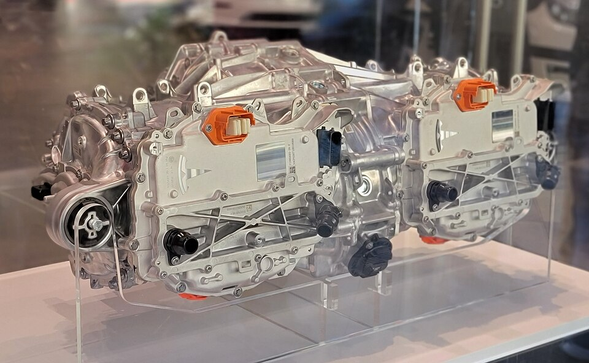  |
| Two-speed rear unit                                         | Porsche Taycan, Audi e-tron GT                          | Short 1st gear for acceleration, taller 2nd gear for efficiency and top speed                                              | Heavier and more complex than a single-speed reduction gear                                               |                                                |
##### Part List

| Make (3D print / laser cut)                                | Buy                                                                         |
| ---------------------------------------------------------- | --------------------------------------------------------------------------- |
| Chassis / floor plate with battery tray (laser cut)        | 2 DC or brushless motors (ideally different sizes, like front/rear)          |
| Two drive unit housings (motor mount + reduction gears)    | 2 motor drivers / ESCs                                                      |
| Two differentials (see Differentials section)              | Microcontroller (e.g. Arduino), throttle potentiometer and torque-split knob |
| Front steering knuckles, suspension mounts, wheel hubs     | Battery pack (e.g. RC LiPo) with fuse and switch                            |
| Control panel / display mount                              | Wheel encoders or speed sensors; CV joints / half shafts (RC parts)          |
| Clear cover over the electronics                           | Ball bearings, wheels and tires, wiring, fasteners                          |

#### Teaching Platform
Manufacture
- Mechanically simpler than a 4x4 or ICE AWD: no transfer case, drive shaft or centre differential to make.
- Each drive unit is just a motor, a printed reduction gear set and a differential, which reuses the Differentials design.
- Electronics and code are harder
Demonstratability
- Needs a battery or bench power supply and a microcontroller, so it depends more on electronics than the mechanical sections, but no fluids are needed.
- Easy to see in action:
  - Turn the torque-split knob from 100% rear to 50:50 to 100% front and watch which wheels drive.
  - Put the rear wheels on a slippery surface: with rear-only drive the model spins its wheels; send torque to the front and it moves.
  - Turn one motor off and spin its wheels by hand: compare the drag of a connected motor with a disconnected one.
  - Regenerative braking: spin the wheels by hand with a motor unpowered and light an LED or show the voltage it makes.
  - Take the covers off to show there is no drive shaft between the axles.
Works with what
- **Gearboxes / transmissions / torque converters**: each motor needs only a single-speed reduction gear (some performance cars use a two-speed rear unit); no torque converter or multi-speed gearbox.
- **Couplings, drive shafts, CV shafts**: no drive shaft between the axles; each axle needs two CV half shafts; some front units add a disconnect clutch.
- **Differentials**: one open differential on each axle; no centre differential.
- **Transfer cases / CVTs**: not needed.
- **Brakes and clutches**: regenerative braking on both axles plus normal friction brakes; some cars use a disconnect clutch on the front unit.
- **Steering and suspension**: usually independent suspension at both ends; the front drive unit sits between the steered wheels, and the heavy floor battery gives a low centre of gravity.
- **FWD / RWD**: each axle on its own is a single-motor EV drive; most dual-motor EVs drive mainly through the rear (or front) motor and add the other one when needed.
- **AWD**: this is electric AWD, with the front/rear split done in software instead of by a centre differential or coupling.
- **4x4**: electric 4x4s (e.g. Rivian R1T) use this layout; no low range is needed because motors give full torque from zero speed.
- **Single-motor, single-axle EV**: uses the same drive unit; the AWD version of a car often just adds a second unit on the other axle.
- **Dual-motor, single-axle EV**: different layout (both motors on one axle); adding a third motor combines the two (e.g. Tesla Model S Plaid).
- **Torque vectoring**: front/rear torque vectoring comes for free; left/right vectoring needs a torque vectoring differential, brakes, or a motor per wheel.
- **ABS and traction control**: motor torque can be cut or changed within milliseconds, much faster than an engine, so traction control is very quick; regenerative braking has to be blended with the friction brakes when ABS works.

# Advanced Systems

## Torque Vectoring

### What it is
#### Description
Torque vectoring is a system that sends different amounts of torque to the left and right wheels (and sometimes front and rear) to help the car turn, instead of splitting torque evenly like an open differential.
- If the outer wheel in a corner pushes harder than the inner wheel, the difference in drive force creates a **yaw moment**: a twist about the vertical axis that helps rotate the car into the turn.
- This reduces **understeer** (the car running wide even though the wheels are turned), so the car turns in more sharply and can hold a higher cornering speed. Sending torque the other way calms **oversteer**.
- It also helps traction: torque can be taken away from a wheel that is slipping and given to the one with grip.
- A controller decides the split using the steering angle, wheel speeds, yaw rate (from a gyro sensor), throttle and lateral acceleration.
- **Why it exists:** an open differential always splits torque evenly, so it can't help the car turn and it sends power to the wheel with the least grip. Torque vectoring makes the car turn more sharply, adds stability and improves traction.
In a common configuration:
- How it turns the car:
	- 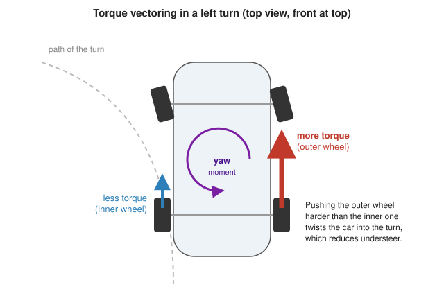
	- In a left turn, the outer (right) rear wheel gets more torque than the inner (left) one. The unequal push makes a yaw moment that turns the car to the left.
- Clutch-based systems (e.g. Ford Focus RS "Twinster"):
	- The rear differential is replaced by two electronically controlled multi-plate clutches, one for each rear wheel. Tightening one clutch more than the other sends more torque to that wheel. The Focus RS can send up to 70% of torque to the rear and up to 100% of that to either rear wheel.
- Brake-based systems:
	- The ESC system lightly brakes the inner wheel. Through the open differential, this sends more torque to the outer wheel.
##### Types of Torque Vectoring

| Torque Vectoring Type                         | Common Use                                                                                  | Advantage                                                                                                               | Disadvantage                                                                              | Image                                         |
| --------------------------------------------- | ------------------------------------------------------------------------------------------- | ----------------------------------------------------------------------------------------------------------------------- | ----------------------------------------------------------------------------------------- | --------------------------------------------- |
| Brake-based (torque vectoring by braking)     | Many modern cars, including FWD (e.g. VW GTI "XDS")                                         | Uses the existing ABS/ESC hardware, so almost no extra cost or weight                                                   | Can only slow the inner wheel, not add torque; wastes energy as heat and wears the brakes |                                               |
| Active / torque vectoring differential        | Mitsubishi Lancer Evolution (AYC), BMW Dynamic Performance Control, Audi sport differential | Clutch packs and extra gears can send more torque to the outer wheel even though it is turning faster                   | Heavy, complex and expensive; clutches heat up under heavy use                            |                                               |
| Twin-clutch rear drive unit (no differential) | Ford Focus RS (GKN Twinster), Acura SH-AWD                                                  | Replaces the rear differential; up to 100% of rear torque to either wheel; can disconnect the rear axle                 | Only on the rear axle of an AWD car; clutches slip and heat up                            |                                               |
| Front/rear split (axle-to-axle)               | AWD cars with an active centre coupling; dual-motor EVs                                     | Shifts the car's balance between understeer and oversteer                                                               | Weaker effect than left/right vectoring; can't create much yaw moment by itself           |                                               |
| Two motors on one axle                        | Tesla Model S Plaid, Tesla Cybertruck (tri-motor)                                           | Each wheel on that axle has its own motor, so torque (and regenerative braking) is set exactly; no clutches             | Cost and weight of an extra motor and inverter                                            |  |
| One motor per wheel (quad-motor)              | Rivian R1T / R1S Quad, Mercedes G 580                                                       | Full control of every wheel; can even spin the two sides in opposite directions (Rivian "Kick Turn", Mercedes "G-Turn") | Most expensive and heaviest: four motors and four inverters                               |                                               |
##### Part List

| Make (3D print / laser cut)                                      | Buy                                                                    |
| ---------------------------------------------------------------- | ---------------------------------------------------------------------- |
| Chassis plate (laser cut) with steerable front axle              | 2 DC motors with motor drivers (one per rear wheel)                    |
| Rear motor mounts and wheel hubs                                 | Microcontroller (e.g. Arduino)                                         |
| Open differential with a brake disc on each side (brake-based version) | Small servos to press brake pads (brake-based version)           |
| Brake pad holders / servo brackets                               | Gyro / IMU (e.g. MPU-6050) to measure yaw rate                         |
| Control panel with steering and torque-split knobs               | Steering angle potentiometer, wheel encoders                           |
| Clear cover over the electronics                                 | Battery pack with fuse and switch, wheels and tires, bearings, fasteners |

#### Teaching Platform
Manufacture
- The easiest version is one motor per rear wheel (like the Dual-Motor, Single-Axle layout): no special mechanical parts, the torque split is set in code.
- A brake-based version is also simple: a printed open differential with a printed disc on each side and a servo pressing a pad onto it.
- A mechanical torque vectoring differential (clutch packs plus speed-up gears) is very hard to make.
- Twin-clutch units need controllable wet clutches, which are hard to print; a model version would need electromagnetic clutches.
- Most of the work is in the electronics and code (sensors, control loop, motor drivers).
Demonstratability
- Needs a battery and a microcontroller, but no fluids.
- Showing the yaw rate from the gyro on a display makes the effect easy to see.
- Easy to see in action:
  - Steering straight, give the right wheel more torque than the left: the model turns left on its own.
  - On a slippery surface, turn with an even split (the model runs wide), then with torque vectoring on (it follows the turn more tightly).
  - Brake-based: brake the left wheel through the open differential and watch the right wheel speed up.
  - Put one rear wheel on a slippery patch: torque moves to the wheel with grip.
  - With a motor on each wheel, spin the left and right sides in opposite directions for a "tank turn".
Works with what
- **Gearboxes / transmissions / torque converters**: no direct link; torque vectoring works after the transmission, at the axles.
- **Couplings, drive shafts, CV shafts**: each wheel needs its own CV half shaft; twin-clutch systems use clutch couplings instead of a differential.
- **Differentials**: an active differential is one form of torque vectoring; brake-based systems need an open differential; per-wheel motors need no differential at all.
- **Transfer cases / CVTs**: an active transfer case or centre coupling can do front/rear vectoring; no link to CVTs.
- **Brakes and clutches**: brake-based systems use the normal brakes; differential and twin-clutch systems use multi-plate clutches.
- **Steering and suspension**: reduces understeer, so the car needs less steering to take a corner; uses the steering angle sensor.
- **FWD**: usually brake-based; Honda's ATTS was an early FWD active differential.
- **RWD**: an active rear differential or brake-based system.
- **AWD**: where the most complete systems are found (e.g. Acura SH-AWD, Ford Focus RS, BMW xDrive with Dynamic Performance Control).
- **4x4**: brake-based systems act like a locker off-road; quad-motor electric trucks can vector torque at every wheel.
- **Single-motor, single-axle EV**: only brake-based, since one motor drives both wheels through an open differential.
- **Dual-motor, single-axle EV**: ideal for left/right torque vectoring, with one motor per wheel.
- **Dual-motor, dual-axle EV**: front/rear vectoring only, unless brakes or extra motors are added.
- **ABS and traction control**: shares the wheel speed sensors, yaw sensor and brake hydraulics; brake-based torque vectoring is part of the stability control (ESC) software.

## ABS and Traction Control

### Anti-Lock Braking System (ABS)

#### What it is

##### Description

ABS is an electronic safety system that prevents the wheels from locking up during hard braking. It allows the driver to keep steering while braking, which a locked wheel cannot do.
**How it works (roughly):**
ABS monitors wheel speed and rapidly modulates brake pressure:
**Wheel speed sensors → ECU → hydraulic valves and pump → brake calipers**
- **Wheel speed sensors** monitor each wheel’s rotation speed.
- **ECU (Electronic Control Unit)** detects when a wheel is decelerating too fast, meaning it is about to lock.
- **Hydraulic valves** reduce brake pressure to that wheel, then re-apply it.
- **Pump** restores pressure after the valves release it.
- This cycle repeats dozens of times per second, faster than a human can pump the brakes.
In normal braking, ABS does nothing. The valves stay open and brake fluid flows normally. ABS only activates when a wheel starts to lock.

Youtube: [DON'T SUBSCRIBE | Understanding Anti-lock Braking System (ABS) !](https://www.youtube.com/watch?v=98DXe3uKwfc) 4:00-4:45

**Why a car needs it:**
A locked wheel slides instead of rolling, and a sliding tire cannot steer. ABS lets the driver brake hard and still steer around an obstacle. On most surfaces, it also shortens stopping distance. On loose surfaces like gravel or deep snow, stopping distance may increase slightly, but steering control is maintained.
##### Types of ABS

| ABS Type                    | Common Use                        | Advantage                                                                 | Disadvantage                                             |
| --------------------------- | --------------------------------- | ------------------------------------------------------------------------- | -------------------------------------------------------- |
| Four-channel, four-sensor   | Most modern passenger cars        | Each wheel controlled independently; best control                         | Can cause yaw on split-friction surfaces                 |
| Three-channel, three-sensor | Many passenger cars               | Front wheels independent; rear wheels controlled together; good stability | Rear wheels share one channel; less precise rear control |
| One-channel, one-sensor     | Older trucks, some light vehicles | Simple; low cost                                                          | Only controls rear wheels; front wheels can still lock   |
Note: For a teaching platform, ABS is usually **too complex to build and not necessary**. It requires wheel speed sensors, an ECU, and hydraulic valves. A simple mechanical brake system demonstrates the core braking concept without ABS.

##### Part List

| Make (3D print / laser cut)         | Buy                                                |
| ----------------------------------- | -------------------------------------------------- |
| Sensor mounting brackets            | Wheel speed sensors                                |
| ECU mounting plate                  | ABS ECU (or use a simple Arduino-based controller) |
| Valve block housing (if simulating) | Solenoid valves                                    |
| —                                   | Hydraulic pump, brake lines, brake fluid           |
##### Teaching Platform
**3D printing / manufacturing easiness:**
- **Easy:** brackets, mounting plates, and a demonstration stand are all simple prints.
- **Hard:** the hydraulic and electronic components. A real ABS needs brake fluid, sealed valves, and a controller. This is beyond what most teaching platforms need.
**Overall:** not recommended as a buildable component. If included, treat it as a **demonstration-only** system using a motor and controller to show the concept of rapid pressure modulation.

**Demonstratability:**
- **External tools / consumables:** a real ABS needs brake fluid and a power supply. A simulated version needs only a power supply.
- **Intuitive to demonstrate:** the concept is intuitive if simplified:
    - Spin a wheel by hand: it rotates freely.
    - Apply a “locked” brake: the wheel stops and cannot be steered.
    - Apply “ABS” pulsing: the wheel slows but keeps rotating, and steering is possible.
- **One caution:** real ABS is hard to demonstrate at low speed because the wheel needs to be rotating fast enough for lock-up to occur. A motor-driven wheel is better than hand-spinning.

**Works with what (what else must be included):**
- **Brakes and clutches**: ABS works with the hydraulic brake system. It needs brake calipers, brake lines, and a master cylinder.
- **Wheel speed sensors**: required at each controlled wheel. These are the primary input for ABS.
- **ECU**: processes sensor data and controls the valves.
- **Hydraulic valves and pump**: modulate brake pressure.
- **Steering and suspension**: ABS allows steering during braking, which is its main benefit. The suspension must keep the tires in contact with the road for ABS to work.
- **FWD / RWD / AWD / 4x4**: ABS works on all layouts. It controls individual wheel brakes regardless of which wheels are driven.
- **EV configurations**: ABS works the same on EVs. Regenerative braking must be blended with ABS to avoid conflicts.
- **Torque vectoring**: ABS and torque vectoring both brake individual wheels, but for different purposes. ABS prevents lock-up; torque vectoring improves turning.
- **Traction control**: shares the same sensors and hydraulic unit as ABS. Traction control prevents wheel spin during acceleration; ABS prevents lock-up during braking .

**How easy is it to design / CAD:**
- **Modeling difficulty:** low for the physical brackets and stand. High for the hydraulic and electronic system.
- **Assembly complexity:** high if building a real hydraulic ABS. Low if building a simulated demonstration.
- **Availability of standard parts:** wheel speed sensors, Arduino boards, and small solenoid valves are available, but building a working hydraulic system is still complex.
- **CAD tips:** if simulating, model a single wheel on a stand with a motor, a speed sensor, and a solenoid valve controlled by an Arduino. Show the pulsing brake pressure on an LED or small display.

### Traction Control System (TCS)

#### What it is

##### Description

Traction control is an active safety system that prevents the driven wheels from spinning during acceleration. It works by reducing engine power or braking the spinning wheel so the tire regains grip. It is also called ASR (Acceleration Slip Regulation) or TRC, depending on the manufacturer.

**How it works (roughly):**
TCS uses the same wheel-speed sensors as ABS to compare driven wheel speed with non-driven wheel speed.
**Wheel speed sensors → ECU → engine control or brake actuator**
- **Wheel speed sensors** monitor how fast each wheel is rotating.
- **ECU** detects when a driven wheel is spinning faster than the non-driven wheels, meaning it has lost grip.
- **Engine torque control** reduces fuel injection, retards ignition timing, or closes the throttle to cut power to the slipping wheel.
- **Brake torque control** applies the brake to the spinning wheel individually, which also sends torque to the wheel with grip through the open differential.
TCS stays inactive in normal driving. It only intervenes when wheel slip is detected.

**Why a car needs it:**
On low-grip surfaces (rain, snow, mud), a driven wheel can spin instead of moving the car forward. TCS prevents this by reducing power or braking the slipping wheel. This helps the car accelerate smoothly and prevents the rear from sliding out or the front from losing steering control. It also reduces tire wear caused by excessive wheelspin.
##### Types of TCS Control

|Control Type|Common Use|Advantage|Disadvantage|
|---|---|---|---|
|Brake torque control|Most modern cars (combined with engine control)|Fast response; can control each driven wheel independently|Brakes overheat if used heavily; wastes energy as heat|
|Engine torque control|Most modern cars (combined with brake control)|No brake wear; smooth power reduction|Slower response; cannot control individual wheels|
Note: For a teaching platform, TCS is **too complex to build as a working system**. It requires wheel-speed sensors, an ECU, and either engine control or hydraulic brake actuation. A demonstration using an electric motor with a simple speed sensor and controller is more realistic.
##### Part List

|Make (3D print / laser cut)|Buy|
|---|---|
|Sensor mounting brackets|Wheel speed sensors|
|ECU mounting plate|Arduino or simple controller|
|Demonstration stand|Small electric motor with speed sensor|
##### Teaching Platform
**3D printing / manufacturing easiness:**
- **Easy:** brackets, mounting plates, demonstration stand — simple 3D prints.
- **Hard:** the sensors, ECU, and brake actuation. A real TCS needs the same hydraulic hardware as ABS. Building it is not practical for a teaching platform.
**Overall:** not recommended as a buildable component. Treat it as a **demonstration-only** system showing the concept of slip detection and power reduction.

**Demonstratability:**
- **External tools / consumables:** a simulated TCS needs only a power supply. A real TCS needs brake fluid and a hydraulic system.
- **Intuitive to demonstrate:** the concept is simple if simulated:
    - Spin a wheel with a motor: it accelerates freely.
    - Introduce a "slipping" condition (low friction surface): the wheel spins faster than the reference.
    - Show the controller reducing motor power: the wheel slows and regains grip.
- **One caution:** real TCS operates in milliseconds. A hand-operated demo cannot show this speed; it only shows the concept.

**Works with what (what else must be included):**
- **ABS**: TCS shares the same wheel-speed sensors and often the same hydraulic unit. They work together as a combined ABS/TCS system.
- **Differentials**: TCS can partially replace a limited-slip differential by braking a spinning wheel, which sends torque to the wheel with grip.
- **Engine / motor**: TCS must be able to reduce torque. In an EV, this means reducing motor current; in an ICE, it means cutting fuel or closing the throttle.
- **Steering and suspension**: TCS helps maintain steering control during acceleration. The suspension must keep the tires in contact with the road for TCS to work.
- **FWD**: TCS prevents front wheelspin, which reduces torque steer and understeer during hard acceleration.
- **RWD**: TCS prevents rear wheelspin, which reduces oversteer and fishtailing on slippery roads.
- **AWD / 4x4**: TCS works on all driven wheels. On split-friction surfaces, it can brake one wheel to send torque to the others.
- **EV configurations**: EVs need special TCS because electric motors produce maximum torque instantly. Distributed TCS (dTCS) moves the control into the motor controller for faster response (10 ms vs 100 ms).
- **Torque vectoring**: torque vectoring is a more advanced form of wheel control. TCS prevents slip; torque vectoring actively distributes torque to improve turning
- **ABS**: TCS is essentially "reverse ABS" — ABS prevents lock-up under braking, TCS prevents spin under acceleration.

**How easy is it to design / CAD:**
- **Modeling difficulty:** low for a demonstration stand; very high for a real system.
- **Assembly complexity:** high if building a real hydraulic TCS. Low if simulating with a motor and controller.
- **Availability of standard parts:** wheel speed sensors and Arduino boards are available, but a complete hydraulic TCS requires OEM-level components.
- **CAD tips:** if simulating, model a single wheel on a stand with a motor, a speed sensor, and a simple controller. Use an LED or display to show when "slip" is detected and power is reduced.
## Dynamic Suspensions

Dynamic suspension is **not the same topic as the basic steering-and-suspension hardware**. A conventional suspension uses fixed springs, dampers, arms and joints to support the vehicle and guide each wheel. A dynamic suspension adds sensors, electronic control and adjustable or powered hardware so its behaviour can change while the vehicle is moving.

#### What it is and how it works

The suspension must let the wheels follow an uneven road while keeping the body controlled. A soft setup improves isolation from bumps but can allow excessive roll, pitch and bounce; a firm setup improves body control but can transmit more shock to the passengers. Dynamic systems reduce this compromise by changing damping, ride height, spring support or wheel force in real time.

1. Accelerometers, ride-height sensors, wheel-speed sensors and vehicle signals such as steering, braking and speed describe what the body, wheels and driver are doing. A predictive system may also use a forward-looking camera.
2. A suspension ECU calculates the desired response for each wheel.
3. An electrically controlled valve, air valve, hydraulic pump or electromechanical actuator changes the suspension force.
4. The sensors measure the result and the controller repeats the calculation many times per second. ZF's CDC system, for example, changes damping at each wheel in fractions of a second, while fully active systems can command a separate force at each corner.[^21][^22]

- **Semi-active suspension** changes damper resistance. It can dissipate motion more or less strongly, but it does not continuously lift the body by adding mechanical energy.
- **Self-levelling or adaptive air/hydropneumatic suspension** changes air pressure or fluid distribution to maintain ride height, carry different loads or select a different ground clearance.
- **Fully active suspension** uses powered hydraulic or electromechanical actuators to push or pull at each wheel. It can counter body roll, pitch and heave instead of only resisting them.[^22][^23]
- **Active anti-roll control** generates torque between the left and right suspensions to oppose body roll while allowing softer ride behaviour in other conditions.[^32]
- **Predictive road-preview suspension** uses a forward-facing camera or other road sensor to command the suspension before the wheel reaches a disturbance.[^33]

#### Why a car needs it

- Keep the tyres in more consistent contact with a rough road while reducing body bounce.
- Combine comfortable straight-line driving with firmer control during cornering, braking and acceleration.
- Maintain ride height when passengers or cargo change the load.
- Reduce roll, brake dive and acceleration squat.
- Raise the vehicle for obstacles or lower it for stability and aerodynamic efficiency.
- Prepare the suspension for an approaching bump when road-preview sensors are available.
- Coordinate chassis motion with steering, brakes, stability control and driver-assistance systems.

#### Representative dynamic-suspension systems

The five rows separate systems by what they actively change: damper force, ride height/support, individual wheel force, roll moment or a preview-based command.

| System type | Common use | Advantage | Disadvantage | Image |
| --- | --- | --- | --- | --- |
| Semi-active variable damping | Passenger cars, performance cars and motorcycles | Fast, relatively energy-efficient and easier to package than a fully active system | Cannot independently support or lift the body; still needs good passive springs and dampers |  |
| Self-levelling air or hydropneumatic suspension | Luxury cars, SUVs and load-carrying vehicles | Maintains ride height and can change clearance or effective spring behaviour | Compressor/pump, valves, seals and fluid or air lines add cost, leakage risk and maintenance |  |
| Fully active individual-wheel suspension | High-end performance and luxury vehicles | Can add force at each wheel to control roll, pitch and heave during a disturbance | High power demand, actuator/control complexity, cost and safety burden | 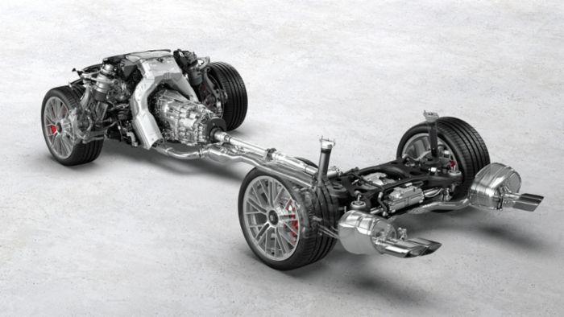 |
| Active anti-roll control | Performance cars, luxury cars and high-centre-of-gravity vehicles | Directly counters body roll in corners while reducing the need for a permanently stiff passive anti-roll bar | Adds high-force actuators, 48 V or hydraulic supply, sensors and fail-safe requirements | 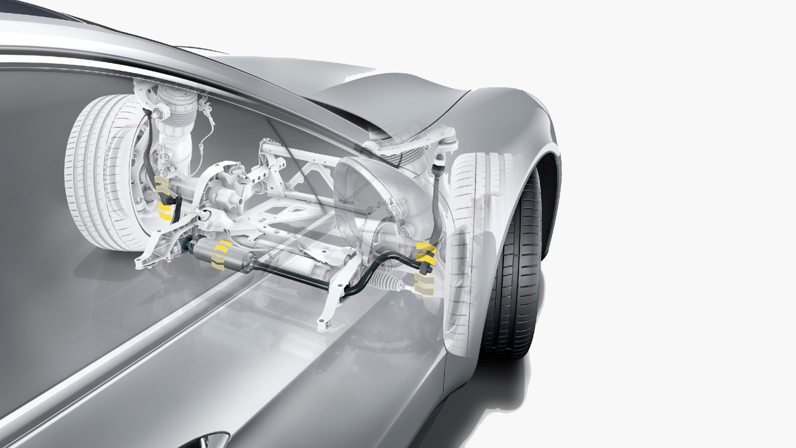 |
| Predictive road-preview suspension | Flagship luxury vehicles with camera-based chassis control | Prepares each corner before a detected bump, reducing body movement without waiting for impact | Camera visibility and road classification limit performance; sensing, calibration and actuators are expensive | 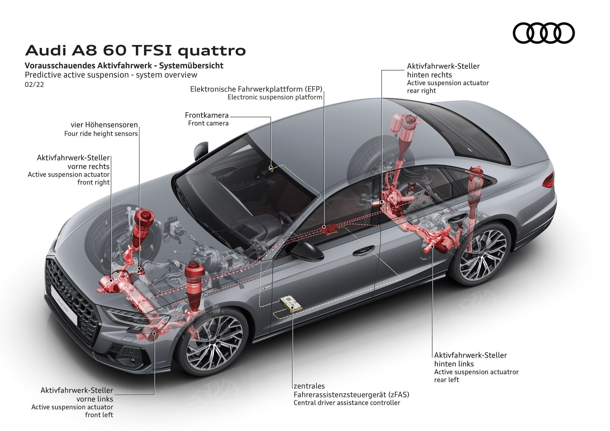 |

#### Rough parts list for a vehicle system

| Subsystem | Typical parts and purpose |
| --- | --- |
| Base suspension | Control arms or struts, joints, wheel carriers and anti-roll hardware guide the wheel and carry loads |
| Elastic elements | Coil springs, air springs or hydropneumatic spheres support vehicle weight |
| Adjustable force element | Electronically valved damper, magnetorheological damper, hydraulic actuator or electric linear actuator changes wheel/body force |
| Sensors | Body and wheel accelerometers, ride-height sensors, wheel-speed sensors, steering/brake inputs and optional road-preview camera |
| Controller | Suspension ECU estimates body motion and commands each corner |
| Power stage | Valve drivers, inverter, 12/48 V supply or high-voltage converter powers the adjustable hardware |
| Fluid/air hardware where applicable | Compressor or pump, reservoir, accumulator, manifold, filters, hoses and pressure sensors |
| Communications and safety | Wiring, CAN connection, fuses, fault monitoring and a fail-safe passive operating mode |

#### Teaching demonstrator: make or buy

| Make (3D print / laser cut) | Buy |
| --- | --- |
| Two matching quarter-car frames labelled Passive and Dynamic | Two equal coil springs and small linear guides or low-friction sliders |
| Sprung- and unsprung-mass carriers with removable weights | Low-voltage servo or linear actuator for the dynamic side |
| Eccentric cam or interchangeable bump profile to move both road platforms | Microcontroller, motor driver and protected low-voltage power supply |
| Adjustable actuator bracket and a simple lever/friction-damper mechanism | Two accelerometers and two distance or ride-height sensors |
| Sensor mounts, scale markers, electronics enclosure and transparent guards | Bearings, shafts, fasteners, emergency-stop switch and wiring |
| Mode labels and an LED/display panel for Comfort, Sport and Active | Optional data logger or computer for acceleration/displacement plots |

#### 3D printing / manufacturing easiness

- **Static cutaway or layout model — easy:** print labelled spring, damper, sensor, ECU and actuator blocks.
- **Passive quarter-car mechanism — easy to moderate:** the main work is aligning the slider, spring and bump input so it moves freely.
- **Servo-controlled semi-active analogy — moderate:** printed brackets and levers are straightforward, but sensor calibration, linkage clearance and control tuning take iteration.
- **Working air suspension — hard:** it needs airtight bellows, a compressor, valves, fittings and safe pressure control; the flexible air spring should be purchased rather than printed.
- **Working hydraulic or fully active unit — very hard:** precision bores, piston seals, low-leakage valves, accumulators and pressure-rated parts are unsuitable for ordinary FDM printing.
- **Active anti-roll or road-preview model — moderate to hard:** the linkage and sensor mounts are printable, but actuator sizing, camera/road sensing and closed-loop tuning need significant iteration.
- Printed parts are appropriate for low-speed structure, guards and linkages only. They must not be treated as road-vehicle suspension or pressure components.

#### Demonstratability

- The recommended rig needs **no external fluid**. Use a low-voltage servo-controlled friction damper or lever actuator to represent variable damping/active force.
- Drive the Passive and Dynamic road platforms from the same slow eccentric cam. Equal removable masses make the comparison fair.
- In **Comfort** mode, use a lower resisting force; in **Sport** mode, increase it; in **Active** mode, use ride-height and acceleration feedback to reduce body motion after the bump.
- Show body displacement with scale markers and plot both accelerometer signals. The dynamic side should settle faster or move less, depending on the selected control goal.
- Add or remove a mass to demonstrate self-levelling: the controller returns the dynamic body to its target height while the passive side remains lower.
- For active anti-roll, tilt the body frame with an offset load and command a servo between the two anti-roll-bar halves. For road preview, place a distance sensor ahead of the wheel and compare pre-emptive actuation with feedback-only control.
- A realistic air model needs compressed air; a realistic hydraulic model needs fluid, a pump, reservoir, accumulator, hoses and leak containment. Those additions improve realism but make a classroom demonstration less reliable and less safe.
- Guard pinch points and stored spring energy, limit actuator current and travel, and provide an emergency stop.

#### Works with what

- A complete **base suspension**: arms or struts, springs, dampers, joints, hubs, bearings and tyres.
- **Vehicle-state sensors** and a suspension ECU; dynamic hardware cannot choose a useful force without feedback and control logic.
- A reliable **electrical supply** and communications network. High-force active systems may need a 48 V or high-voltage power stage.[^23]
- **Steering, friction brakes, ABS, traction/stability control and powertrain torque control**, because all of them affect tyre force and body motion.
- The vehicle structure and subframes, which must carry actuator loads without excessive flex.
- For air/hydraulic versions: pumps or compressors, valves, reservoirs/accumulators, filters, hoses, pressure sensors and service procedures.

#### CAD easiness

- **Easy:** system block diagram or static cutaway with labelled energy and signal paths.
- **Easy to moderate:** quarter-car frame, removable masses, cam road input and adjustable sensor brackets.
- **Moderate:** servo lever, friction element, motion limits and transparent guards; check the entire suspension travel for collisions.
- **Moderate to hard:** split active anti-roll bar, actuator brackets or a camera/distance-sensor preview path because kinematics, sensing range and actuator timing all interact.
- **Hard:** air spring packaging and hose routing with realistic joints and service clearances.
- **Very hard:** vehicle-grade active strut or hydraulic valve body because sealing surfaces, fatigue, heat, pressure, noise and fail-safe behaviour must all be engineered.
- Keep the passive and dynamic modules dimensionally identical in CAD. Parameterise mass position, spring preload, actuator ratio and travel so comparisons can be changed without rebuilding the whole assembly.

#### Recommended dynamic-suspension demonstrator

Build a guarded, low-speed **side-by-side quarter-car rig**. Both sides use the same spring, moving mass and cam-driven road bump. Leave one side passive; equip the other with a ride-height sensor, accelerometer and low-voltage servo-controlled damper/actuator. Provide Comfort, Sport and Active modes plus a removable payload. This clearly demonstrates variable damping, body-motion control and self-levelling without high-pressure hydraulics, compressed air or duplicated images from the basic Steering and Suspension section.

---

### Dynamic Suspensions: Sources and Image Credits

#### Technical sources

[^21]: ZF, [Continuous Damping Control (CDC)](https://www.zf.com/products/en/cars/stories/cdc.html), explaining individual electronic damping adjustment at each wheel in fractions of a second.
[^22]: Porsche Newsroom, [Porsche Active Ride: The new dimension in suspension systems](https://newsroom.porsche.com/en/2024/innovation/porsche-active-ride-panamera-christophorus-409-34747.html), describing electrically driven hydraulic pumps at each damper, sensor feedback and actively controlled compression and rebound.
[^23]: Mercedes-Benz, [E-ACTIVE BODY CONTROL suspension](https://media.mercedes-benz.com/en/article/c5164883-505b-42b5-8aca-4fa08e6490ae), describing air springs, more than 20 sensors and four individually controlled 48 V motor-pump units.
[^32]: Porsche Newsroom, [Active Balance](https://newsroom.porsche.com/en/christophorus/porsche-christophorus-panamera-pdcc-sport-system-13424.html), explaining electromechanical anti-roll bars that twist their left and right halves in opposite directions.
[^33]: Audi MediaCenter, [Predictive active suspension in the A8](https://www.audi-mediacenter.com/en/press-releases/multifaceted-personality-predictive-active-suspension-in-the-a8-flagship-model-11905/download), describing camera road scanning and pre-emptive actuator commands.

#### Image credits

- [Magnetorheological fluid chain formation](https://commons.wikimedia.org/wiki/File:MRF_Kettenbildung.gif) by INVENTUS Engineering GmbH, CC BY-SA 3.0.
- [Hydropneumatic suspension diagram](https://commons.wikimedia.org/wiki/File:Sus_hydropneumatic_english.png) by Teccirio, CC BY 2.5.
- [Porsche Active Ride pump-and-damper photograph](https://newsroom.porsche.com/en/2024/innovation/porsche-active-ride-panamera-christophorus-409-34747.html), Porsche Newsroom.
- [Porsche PDCC Sport active anti-roll illustration](https://newsroom.porsche.com/en/christophorus/porsche-christophorus-panamera-pdcc-sport-system-13424.html), Porsche Newsroom.
- [Audi A8 predictive active suspension system illustration](https://www.audi.se/sv/kopa-aga/teknik-funktioner/korupplevelse/), Audi Sverige.
