# Core Components

## Gearboxes, Transmissions, Torque Converters

The three subjects are related, but they are not the same component. They are researched separately below:

- A **gearbox** is the gears-and-shafts mechanism that changes speed, torque or direction.
- A **transmission** is the complete vehicle unit that selects and controls ratios. It contains a gearbox plus items such as clutches, selectors, bearings, lubrication and controls.
- A **torque converter** is a hydrodynamic input device used ahead of many automatic transmissions. It transfers engine power through fluid and is not itself a gearbox.

---

### Gearboxes

#### What it is

##### Description and rough working principle

A gearbox passes rotation through meshing gears. Changing the relative tooth counts changes output speed and torque:

- For a simple gear pair, `reduction ratio = driven gear teeth / driving gear teeth`.
- A 15-tooth driving gear turning a 45-tooth driven gear gives a 3:1 reduction: the output turns once for every three input turns.
- Ignoring losses, the 3:1 reduction produces about three times the input torque at one-third of the speed.
- Two external gears reverse direction. Adding another external idler gear reverses it again, which is useful for a vehicle's reverse gear.
- A multi-ratio gearbox places several gear pairs on shafts and selects which pair carries torque.
- A planetary gearbox uses a central sun gear, planet gears on a carrier and an internal ring gear. Holding, driving and taking output from different members produces different ratios from one compact coaxial set.[^1]

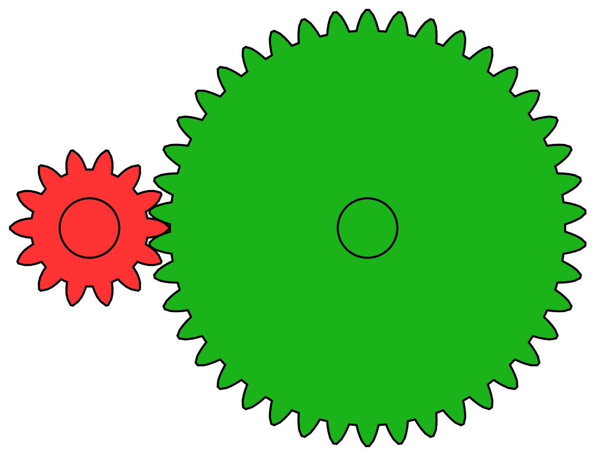

##### Why a car needs a gearbox

- **Launch and climbing:** reduction multiplies torque at the wheels.
- **Speed range:** an internal-combustion engine cannot operate efficiently from zero wheel speed to highway speed using one direct ratio.
- **Efficient cruising:** a taller ratio lowers engine speed, noise and fuel use at road speed.
- **Direction:** the gear train can provide reverse without reversing engine rotation.
- **Packaging:** planetary gearsets provide several ratios on one axis; a fixed reduction lets a high-speed EV motor drive the wheels at a practical speed.

##### Representative gearbox architectures

The five entries below are representative architectures selected for comparison; they are not an exhaustive list of every gearbox design.

| Gearbox Type | Common Use | Advantage | Disadvantage | Image |
| --- | --- | --- | --- | --- |
| Single-stage spur/helical reduction | EV drive units, final reductions, simple teaching rigs | Few parts; efficient; easiest to understand, print and CAD | Only one ratio; external gears reverse direction; helical gears add axial bearing load |  |
| Two-stage compound reduction | EV e-axles, compact reducers and teaching rigs needing a larger overall ratio | Multiplies two stage ratios in a compact package; each gear pair remains easy to understand | More bearings and alignment points than one stage; efficiency losses and backlash accumulate | 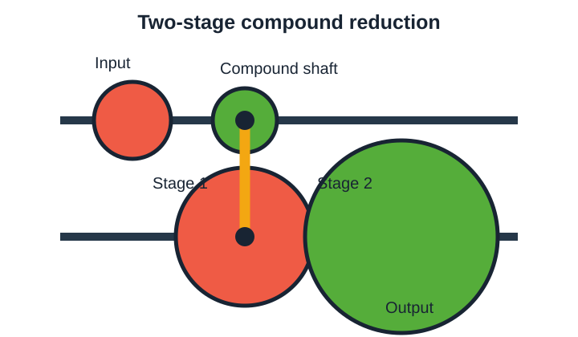 |
| Parallel-shaft, constant-mesh multi-ratio | Manual transmissions, DCT gear-train halves | Several ratios using familiar gear pairs; power flow is visible | Needs accurate shaft spacing, selectors and axial packaging; more gears rotate even when not selected | 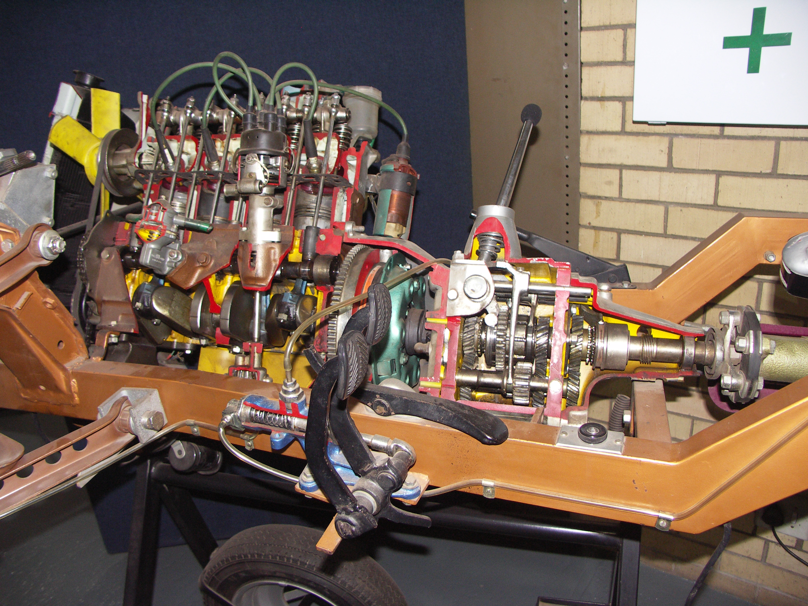 |
| Planetary / epicyclic | Conventional automatic transmissions, hybrid power-split devices | Compact and coaxial; several ratios by holding different members; load shared by multiple planets | Ring gear and carrier are harder to manufacture; ratio combinations and clutch logic are less intuitive | 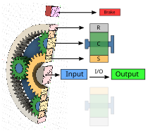 |
| Bevel / hypoid final-drive gearbox | Rear-drive axles, differentials and transfer/final-drive units | Turns the power path through approximately 90° while providing final reduction; hypoid offset can improve packaging | Curved tooth geometry, contact pattern, bearing preload and lubrication are difficult to manufacture and set correctly[^24] | 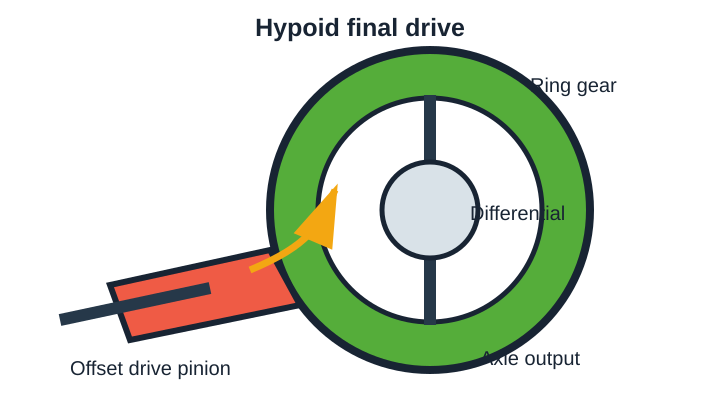 |

#### Part List

For a printable gearbox teaching module:

| Make (3D print / laser cut) | Buy |
| --- | --- |
| Two or three interchangeable spur-gear pairs | Steel input, counter and output shafts (D-shaft or keyed) |
| Optional sun, planet, ring and carrier set | Ball bearings or low-friction bushings |
| Split housing with removable clear acrylic cover | Shaft collars, keys, retaining rings and spacers |
| Sliding dog sleeve and simple selector fork | Fasteners and metal dowel pins |
| Input/output direction and ratio indicator discs | Small amount of plastic-safe grease |
| Motor/hand-crank and output-load mounting plates | Hand crank or low-speed geared DC motor |

#### Teaching Platform

##### 3D printing / manufacturing easiness

- **Single spur reduction — easy:** large printed teeth and purchased shafts/bearings are enough for a low-speed model.
- **Two-stage compound reduction — easy to moderate:** the gears are simple, but both centre distances and the compound shaft must remain aligned.
- **Two-/three-ratio constant-mesh gearbox — easy to moderate:** the main challenges are centre distance, backlash, shaft support and complete dog-clutch engagement.
- **Simple planetary gearbox — moderate:** the sun, ring and carrier must be concentric; planet gears must be evenly spaced and supported on both sides.
- **Bevel/hypoid final drive — hard:** a visual approximation can be printed, but realistic curved teeth and their contact pattern need specialist gear design and machining.
- **Working synchromesh — hard:** friction cones, blocker-ring clearance, splines, small dog teeth and detents need close tolerances.
- Print gears flat where possible for consistent teeth. Use metal shafts and through-fasteners instead of printed threads.
- PLA/PETG is suitable only for slow, low-load demonstrations—not vehicle loads or high rotational speed.

##### Demonstratability

- Excellent for demonstration; no fluid or special external tool is needed.
- Turn the input by hand and count input/output revolutions to measure each ratio.
- Mark one tooth on every gear and use different colours for the input, idler and output gears.
- Add a small friction brake or hanging-weight drum to the output so students can feel increased torque in a lower ratio.
- Move the selector to neutral to show that gears may spin while no torque reaches the output.
- Add/remove a reverse idler to make the output direction change visibly.
- On the planetary module, use removable locking pins to hold the sun, ring or carrier and compare the resulting ratios.

##### Works with what

- **Input:** hand crank, geared electric motor or engine simulator.
- **Output:** coupling, drive shaft, differential/final drive or wheel module.
- **Support:** shafts, bearings/bushings, housing, lubrication and a clear safety guard.
- **For multiple ratios:** selector sleeve/dog clutch and shift fork; a real vehicle also needs a clutch or another way to unload the gears during a shift.
- **For a planetary set:** brakes/clutches or removable holding pins must control which member is fixed, driven and used as output.

##### CAD easiness

- **Easy:** single-stage spur reduction using an involute-gear generator.
- **Easy–moderate:** parallel-shaft multi-ratio gearbox; add axial spacing, selector travel, shaft retention and backlash checks.
- **Moderate:** planetary gearbox. For a simple set with equal gear module, `ring teeth = sun teeth + 2 × planet teeth`.
- **Hard:** realistic synchromesh or compact vehicle-grade helical gearbox because tolerances, splines, bearings and lubrication paths all interact.

##### Recommended gearbox demonstrator

Use a modular three-shaft constant-mesh gearbox with two forward ratios, neutral and reverse, plus a separate planetary module with removable holding pins. It is printable, visually clear, easy to operate by hand and useful with the later transmission and differential demonstrations.

---

### Transmissions

#### What it is

##### Description and rough working principle

A vehicle transmission is the complete system that accepts power from the engine or traction motor, selects an appropriate ratio and sends controlled output to the rest of the drivetrain.

- A **manual transmission** uses a driver-operated clutch and shift lever. Constant-mesh gears rotate on the shafts; synchronizers match speed before a sleeve locks the chosen gear to the output shaft.[^2]
- A **torque-converter automatic** uses a torque converter for launch, planetary gearsets for ratios and hydraulically applied clutches/brakes to select the power path. A transmission control unit commands valves or solenoids.[^3][^4]
- A **dual-clutch transmission (DCT)** has two manual-like gear-train halves and two clutches. One half carries the current gear while the next gear can be preselected on the other; the controls swap clutches for a rapid shift.[^5]
- A **belt/chain CVT** moves the halves of two variable pulleys so the belt runs at different effective radii. This changes ratio continuously without selecting fixed gear pairs.[^25]
- A **power-split e-CVT** is mechanically different: a planetary device connects the engine, generator and wheel/motor path, while electrical control of the motor-generators changes the effective ratio.[^26]
- A **single-speed EV transmission** normally combines one fixed reduction gearset, bearings, differential/final drive and lubrication in a compact drive unit.

##### Why a car needs a transmission

- It keeps the engine or motor in a usable speed/torque range while road speed changes.
- It provides launch, acceleration, cruising, neutral and reverse functions.
- It gives the driver or controller a safe, repeatable way to select ratios.
- It supports and lubricates the rotating parts and connects the power source to the final drive.
- In an EV, the transmission may have only one fixed ratio, but the reduction, housing, bearings, differential and lubricant are still required.

##### Representative transmission systems

These six systems cover the main operating principles relevant to the project. A belt/chain CVT and a hybrid power-split e-CVT are shown separately because the name “CVT” does not mean that their mechanisms are the same.

| Transmission Type | Common Use | Advantage | Disadvantage | Image |
| --- | --- | --- | --- | --- |
| Manual synchromesh | Manual passenger cars, sports cars, trucks | Efficient; direct driver control; internal power path is comparatively easy to trace | Driver must operate clutch and lever; shift interrupts torque; synchronizers and linkages require accurate fits |  |
| Torque-converter automatic | Most conventional automatic passenger cars and many trucks | Smooth launch; shifts under load; controller chooses ratios automatically | Many precision parts; needs fluid pump, clutch packs, valve/solenoid control and cooling | 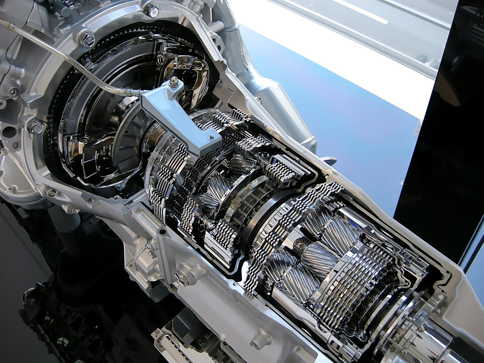 |
| Dual-clutch transmission (DCT) | Performance and efficient automated vehicles | Preselects the next gear; fast shifts; mostly mechanical power path | Two clutches, concentric shafts, actuators and control timing make design difficult; clutch heat/wear at low speed | 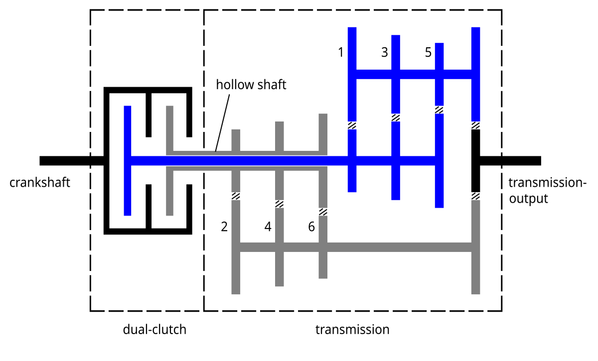 |
| Belt- or chain-type CVT | Small and midsize combustion vehicles, scooters and some hybrids | Adjustable pulleys provide a continuous ratio range and keep the engine near an efficient speed[^25] | Requires high belt clamping force, hydraulic control and cooling; belt/pulley wear limits torque capacity | 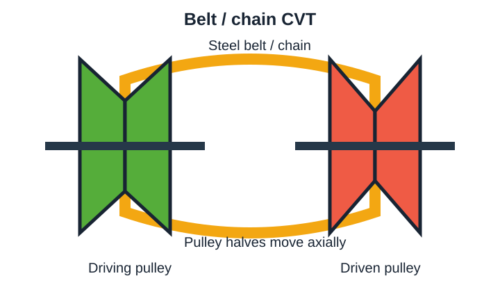 |
| Power-split e-CVT | Full-hybrid vehicles such as Toyota-style hybrid systems | A planetary power-split device plus motor-generators varies engine speed smoothly without a belt or stepped shifts[^26] | Requires two motor-generators, inverter, high-voltage battery and complex control; power flow is less intuitive | 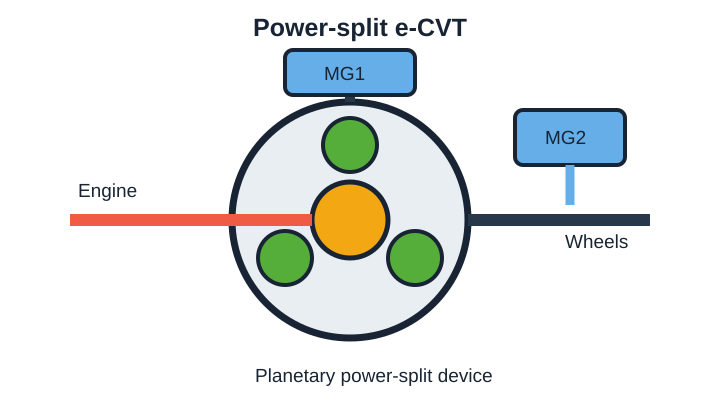 |
| Single-speed EV reduction transmission | Most battery-electric vehicles | Few parts; compact, efficient and no shift mechanism | One ratio must satisfy launch torque and maximum motor speed; does not demonstrate gear changing | 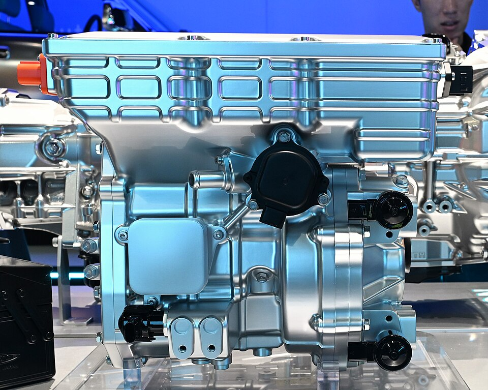 |

#### Part List

For a simplified selectable-ratio transmission demonstrator:

| Make (3D print / laser cut) | Buy |
| --- | --- |
| Gearbox housing and removable transparent cover | Steel shafts, bearings/bushings and shaft collars |
| Two forward gear pairs, reverse idler and sliding dog selector | Small geared DC motor or hand crank |
| Shift fork, guide rail, lever and detent plate | Flexible shaft coupling and fasteners |
| Simplified dry clutch disc/pressure plate display | Low-voltage speed controller if motor-driven |
| Motor, transmission and load mounting brackets | Optical tachometers/encoders (optional) |
| Ratio labels, power-flow arrows and safety guard | Adjustable friction load or small brake |

A realistic automatic or DCT would additionally require clutch packs, seals, hydraulic passages, a pump, valves/solenoids, speed sensors and an electronic controller. A CVT adds variable pulleys and a steel belt/chain; an e-CVT adds motor-generators, power electronics and hybrid control. Those systems are better shown with a cutaway or schematic than reproduced as a working student-built mechanism.

#### Teaching Platform

##### 3D printing / manufacturing easiness

| Transmission Demonstrator | Manufacturing Difficulty | Reason |
| --- | --- | --- |
| Single-speed EV reduction | **Easy** | One gear pair, fixed shafts and no selector |
| Simplified dog-shift manual | **Moderate** | Several ratios plus shift sleeve/fork and axial retention |
| True synchromesh manual | **Hard** | Friction cones, blocker rings, splines and tight clearances |
| DCT | **Very hard** | Two clutches, two gear-train halves, concentric shafts and actuators |
| Belt/chain CVT | **Very hard** | Variable pulleys, belt clamping, hydraulic pressure and wear-sensitive contact surfaces |
| Power-split e-CVT | **Very hard** | Planetary geometry, two motor-generators, inverter and coordinated control software |
| Hydraulic planetary automatic | **Very hard** | Multiple clutch packs, fluid circuits, valve control and precise shift timing |

##### Demonstratability

- A simplified manual is the clearest working model: use a hand crank or low-speed motor and a transparent cover.
- Select first, second, neutral and reverse while coloured arrows show the active power path.
- Use two tachometers or count turns to compare ratios quantitatively.
- A removable clutch model can show why torque must be interrupted before a manual shift.
- A DCT schematic can show odd/even gear paths, but a realistic working model needs two controlled clutches and synchronized actuators.
- A conventional automatic is difficult to see internally while running. A cutaway plus removable locking pins on a separate planetary module communicates the gear logic more clearly than a sealed hydraulic replica.
- A low-load pulley-and-elastic-belt model can demonstrate CVT ratio change, but it does not reproduce the clamping force, steel belt construction or lubrication of a vehicle CVT. An e-CVT is clearest as a colour-coded planetary module plus motor-speed animation.
- No fluid is needed for the recommended manual/dog-shift model. A realistic automatic needs transmission fluid, a pump, control pressure and cooling.

##### Works with what

- **Before the transmission:** engine or motor, flywheel/flexplate and a clutch or torque converter depending on type.
- **After the transmission:** coupling/drive shaft and differential/final drive; a FWD transaxle packages the differential in the same housing.
- **Manual:** clutch, shift linkage and driver input.
- **Torque-converter automatic:** torque converter, automatic-transmission fluid, oil pump, clutch packs, valve body/solenoids, cooler and transmission controller.
- **DCT:** two clutches, electromechanical or electrohydraulic actuators, speed/position sensors and controller.
- **Belt/chain CVT:** variable pulleys, steel belt/chain, hydraulic pump and valves, launch device, controller, lubricant and cooler.
- **Power-split e-CVT:** planetary power-split device, engine, MG1, MG2, inverter, high-voltage battery, final drive and hybrid controller.
- **EV reduction:** traction motor, inverter/controller, final drive/differential and lubricated bearings/gears.
- **Teaching rig:** clear guard, low-speed drive and adjustable output load.

##### CAD easiness

- **Easy:** single-speed EV reduction transmission.
- **Moderate:** simplified two-speed dog-shift manual with large printed components.
- **Hard:** true synchromesh because selector travel, cone engagement, dog teeth, splines and detents must all align.
- **Very hard:** DCT, hydraulic automatic, production CVT or e-CVT because CAD must coordinate many coaxial components, clutches or variable pulleys, actuators, motor-generators and fluid/electrical hardware.

##### Recommended transmission demonstrator

Build a two-speed dog-shift manual transmission with neutral and reverse. Keep the synchronizer as a separate enlarged cutaway/display piece instead of making it load-bearing. Use the automatic and DCT images to compare architectures without adding their hydraulic and control complexity to the working rig.

---

### Torque Converters

#### What it is

##### Description and rough working principle

A torque converter is a sealed hydrodynamic device between an internal-combustion engine and a conventional automatic transmission. It transfers power through automatic-transmission fluid rather than through a continuously engaged dry friction clutch.[^4][^6]

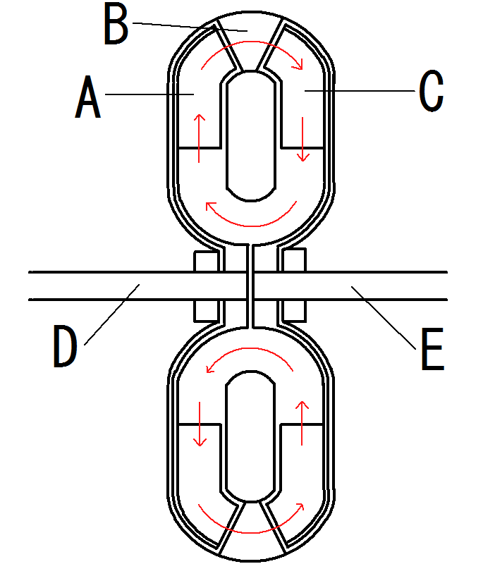

The labelled cross-section shows the three main rotating-flow elements:

- **Pump/impeller (A):** fixed to the converter cover and engine input (D). It throws fluid outward and toward the turbine.
- **Turbine (C):** connected to the transmission input shaft (E). Moving fluid pushes its blades and produces output torque.
- **Stator (B):** mounted on a one-way clutch between pump and turbine. At low turbine speed it redirects returning fluid so it assists the pump instead of opposing it; this produces torque multiplication.
- **Lock-up clutch:** not shown in this simplified diagram. At cruise it mechanically connects input and output to eliminate most converter slip and heat.

##### Operating stages

| Stage | What Happens | Result |
| --- | --- | --- |
| Stall / launch | Engine turns the pump while the turbine is stopped or very slow; stator locks and redirects return flow | Maximum torque multiplication, maximum slip and rapid heat generation |
| Acceleration | Turbine speed rises; speed difference and multiplication gradually decrease | Smooth non-contact power transfer while the car accelerates |
| Coupling | Pump and turbine speeds become closer; stator freewheels | Converter behaves mainly as a fluid coupling, with some remaining slip |
| Lock-up | A friction clutch connects converter cover to turbine/input shaft | Near-direct mechanical drive, less heat and better efficiency |

##### Why a car needs a torque converter

- It lets an automatic-transmission vehicle stop in gear while the engine continues idling.
- It provides smooth launch without the driver operating a clutch pedal.
- It multiplies torque when starting and when the turbine is much slower than the pump.
- Fluid slip and internal damping absorb engine torsional vibration and driveline shock.
- The lock-up clutch restores efficiency once continuous slip is no longer needed.[^4]

#### Part List

##### Real automotive torque converter

| Main Part | Function |
| --- | --- |
| Welded converter cover and engine drive hub | Sealed rotating housing connected to flexplate/crankshaft |
| Pump/impeller | Adds energy to the fluid |
| Turbine and turbine hub | Converts fluid momentum back into output-shaft torque |
| Stator and one-way clutch | Redirects return flow during launch; freewheels near coupling speed |
| Lock-up clutch and torsional damper | Connects input/output mechanically and filters vibration |
| Bearings/thrust washers and seals | Maintain alignment and contain fluid |
| Automatic-transmission fluid | Working medium, lubrication and heat transport |

##### Teaching demonstrator

| Make (3D print / laser cut) | Buy |
| --- | --- |
| Enlarged dry pump, turbine and stator shapes | Used/cutaway torque converter for visual comparison |
| Transparent housing/display shell that does not hold pressure | Two small guarded electric fans for a dry airflow analogy |
| Fixed guide-vane/stator insert | Low-voltage power supply and speed controller |
| Colour-coded flow arrows and labelled cross-section stand | Clear safety guard, fasteners and bearings |
| Catch tray and mounting frame if any fluid demo is attempted | Suitable fluid, shaft seals and commercial one-way bearing for an advanced fluid model |

#### Teaching Platform

##### 3D printing / manufacturing easiness

- **Static cutaway/display — moderate:** the three elements can be enlarged and printed separately so blade direction is visible.
- **Dry two-fan analogy — moderate:** easy to assemble, but guide vanes and guards must be securely mounted.
- **Working fluid model — very hard and not recommended as the first build:** it needs curved blades, rotor balance, a leak-proof case, seals, one-way stator clutch, fill/bleed ports and fluid compatibility.
- A printed high-speed rotor can fail dangerously. Operate only a guarded, low-speed model and never treat printed parts as vehicle components.

##### Demonstratability

- A real converter is difficult to observe because it is opaque, sealed and full of fluid.
- A transparent fluid model needs external fluid, sealing, sufficient input speed, a load and a catch tray. Aeration and leaks can obscure the result.
- A cutaway is best for identifying parts but cannot demonstrate power transfer while open.
- Two guarded fans facing each other provide a clean analogy for non-contact fluid power transfer. Adding fixed guide vanes suggests the stator's role, but air fans do **not** reproduce an automotive converter's exact oil flow or torque ratio.
- The labelled diagram should remain beside the demo so students can connect pump, stator, turbine, input and output.

##### Works with what

- **Engine side:** engine crankshaft/flexplate and converter cover.
- **Transmission side:** input shaft and usually a planetary automatic transmission.
- **Fluid system:** automatic-transmission fluid, transmission oil pump, sump/filter and cooler/heat exchanger.[^6]
- **Controls:** lock-up clutch valve/solenoid and transmission control unit.
- **Supporting parts:** stator support and one-way clutch, bearings/thrust washers and seals.
- It normally replaces the launch clutch of a conventional automatic; it is not required with a normal manual transmission and is commonly replaced by clutches or an electric motor in DCT/hybrid architectures.

##### CAD easiness

- **Easy:** simplified labelled cross-section or non-rotating display shell.
- **Moderate:** enlarged dry pump/turbine/stator shapes for visual teaching.
- **Very hard:** functional converter. Blade angles, toroidal flow passages, clearances, balance, seals, stator one-way clutch and lock-up clutch require specialist design and manufacturing. Research measurements show the internal three-dimensional flow is highly unsteady and complex.[^7]

##### Recommended torque-converter demonstrator

Use the labelled cross-section plus a purchased used/cutaway converter. If motion is required, add a separate guarded two-fan airflow analogy. Do not make a high-speed fluid-filled printed converter unless leak containment, rotor balance and overspeed protection can be engineered and tested properly.

---

### Sources and Image Credits

#### Technical sources

[^1]: ZF, [Coaxial reduction gear](https://press.zf.com/press/en/media/media_57732.html), an EV reduction unit using two planetary gearsets and an integrated differential.
[^2]: U.S. educational manual-transmission unit, [Manual Transmission](https://files.eric.ed.gov/fulltext/ED204627.pdf), covering power flow, constant-mesh gears, synchronizers, shafts, bearings and lubrication.
[^3]: MIT 2.972, [How an Automatic Transmission Works](https://web.mit.edu/2.972/www/reports/automatic_transmission/automatic_transmission.html), describing the torque converter and planetary gearbox power path.
[^4]: ZF, [Torque Converter](https://www.zf.com/products/en/cars/products_65854.html), including hydrodynamic circuits, lock-up clutches and torsional damping.
[^5]: Volkswagen service training document hosted by NHTSA, [The 02E Direct Shift Gearbox](https://static.nhtsa.gov/odi/tsbs/2012/MC-10157658-9999.pdf), describing two independent gear-train halves, two clutches and preselection of the next gear.
[^6]: ZF PowerLine maintenance guide, [8-speed automatic transmission](https://www.zf.com/products/media/automotive/cv/literature_downloads_wna/truck_solutions/PowerLine_Maintenance_Guide.pdf), describing a torque converter with lock-up clutch, downstream planetary gearset, oil system and cooler connections.
[^7]: SAE Technical Paper 960721, [The Flow Field Inside an Automotive Torque Converter](https://doi.org/10.4271/960721), reporting measured three-dimensional, unsteady flow in the pump, turbine and stator.
[^24]: Dana, [Beam Axles](https://www.dana.com/product/light-vehicle/beam-axles/), describing automotive hypoid gearing, differential options and axle applications.
[^25]: Nissan Motor Corporation, [XTRONIC CVT](https://www.nissan-global.com/EN/INNOVATION/TECHNOLOGY/ARCHIVE/NEW_CVT/), explaining how adjustable pulley width changes the steel belt's running radius and continuously varies the ratio.
[^26]: Toyota Motor Corporation, [Toyota Introduces New Passenger Vehicle Hybrid System](https://global.toyota/en/detail/7889139), explaining the planetary power-split device, motor, generator and electronically controlled continuously variable operation.

#### Image credits

- [Two spur gears 1:3](https://commons.wikimedia.org/wiki/File:Two_spur_gears_1_3.svg) by Jahobr, CC0.
- [Manual transmission cutaway](https://commons.wikimedia.org/wiki/File:Engine_and_Gearbox_cutaway-001.jpg) by NJR ZA, CC BY-SA 3.0.
- [Planetary gearset schematic](https://commons.wikimedia.org/wiki/File:Planetary_gear_set_schematic.svg) by DaveRcWiki, CC0.
- [Eight-speed automatic transmission cutaway](https://commons.wikimedia.org/wiki/File:Lexus_IS_F_08.JPG) by Hatsukari715, public domain.
- [Dual-clutch transmission schematic](https://commons.wikimedia.org/wiki/File:Dual-clutch_transmission.svg) by Xavax/C-Lover, public domain.
- [Aisin integrated electric drive unit](https://commons.wikimedia.org/wiki/File:Aisin_Xin1_Electric_Drive_Unit.jpg) by TTTNIS, CC0.
- [Torque-converter cross-section](https://commons.wikimedia.org/wiki/File:Torque_converter_a_cross_section.png) by Toshinori baba, CC BY-SA 4.0.
- Two-stage compound-reduction, hypoid final-drive, belt/chain CVT and power-split e-CVT diagrams created specifically for this research document.

---

## Brakes and Clutches

Brakes and clutches both use controlled friction, but they do different jobs. A **brake** connects a rotating part to the stationary vehicle structure so the vehicle slows or stops. A **clutch** connects or disconnects two rotating parts so engine torque can be transmitted smoothly or interrupted.

---

### Brakes

#### What it is

##### Description and rough working principle

A vehicle brake converts the vehicle's kinetic energy into another form so wheel speed decreases.

- In a hydraulic **disc brake**, the pedal moves a master-cylinder piston. Brake-fluid pressure travels through the lines to the caliper pistons, which squeeze two pads against a rotor fixed to the wheel. Friction produces braking torque and heat.[^8]
- In a **drum brake**, a hydraulic wheel cylinder pushes two curved shoes outward against the inside of a rotating drum. Return springs retract the shoes when pressure is released.[^9]
- In an EV or hybrid, **regenerative braking** makes the traction motor operate as a generator. Vehicle energy is converted to electrical energy and returned to the high-voltage battery; friction brakes still provide stronger braking, very-low-speed braking and stationary holding.[^10]
- ABS can rapidly reduce and restore hydraulic pressure at an individual wheel to prevent sustained wheel lock. ABS changes how braking force is controlled; it does not replace the service brake.
- Heavy commercial vehicles often use **compressed-air service brakes**. A compressor fills reservoirs; the pedal valve meters pressure to brake chambers, which apply the wheel brakes.[^27]
- An **electric parking brake (EPB)** replaces the hand lever and cable with a switch, controller and electromechanical actuator that creates holding clamp force.[^28]

##### Why a car needs brakes

- Slow the vehicle predictably and stop it within a safe distance.
- Hold the vehicle stationary when parked or stopped on a slope.
- Control speed on descents and during manoeuvres.
- Provide the wheel-torque control used by ABS, traction control and stability control.
- In an EV or hybrid, recover some energy while retaining a friction-brake backup when regeneration is unavailable or insufficient.

##### Representative brake systems

These five rows deliberately mix energy-conversion and actuation categories so the project can compare service braking, energy recovery and stationary holding. They are representative examples, not a complete brake taxonomy.

| Brake Type | Common Use | Advantage | Disadvantage | Image |
| --- | --- | --- | --- | --- |
| Hydraulic disc brake | Front brakes on most passenger cars; often all four wheels | Good heat rejection; pads are accessible; clamping action is easy to see and demonstrate | Rotor and caliper must be aligned; a realistic hydraulic model needs fluid, seals and bleeding | 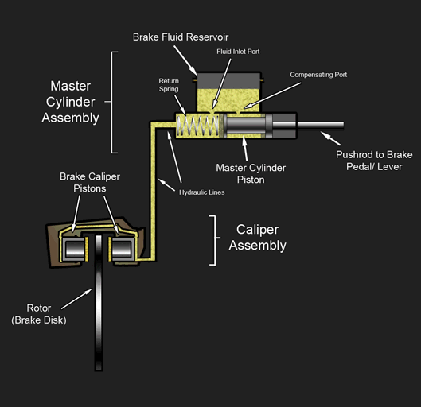 |
| Drum brake | Rear brakes on some small cars and trucks; parking-brake duty | Compact parking-brake integration; large friction area; self-energising shoe geometry can reduce actuation force | Enclosed drum retains heat; springs and adjuster are less visible and more complicated to assemble | 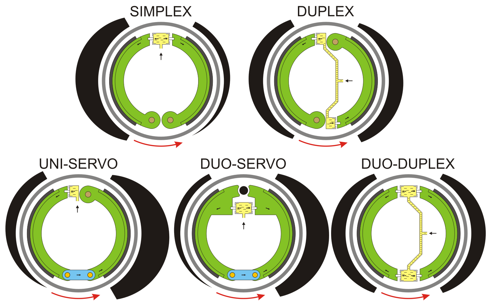 |
| Regenerative brake | Battery-electric and hybrid vehicles | Recovers energy; reduces friction-pad wear; motor torque is electronically controllable | Braking depends on motor, inverter, battery limits and vehicle speed; friction brakes are still required | 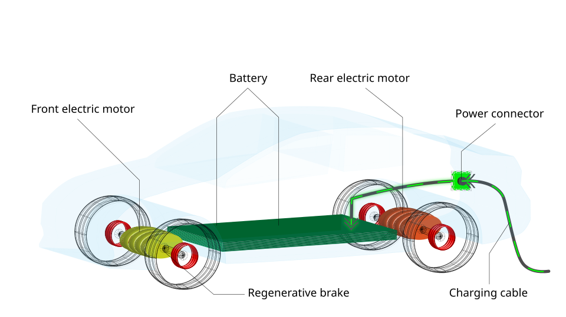 |
| Compressed-air service brake | Heavy trucks, buses and trailers | Stored air provides robust multi-axle actuation; leakage does not immediately remove all braking capability | Compressor, dryer, reservoirs, valves and chambers add weight and response delay; a working model needs pressure-rated hardware | 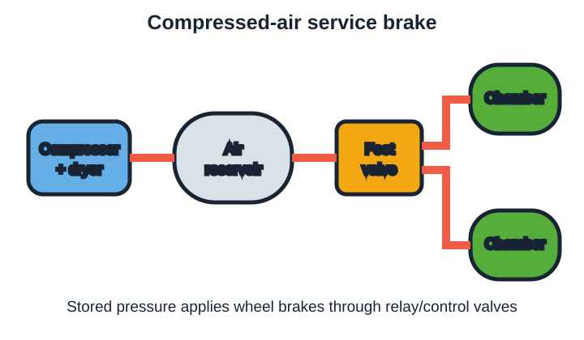 |
| Electric parking brake (EPB) | Modern passenger-car rear disc or drum brakes | Compact cabin control; automatic apply/release and integration with hill-hold functions | Needs motor, reduction gear, sensors, wiring and fail-safe release; it is primarily a holding brake, not a substitute for the service brake | 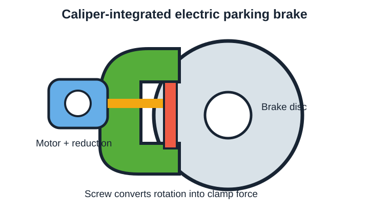 |

#### Part List

##### Main parts in a road-car brake system

| Main Part | Function |
| --- | --- |
| Brake pedal, booster and master cylinder | Create and amplify the driver's hydraulic command |
| Reservoir, brake fluid, rigid lines and flexible hoses | Store and transmit hydraulic pressure |
| Rotor and caliper, or drum and wheel cylinder | Convert hydraulic force into friction torque at each wheel |
| Pads or shoes and friction lining | Provide the replaceable friction surfaces |
| Return springs, slide pins and adjusters | Release the brake and maintain operating clearance |
| Parking-brake lever/actuator and cable or motor | Hold the vehicle independently of the normal pedal system |
| Wheel-speed sensors, ABS modulator and controller | Detect wheel slip and modulate individual brake pressure |
| EV motor, inverter and high-voltage battery | Provide and absorb regenerative braking power where fitted |

##### Teaching demonstrator

| Make (3D print / laser cut) | Buy |
| --- | --- |
| Large rotor, caliper shell and replaceable pad carriers | Steel input shaft, bearings/pillow blocks and shaft collars |
| Cable- or screw-operated piston/lever mechanism | Commercial friction material or small bicycle brake pads |
| Pedal/hand lever, mounting plate and adjustable pad-clearance features | Bowden cable, springs, fasteners and threaded inserts |
| Colour-coded pressure/force arrows and wheel-speed markers | Clear polycarbonate guard and low-speed hand crank or geared motor |
| Optional drum, shoes and removable cover for comparison | Optional master/slave cylinder set, compatible brake fluid and catch tray |

#### Teaching Platform

##### 3D printing / manufacturing easiness

- **Dry mechanical disc-brake model — easy to moderate:** the rotor, caliper body, pad carriers and lever can be printed. Flatness, concentricity and sufficient shaft support matter more than fine surface detail.
- **Drum-brake model — moderate:** the circular parts are easy to CAD, but shoe pivots, return springs and the adjuster add small parts and assembly work.
- **Hydraulic disc-brake model — moderate to hard:** use commercial cylinders, hose and seals. Printed pressure-containing parts can leak or fail and should not be used.
- **Regenerative-brake rig — hard:** it needs a motor/generator, drive electronics, a safe electrical load or battery, sensing and control logic.
- **Air-brake or EPB rig — moderate to hard:** use certified pneumatic or electromechanical actuators; do not print pressure vessels or safety-critical load paths.
- A printed demonstrator is for low-speed teaching only and must never be installed on a vehicle.

##### Demonstratability

- The simplest demonstration needs **no external fluid**: turn a guarded rotor by hand or with a low-speed motor, pull a cable/screw actuator and observe the pads clamp the rotor.
- Put coloured marks on the shaft and rotor, and add a spring scale at the lever to compare input force with braking effect.
- A hydraulic demonstration does require compatible brake fluid, sealed commercial cylinders, hose, bleeding equipment and a catch tray.
- A drum model should use a removable or transparent cover so shoe movement remains visible.
- Regenerative braking needs a motor/generator, controller and electrical load or battery; an energy meter makes recovered power visible.
- An air-brake model needs a regulated low-pressure source, gauge, reservoir and commercial valves/chambers. An EPB model needs only low-voltage power and a current-limited switch/controller if a purchased actuator is used.

##### Works with what

- **Wheel end:** wheel hub, rotor or drum, bearings and tyre-road contact.
- **Driver input:** pedal, booster, master cylinder and hydraulic lines, or an electronic brake-by-wire command.
- **Control systems:** wheel-speed sensors, ABS hydraulic modulator, traction control and stability control.
- **Parking system:** cable or electric parking-brake actuator and a mechanical holding feature.
- **Commercial air system:** compressor, dryer, reservoirs, protection/relay valves, chambers and mechanical wheel brakes.
- **EV/hybrid system:** traction motor, inverter, battery-management limits and blended-braking controller; friction brakes remain necessary.[^10]

##### CAD easiness

- **Easy:** simplified rotor, pads, cable lever, mounting plate and open caliper shell.
- **Moderate:** drum shoes, adjuster, return-spring anchors and a visually accurate floating caliper.
- **Hard:** pressure-tight hydraulics or pneumatics, ABS modulator, production EPB screw drive or a functional regenerative/brake-blending system.
- For a clear teaching model, enlarge pad travel and clearances slightly, use different colours for fixed and moving parts, and expose the force path.

##### Recommended brake demonstrator

Build a large, guarded **dry disc-brake model** with a hand crank or low-speed geared motor and a cable- or screw-operated caliper. It is easy to print and CAD, shows the braking action immediately, and needs no fluid. Add a removable drum-brake model or a separate motor/generator rig only if the project needs a comparison.

---

### Clutches

#### What it is

##### Description and rough working principle

A clutch is a controllable connection between a driving shaft and a driven shaft.

- In a conventional single-plate dry clutch, a diaphragm spring pushes the pressure plate against the clutch disc and flywheel. Friction locks the three together so engine torque reaches the gearbox input shaft.[^11]
- Pressing the clutch pedal moves a cable or hydraulic release system. The release bearing deflects the diaphragm spring, the pressure plate unloads the disc and the engine can rotate independently of the gearbox.
- During launch the disc is allowed to slip briefly, letting the engine and stationary drivetrain approach the same speed smoothly. A torsional damper in the disc reduces vibration and shock.[^12]
- Multi-plate clutches stack alternating driving and driven plates to obtain more torque capacity in a small diameter. Centrifugal clutches use speed-sensitive shoes or weights to engage automatically.
- A **dog clutch** locks matching teeth without controlled slip; a **one-way clutch** wedges only in one direction; an **electromagnetic clutch** uses a powered coil to pull friction faces together.[^29][^30][^31]

##### Why a car needs a clutch

- Disconnect the engine from the drivetrain while starting, stopping or selecting a gear.
- Allow controlled slip when launching from rest so the engine does not stall and the vehicle does not jerk.
- Reconnect power smoothly after a gear change.
- Reduce torsional shock and protect gears, shafts and joints from sudden torque changes.
- In DCTs, hybrids and automatic transmissions, multiple controlled clutches select power paths even though the driver may not operate a clutch pedal.

##### Representative clutch mechanisms

The six mechanisms below engage torque in different ways: friction, centrifugal force, positive teeth, wedging elements or electromagnetic force.

| Clutch Type                       | Common Use                                                                           | Advantage                                                                                     | Disadvantage                                                                                                       | Image                                                                                                   |
| --------------------------------- | ------------------------------------------------------------------------------------ | --------------------------------------------------------------------------------------------- | ------------------------------------------------------------------------------------------------------------------ | ------------------------------------------------------------------------------------------------------- |
| Single-plate dry diaphragm clutch | Manual-transmission passenger cars and light trucks                                  | Compact; efficient when fully engaged; operation and release mechanism are easy to understand | Friction lining wears; poor control causes heat, judder or stalling; needs axial release travel                    | 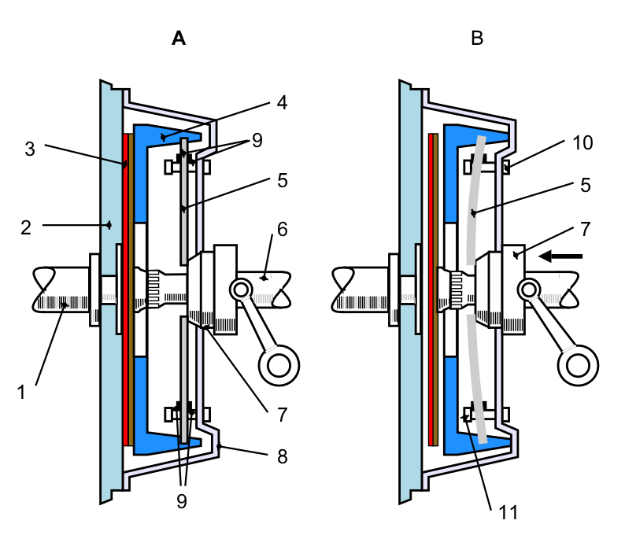 |
| Multi-plate wet or dry clutch     | Motorcycles, dual-clutch transmissions, automatic transmissions and performance cars | High torque capacity in a small diameter; several interfaces share the load                   | More plates, tight tolerances and heat management; a wet clutch needs oil, sealing and drag control                | 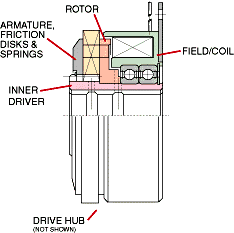                            |
| Centrifugal clutch                | Scooters, small utility vehicles and simple automatic drives                         | Engages automatically as speed rises; no clutch pedal or external release actuator            | Engagement speed depends on springs, mass and wear; slipping creates heat; guarded rotation is required for a demo | 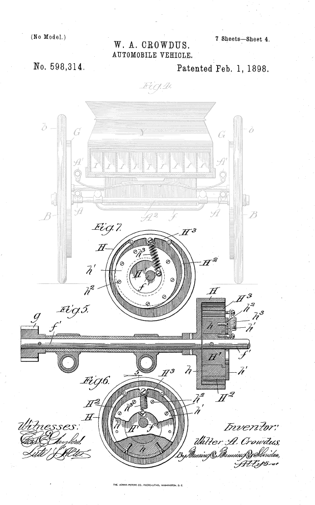                                |
| Positive dog clutch | Gear selectors, disconnect units and hybrid/EV driveline couplers | Near-zero slip and high efficiency once teeth are engaged; operation is visually clear | Cannot smoothly launch a vehicle; tooth speeds must be matched and engagement shock controlled[^29] | 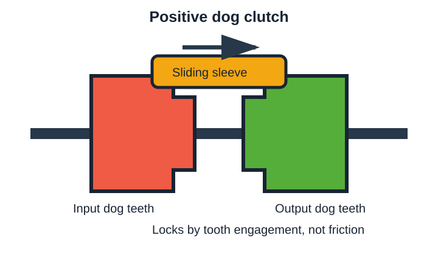 |
| Sprag or roller one-way clutch | Automatic transmissions, starter drives and hybrid power paths | Automatically locks in one direction and freewheels in the other with little control hardware | Direction-specific; wedging geometry, race hardness and tolerances are difficult to manufacture[^30] | 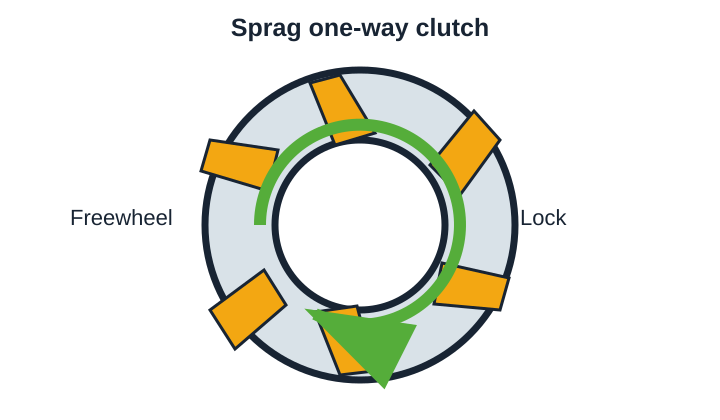 |
| Electromagnetic friction clutch | Engine-driven accessories, pumps, compressors and remotely controlled disconnects | Fast electrical control with no mechanical linkage; easy to switch from a controller | Coil consumes power and produces heat; air gap and friction wear must be controlled[^31] | 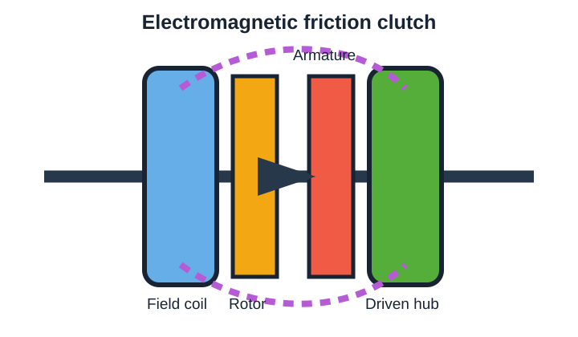 |

#### Part List

##### Main parts in a single-plate automotive clutch

| Main Part | Function |
| --- | --- |
| Flywheel | Provides the engine-side friction surface and rotational inertia |
| Clutch disc, friction linings and splined hub | Carries torque to the gearbox input shaft while permitting axial release |
| Torsional damper springs | Filter engine torque pulses and driveline shock |
| Pressure plate and clutch cover | Clamp the disc to the flywheel |
| Diaphragm spring | Supplies clamp load and acts as the release lever system |
| Release bearing and guide tube | Apply axial force to the diaphragm while allowing rotation |
| Release fork, pedal and cable or hydraulic cylinders | Carry the driver's command to the release bearing |
| Pilot bearing and gearbox input shaft | Support and align the driven shaft |

##### Teaching demonstrator

| Make (3D print / laser cut) | Buy |
| --- | --- |
| Enlarged flywheel, pressure plate, clutch disc and transparent cover | Two steel shafts, bearings/pillow blocks and shaft collars |
| Simplified splined or keyed disc hub | Friction sheet, cork/rubber lining or a small commercial clutch disc |
| Release fork, pedal/hand lever and adjustable pressure-plate guides | Compression springs, thrust bearing, cable and fasteners |
| Colour-coded torsional-damper insert and shaft-speed markers | Hand crank or guarded low-speed geared motor and controllable load |
| Optional interchangeable single- and multi-plate stacks | Clear polycarbonate safety guard and threaded inserts |

#### Teaching Platform

##### 3D printing / manufacturing easiness

- **Simplified single-plate dry clutch — moderate:** large circular parts are easy to print, but the pressure plate must move axially without tilting and the disc must remain centred.
- **Multi-plate dry stack — moderate:** plates are simple, but flatness, alternating tabs and controlled stack clearance matter.
- **Wet multi-plate clutch — hard:** it needs a sealed oil housing, compatible friction material, lubrication and heat management.
- **Centrifugal clutch — moderate to hard:** pivots and shoes are straightforward, but spring selection, balance, engagement speed and containment require care.
- **Dog clutch — easy to moderate:** printable at enlarged scale, but the sleeve needs enough lead-in chamfer and axial travel to engage fully.
- **One-way or electromagnetic clutch — moderate to hard:** a low-load visual model is possible, but realistic sprags, hardened races, magnetic air gaps and heat management are specialist work.
- A real vehicle clutch requires heat-resistant lining, accurately ground surfaces, controlled clamp load and high-speed balance; printed parts are suitable only for a guarded low-speed model.

##### Demonstratability

- The recommended dry model needs **no external fluid**. Turn the input shaft by hand, clamp the disc, and show both shafts rotate together; pull the release lever and show the input turn while the output stops.
- Mark both shafts to make slip, engagement and relative speed visible. An adjustable spring preload can demonstrate the relationship between clamp force and torque capacity.
- Apply a small controllable output load to show why partial engagement slips and generates heat, but keep speed and contact temperature low.
- A wet clutch requires oil and a leak-proof case. A centrifugal clutch requires a motor, speed controller, tachometer and strong transparent guard.
- An enlarged dog clutch and a one-way roller analogy can both be turned by hand with no external fluid. An electromagnetic model additionally needs a current-limited low-voltage supply.
- Do not touch rotating parts or use an unguarded printed flywheel, shoe or pressure plate.

##### Works with what

- **Input side:** engine crankshaft, flywheel and usually a pilot bearing.
- **Output side:** splined gearbox input shaft, transmission gears and the rest of the drivetrain.
- **Release system:** pedal plus cable, or master/slave hydraulic cylinders, release fork and release bearing.
- **Supporting systems:** bellhousing, bearings, mounts and sometimes a dual-mass flywheel.
- **Automated systems:** clutch actuator, transmission control unit and shaft-speed/temperature sensing; a DCT needs two clutches and two gear-train input paths.
- **Special mechanisms:** a dog clutch needs matched shaft speeds or a synchronizer; a one-way clutch needs hardened concentric races; an electromagnetic clutch needs a coil driver and electrical supply.

##### CAD easiness

- **Easy:** non-functional exploded display, flat clutch disc and simple flywheel.
- **Moderate:** moving single-plate model with pressure-plate guides, release lever, keyed hub and adjustable spring preload.
- **Moderate to hard:** multi-plate stack or centrifugal shoes with realistic clearances and balance.
- **Moderate:** enlarged dog-clutch teeth and sliding sleeve; **hard:** sprag geometry or electromagnetic flux/thermal design at realistic scale.
- **Very hard:** vehicle-grade diaphragm-spring geometry, friction/thermal design, torsional damper, spline standards, fatigue life and high-speed containment.

##### Recommended clutch demonstrator

Build a large, guarded **single-plate dry clutch** with two supported shafts, a spring-loaded pressure plate and a hand-operated release fork. Use visible shaft marks and adjustable clamp load. It clearly demonstrates engaged, slipping and disengaged states without oil, hydraulics or specialist tools.

---

### Brakes and Clutches: Sources and Image Credits

#### Technical sources

[^8]: Brembo, [Brake caliper technology and operation](https://www.bremboparts.com/america/en/support/car/insights/brake-caliper-technology-and-operation-324333), describing hydraulic pressure, pistons, pads, rotors and fixed/floating calipers.
[^9]: Continental, [Drum Brakes](https://www.continental-automotive.com/en/components/brake-systems/drum-brakes.html), describing hydraulic wheel-cylinder actuation of brake shoes against a drum.
[^10]: Bosch Mobility, [Regenerative braking systems](https://www.bosch-mobility.com/en/solutions/driving-safety/regenerative-braking-systems/), explaining motor-generator energy recovery and the continuing role of friction brakes.
[^11]: MIT 2.972, [Clutch](https://web.mit.edu/2.972/www/reports/clutch/clutch.html), explaining engagement of the friction disc between flywheel and pressure plate.
[^12]: ZF, [Clutch Systems](https://www.zf.com/products/en/cv/products_65885.html), describing diaphragm-spring clamp load, the clutch disc and torsional vibration damping.
[^27]: ZF, [Engine Driven Compressors](https://www.zf.com/products/en/cv/products_64626.html), explaining that compressors generate pressurised air for commercial-vehicle braking and other pneumatic systems.
[^28]: Continental, [EPB-Si Electric Parking Brake](https://www.continental-automotive.com/en/components/brake-systems/drum-brakes/epb-si.html), explaining switch control and electromechanical actuators that build parking-brake clamp force.
[^29]: Schaeffler, [Hybrid Transmission](https://www.schaeffler.com/remotemedien/media/_shared_media/08_media_library/01_publications/schaeffler_2/symposia_1/downloads_11/schaeffler_kolloquium_2018_en.pdf), showing a dog clutch used to connect or separate a hybrid-transmission variator from the wheel side.
[^30]: BorgWarner, [Transmission Technologies](https://www.borgwarner.com/technologies/transmission-technologies), describing cam, roller and sprag one-way clutches for transmissions and engine start-stop systems.
[^31]: Ogura Industrial, [Electromagnetic Clutches and Brakes](https://ogura-clutch.com/), documenting electrically controlled friction-clutch products for mobile and engine-driven applications.

#### Image credits

- [Hydraulic disc brake diagram](https://commons.wikimedia.org/wiki/File:Hydraulic_disc_brake_diagram.gif) by KDS444, CC BY-SA 3.0.
- [Drum-brake arrangements](https://commons.wikimedia.org/wiki/File:Tipologia_tamburo.svg) by A7N8X, CC BY-SA 4.0.
- [Electric car diagram](https://commons.wikimedia.org/wiki/File:Electric_car_diagram.svg) by Ian Furst, CC BY-SA 4.0.
- [Single-plate diaphragm clutch](https://commons.wikimedia.org/wiki/File:Embrague2.png) by Enrique A. Chaparro, Free Art License.
- [Multiple Disk Clutch](https://commons.wikimedia.org/wiki/File:Multiple_Disk_Clutch.gif) by Oguraclutch, public domain.
- [Centrifugal clutch patent drawing](https://commons.wikimedia.org/wiki/File:US_Patent_598314_detail_centrifugal_clutch.png) by W. A. Crowdus, public domain.
- Compressed-air brake, electric parking brake, dog clutch, one-way clutch and electromagnetic clutch diagrams created specifically for this research document.

---

# Drivetrain Layouts

## Front-Wheel Drive

### What it is

#### Description and rough working principle

Front-wheel drive (FWD) means that propulsion torque is delivered to the two front wheels. Those wheels must drive the vehicle while also steering and moving through the suspension travel.

- In a conventional FWD car, the engine sends torque through a clutch or torque converter into a **transaxle**. The transaxle combines the transmission, final reduction and differential in one compact front-mounted assembly.[^13]
- The final-drive gears reduce speed and increase torque. The differential then divides torque between the left and right front outputs while allowing the two wheels to rotate at different speeds in a turn.
- Two short half-shafts carry torque from the differential to the wheel hubs. Each normally has an inboard plunging CV joint and an outboard fixed CV joint, so it can transmit torque while the suspension moves and the wheels steer.[^14]
- A battery-electric FWD vehicle replaces the engine and multi-ratio transmission with a front electric drive unit. The motor, power electronics, reduction gears, differential and drive shafts may be integrated into one e-axle or electric transaxle.[^15][^16]

The power path is:

**engine or motor → clutch/torque converter or inverter control → transmission/reduction gear → final drive and differential → CV half-shafts → front hubs → front tyres**

#### Why a car needs or uses front-wheel drive

- Packages the power unit, transmission and driven axle together at the front, leaving more cabin and luggage space and usually avoiding a long propeller shaft and rear differential.
- Reduces the number, mass and cost of separate driveline assemblies in many small and medium passenger cars.
- Places the powertrain mass over the driven wheels, which can help launch traction on low- or moderate-grip surfaces.
- Produces predictable understeer near the handling limit, which is generally easier for an average driver to manage than sudden oversteer.
- Works well with transverse engines and compact electric drive units.

FWD also has compromises: the front tyres share acceleration, steering and most braking work; hard acceleration transfers load rearward; unequal half-shafts and suspension geometry can contribute to torque steer; and tight packaging can make service difficult.

#### Types of Front-Wheel-Drive Layouts

| FWD Layout | Common Use | Advantage | Disadvantage | Image |
| --- | --- | --- | --- | --- |
| Transverse-engine FWD | Most modern compact and mid-size combustion-engine cars; manual, automatic, DCT or CVT transaxles | Very compact front power module; short vehicle length; no longitudinal propeller shaft | Crowded engine bay; unequal half-shaft lengths can worsen torque steer; engine width limits packaging | 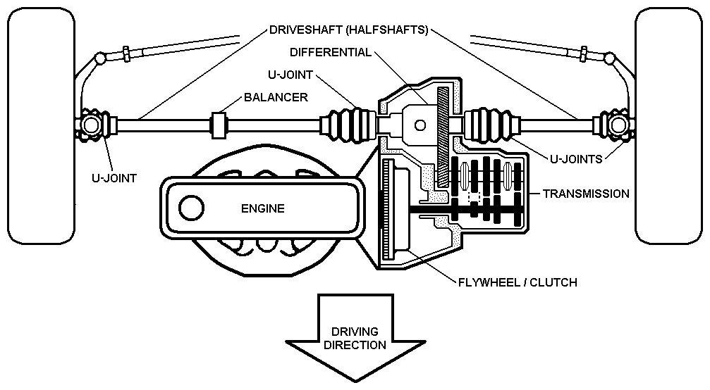 |
| Longitudinal-engine FWD | Less common passenger-car platforms and some historic designs | Engine and gearbox lie along the vehicle centreline; can suit long engines and platform families related to AWD | Longer front overhang and more complex final-drive packaging; uncommon and less suitable for a simple model | 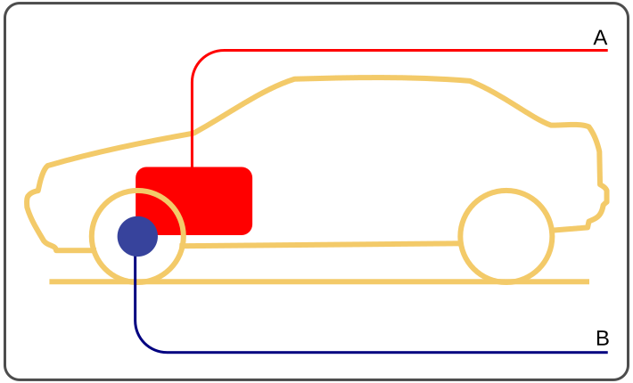 |
| Single-motor electric FWD | Compact and mass-market battery-electric vehicles | Motor, inverter, reduction gear and differential can form one compact unit; no clutch or multi-speed gearbox is normally required | Front tyres still handle drive and steering; high-voltage controls and cooling make a realistic working model difficult | 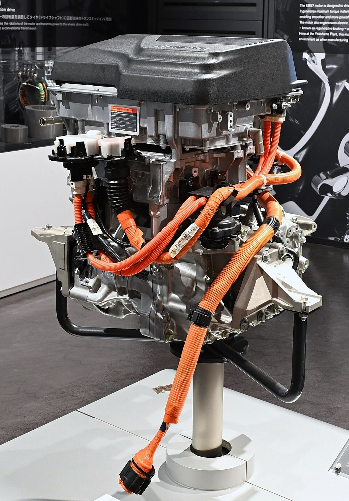 |

### Part List

#### Main parts in a road-car FWD system

| Main Part | Function |
| --- | --- |
| Engine or electric motor | Produces the input torque |
| Clutch and flywheel, or torque converter | Connects a combustion engine to the transaxle and permits launch |
| Transmission or EV reduction gears | Match power-unit speed and torque to road requirements |
| Final drive and differential | Provide the last reduction and divide torque between the front wheels |
| Left and right half-shafts | Carry torque from the differential to the wheel hubs |
| Inboard plunging CV joints | Allow half-shaft length change as the suspension moves |
| Outboard fixed CV joints | Transmit torque through the large angle required for steering |
| Wheel hubs, bearings and steering knuckles | Support the driven wheels and connect drivetrain, steering and suspension |
| Engine/transaxle mounts or e-drive mounts | React drive torque and locate the power unit in the chassis |
| Lubricant, seals and CV boots | Lubricate gears/joints and exclude dirt while retaining oil or grease |

#### Teaching demonstrator

| Make (3D print / laser cut) | Buy |
| --- | --- |
| Transverse motor/transaxle shell and labelled mounting frame | Low-voltage geared motor or hand crank |
| Spur-gear reduction and open bevel-gear differential carrier | Steel shafts, bearings/pillow blocks and shaft collars |
| Two half-shafts with colour-coded input/output markers | Small commercial CV joints, universal joints or model-car drive shafts |
| Steerable knuckles, hubs and adjustable steering linkage | Fasteners, threaded inserts, washers and retaining clips |
| Sliding suspension guides and transparent gear guard | Two wheels/tyres and a small controllable output load |
| Optional equal- and unequal-length half-shafts for comparison | Optional commercial model-car differential for validation |

### Teaching Platform

#### 3D printing / manufacturing easiness

- **Static FWD layout — easy:** the engine/motor, transaxle, half-shafts and driven wheels can be simplified into colour-coded blocks and shafts.
- **Working fixed-wheel drivetrain — moderate:** a printed reduction stage and open differential work at low speed, but gear spacing, shaft alignment, bearing fits and backlash must be controlled.
- **Working steerable and suspended front axle — moderate to hard:** both half-shafts need joints that articulate during steering and plunge during suspension travel.
- **Realistic CV joints — hard:** ball tracks, cages, hardened surfaces, grease retention and boots are poor candidates for ordinary FDM printing. Buy small CV joints or use visible universal/sliding joints as a labelled approximation.
- **Road-capable hardware — very hard and unsafe to print:** real shafts, hubs, gears and knuckles carry cyclic torque, bending and impact loads. Printed parts are for guarded low-speed teaching only.

#### Demonstratability

- The recommended model needs **no external fluid**. Use dry printed gears and purchased bearings at hand-crank or low-motor speed.
- Turn the input and show the final reduction, differential, half-shafts and both front wheels rotating. Hold one wheel lightly to show an open differential allowing the other wheel to turn faster.
- Steer the front hubs while rotating them to show why flexible constant-velocity joints are required. Move one hub vertically on a guide to demonstrate suspension travel and inboard plunge.
- Place matching marks on both half-shafts to compare their speed and add arrows showing the complete torque path.
- A realistic transaxle would require lubricant and seals, while a working EV drive would also require an inverter, battery, controller and cooling. Neither is necessary for the basic demonstrator.
- All gears, shafts and joints must be covered by a clear guard when motor-driven.

#### Works with what

- **Power source:** transverse or longitudinal combustion engine, hybrid power unit, or front electric motor/inverter.
- **Torque connection:** manual clutch, DCT clutch, torque converter, or direct EV reduction input.
- **Front transaxle:** transmission/reduction gears, final drive, open or limited-slip differential and parking lock where required.
- **Wheel drive:** left/right half-shafts, inboard plunging joints, outboard fixed CV joints, hubs and wheel bearings.[^14]
- **Steering and suspension:** steering rack/tie rods, knuckles, struts/control arms and geometry that limits CV-joint angles throughout wheel travel.
- **Vehicle control:** ABS/traction-control wheel-speed sensing, engine or inverter torque control and, where fitted, electronic limited-slip braking.
- **Structure:** subframe and powertrain mounts strong enough to react motor/engine torque without excessive movement.

#### CAD easiness

- **Easy:** top-view packaging model with engine/motor, transaxle, half-shafts and front wheels.
- **Moderate:** working spur reduction and bevel-gear open differential with fixed wheel hubs.
- **Moderate to hard:** steerable hubs, unequal half-shafts, sliding joints, suspension motion and a compact transverse housing without interference.
- **Very hard:** true Rzeppa/tripod CV-joint tracks, production gear tooth geometry, bearing preload, lubrication, seals, mount compliance, durability and torque-steer optimisation.
- CAD the assembly from the wheel-centre locations inward. Define steering angle and suspension travel first, then check half-shaft articulation, plunge and interference through the full motion range.

#### Recommended front-wheel-drive demonstrator

Build a guarded, low-speed **transverse FWD module** with a hand crank or geared motor, one visible reduction stage, an open differential, two half-shafts and steerable front hubs. Purchase small model-car CV shafts if available; otherwise use clearly labelled universal-and-sliding joints as an approximation. This model shows the complete power path, differential action, steering articulation and suspension plunge without oil, high voltage or specialist tools.

---

### Front-Wheel Drive: Sources and Image Credits

#### Technical sources

[^13]: West Virginia Department of Transportation, [Crawford's Guide to Beginners Auto Maintenance & Repair](https://transportation.wv.gov/highways/training/TrainingDocuments/Crawfords_Auto_Repair_Guide.pdf), explaining that an FWD transaxle combines the transmission and differential and sends power to the front wheels.
[^14]: GKN Automotive, [Countertrack principle for CV joints explained](https://www.gknautomotive.com/media/woyls0y4/gkn-automotives-countertrack-principle-for-cv-joints-explained.pdf), describing the two CV joints on FWD sideshafts and their rotation, articulation and plunge requirements.
[^15]: Bosch Mobility, [Electric drive](https://www.bosch-mobility.com/en/solutions/powertrain/battery-electric/electric-drive/), describing compact eAxles that combine power electronics, electric motor and transmission.
[^16]: ZF, [Electric Axle Drive 200 kW](https://www.zf.com/products/en/cars/products_79234.html), listing an integrated e-drive system with motor, power electronics, differential and drive shafts.

#### Image credits

- [Transverse engine layout](https://commons.wikimedia.org/wiki/File:Transverse_engine_layout.png) by Hoikka1, CC BY-SA 3.0.
- [Front-mid-engine front-wheel-drive diagram](https://commons.wikimedia.org/wiki/File:Engine_fmf002.svg) by Teccirio and Malyszkz, CC BY 2.5.
- [Nissan Leaf ZE1 powertrain](https://commons.wikimedia.org/wiki/File:Nissan_Leaf_ZE1_powertrain_01.jpg) by TTTNIS, CC0.

---

# EV Configurations

## Dual-Motor, Single-Axle

This is **one complete vehicle configuration**: two traction motors drive the two wheels of the same axle. The driven axle may be the front or rear axle. It is not the common “dual-motor AWD” arrangement in which one motor drives the front axle and the other drives the rear axle.

### What it is

#### Description and rough working principle

The clearest dual-motor, single-axle arrangement gives each driven wheel its own motor and reduction gear.

- The battery supplies DC power to two inverters. Each inverter independently controls the speed and torque of one motor.
- Motor A drives the left wheel through its reduction gears and half-shaft; Motor B independently drives the right wheel through a matching path.
- Because the two wheel speeds are controlled electrically, the axle may not need a conventional mechanical differential. During a turn, the controller commands the outside wheel to rotate faster than the inside wheel.
- The controller can also command different positive or negative torque at each wheel. This is **torque vectoring**: the torque difference can help the car rotate into a corner, remain stable, or regain traction.[^17]
- During regenerative braking, either motor can operate as a generator. A sophisticated system can brake one wheel while continuing to drive the other.[^17]
- Some production systems package two motors, two gearsets and two inverters into one central axle module; others mount one compact drive unit near each wheel or place the motors inside the wheel hubs.[^18][^19][^20]

The power paths are:

- Left: **battery → left inverter → left motor → left reduction gear → left half-shaft/hub → left tyre**
- Right: **battery → right inverter → right motor → right reduction gear → right half-shaft/hub → right tyre**

#### Why a car uses dual motors on one axle

- Provides more axle power and torque than a single motor of similar individual size.
- Allows genuinely independent left/right wheel torque instead of relying only on a mechanical differential or brake intervention.
- Improves cornering response, traction and stability through active torque vectoring.
- Allows independent regenerative braking at the two driven wheels.
- Can remove the conventional differential when each motor has a separate wheel path.
- Lets designers use two small, fast motors and compact gearsets instead of one very large motor.
- May retain limited propulsion if one drive channel is safely shut down, although fault handling depends on the vehicle design.

The disadvantages are additional motor/inverter cost, mass, wiring, cooling and control complexity. Both drive channels must coordinate precisely, and excessive left/right torque difference can destabilise the vehicle.

#### Implementation Styles

| Dual-Motor Single-Axle Style | Common Use | Advantage | Disadvantage | Image |
| --- | --- | --- | --- | --- |
| Independent central/near-wheel motors, one per wheel | Performance EV axles, off-road EVs and research vehicles | Direct left/right torque control; no conventional differential is required; easiest architecture for demonstrating torque vectoring | Requires two motor controls and accurate coordination; duplicated gears, bearings and cooling connections | 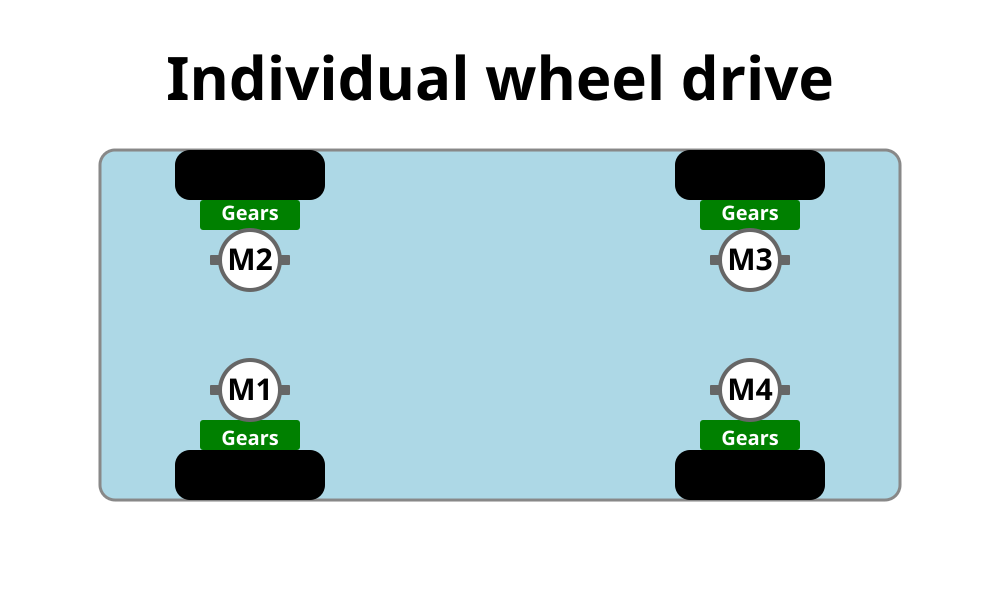 |
| Twin compact drive units in one axle package | High-performance road EVs such as a twin rear-drive arrangement | High power density; compact modular units; central mounting keeps motor mass off the wheels | Tight packaging and thermal management; complex mounting, lubrication, software and high-current connections | 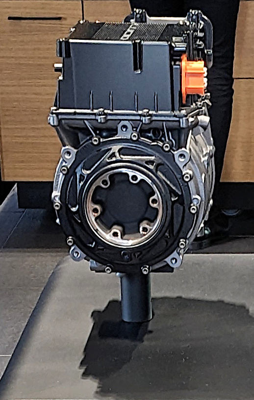 |
| Two in-wheel or wheel-end motors | Concept vehicles, urban vehicles and specialised platforms | Removes long half-shafts and gives the most direct independent wheel control | Adds unsprung mass; exposes motors to impact, water and heat; wheel/brake/suspension packaging is difficult | 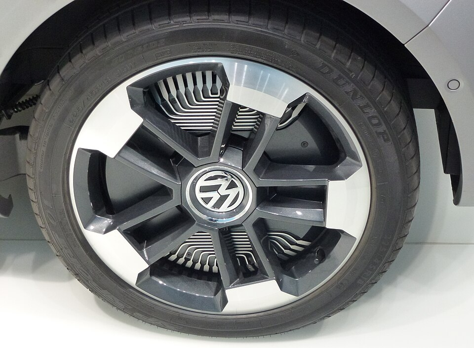 |

### Part List

#### Main parts in a road-car system

| Main Part | Function |
| --- | --- |
| High-voltage traction battery and contactors | Store energy and safely connect/disconnect the drive system |
| Two traction inverters | Independently convert battery DC into controlled motor current |
| Left and right traction motors | Produce separately controllable wheel torque |
| Two reduction gearsets | Reduce motor speed and multiply torque for the wheels |
| Half-shafts/CV joints or wheel-end couplings | Transfer each motor's torque while allowing suspension movement |
| Wheel hubs, bearings and tyres | Support the vehicle and transmit longitudinal/lateral force to the road |
| Vehicle control unit and torque-vectoring software | Calculate total axle torque and divide it safely between left and right motors |
| Wheel-speed, motor-position, current and temperature sensors | Provide feedback for commutation, traction, stability and protection |
| Cooling circuit | Remove heat from motors, inverters and sometimes gear oil |
| Low-voltage supply and communications bus | Power controllers and exchange commands/status with ABS and stability control |
| Mechanical brakes | Stop and hold the car when regenerative braking is insufficient or unavailable |

#### Teaching demonstrator

| Make (3D print / laser cut) | Buy |
| --- | --- |
| Axle frame, two motor mounts and transparent guards | Two identical low-voltage geared DC motors with encoders if possible |
| Two matching spur-gear reductions and wheel hubs | Two H-bridge motor drivers and a low-voltage DC power supply |
| Two wheels and interchangeable low/high-grip tyre sleeves | Microcontroller, wiring, switches and emergency-stop button |
| Adjustable track-width brackets and small wheel-load arms | Wheel-speed sensors/encoders and current sensors |
| LED torque/speed indicators and labelled left/right power paths | Bearings, steel shafts, shaft collars, fasteners and threaded inserts |
| Optional small turntable or curved guide to represent cornering | Two potentiometers or a steering-angle sensor for command input |

### Teaching Platform

#### 3D printing / manufacturing easiness

- **Static layout model — easy:** motors, inverters, battery and wheel paths can be represented by coloured blocks and two parallel drivetrains.
- **Direct-drive two-motor model — easy to moderate:** use two purchased geared motors connected directly to two printed hubs. Alignment and guarding are the main mechanical tasks.
- **Twin printed reduction gearsets — moderate:** both sides should have equal ratios, centre distances and backlash so differences in wheel behaviour come from control commands rather than mechanical mismatch.
- **Central integrated axle housing — hard:** two motors, gears, bearings, seals, oil paths, inverters and cooling must fit without interference.
- **In-wheel implementation — very hard:** it adds motor electromagnetic design, wheel-bearing loads, sealing, brake packaging and unsprung-mass concerns.
- Printed gears, wheels and mounts are suitable only for a low-voltage, low-speed teaching rig—not a road vehicle.

#### Demonstratability

- No external fluid is needed for the recommended model. It does require a low-voltage power supply, two motor drivers and a controller or two manual speed controls.
- **Straight-line mode:** command equal motor speeds/torques and show both wheels turning together.
- **Cornering/electronic-differential mode:** use a steering knob to slow the inside wheel and speed the outside wheel. LEDs or a display can show both commands and measured speeds.
- **Torque-vectoring mode:** apply more drive torque to the outside wheel and less to the inside wheel; mount the axle module on a low-friction turntable so the yaw reaction is visible.
- **Split-traction mode:** put one wheel on a low-grip roller or smooth sleeve and show the controller limiting that motor while maintaining useful torque at the other wheel.
- **Regeneration analogy:** electrically brake one motor while the other continues to drive. A resistor/LED load can make recovered electrical power visible; charging a battery requires proper battery-management hardware.
- Use an emergency stop, current limits and clear guards. Never run exposed printed gears or wheels at high speed.

#### Works with what

- **Energy system:** traction battery, contactors, fuse, pre-charge circuit and battery-management system.
- **Power electronics:** two inverters or one dual-channel inverter, DC bus and low-voltage control supply.
- **Axle hardware:** two reductions, half-shafts/CV joints or wheel-end drives, hubs, bearings and tyres.
- **Chassis systems:** suspension, steering if fitted to the driven axle, friction brakes and suitable subframe/mounts.
- **Vehicle controls:** accelerator and brake requests, wheel-speed sensors, ABS, traction/stability control and torque-vectoring supervisor.
- **Thermal system:** coolant pump, radiator/chiller, hoses and temperature monitoring for high-output systems.
- The other axle can be non-driven; therefore this configuration by itself remains two-wheel drive, not AWD. A separate drive unit on the second axle would create a three- or four-motor AWD vehicle.

#### CAD easiness

- **Easy:** top-view packaging model showing battery, two motors, two controllers and two driven wheels.
- **Easy to moderate:** direct-drive teaching axle with mirrored motor mounts and adjustable wheel spacing.
- **Moderate:** two equal reduction gearsets, protected cables, sensor mounts and removable transparent guards.
- **Hard:** compact twin-motor housing with realistic bearings, lubrication, cooling and service access.
- **Very hard:** in-wheel motors or vehicle-grade design involving electromagnetic, structural, thermal, sealing, fatigue, NVH and crash-load requirements.
- Model the two sides as linked mirrored subassemblies, but keep motor mounts and cable routing independently editable. Check wheel, suspension and brake clearance through full travel before finalising the housing.

#### Recommended dual-motor, single-axle demonstrator

Build one complete guarded axle with **two identical low-voltage geared motors, one motor per wheel**, controlled by a microcontroller and two motor drivers. Use a steering-angle knob to generate different left/right speed commands, add visible encoder readouts, and provide straight-line, cornering and split-traction modes. This avoids oil, high voltage and difficult CV-joint manufacture while clearly demonstrating why two motors on one axle are different from one motor plus a mechanical differential.

---

### Dual-Motor, Single-Axle: Sources and Image Credits

#### Technical sources

[^17]: Lucid Motors, [Introducing Sapphire: The pinnacle of electric performance](https://lucidmotors.com/de-de/stories/introducing-sapphire-pinnacle-electric-performance), describing a twin rear-drive unit that can drive and regeneratively brake the rear wheels independently for torque vectoring.
[^18]: Rivian, [Investor Day 2024](https://downloads.rivian.com/2md5qhoeajym/29B1jJmErhGosTcyaS5Lci/4c04aba25a22778e3a9516cedaac2ddd/062724_Rivian_InvestorDay.pdf), identifying its Ascent drive unit as a production design with two motors per axle.
[^19]: ZF, [With Integrated Systems in Volume Production, ZF Can Electrify all Vehicle Types](https://press.zf.com/press/en/releases/release_3005.html), describing an electric rear axle with one compact drive unit at each wheel and independent torque distribution.
[^20]: ZF, [AxTrax 2 dual](https://www.zf.com/products/en/cv/products_75904.html), describing an integrated axle containing two motors, two inverters, transmission, actuators and an ECU.

#### Image credits

- [Individual-wheel-drive conceptual block diagram](https://commons.wikimedia.org/wiki/File:20210921_Individual_wheel_drive_-_conceptual_block_diagram.svg) by RCraig09, CC BY-SA 4.0.
- [Lucid Air electric drive unit](https://commons.wikimedia.org/wiki/File:Lucid_Air_Electric_Drive_Unit.jpg) by DutchTreat, CC BY-SA 4.0.
- [Volkswagen eT! concept hub motor](https://commons.wikimedia.org/wiki/File:Volkswagen_eT!_Concept_Hub_motor.JPG) by RudolfSimon, CC BY-SA 3.0.

---

# Advanced Systems

## Dynamic Suspensions

Dynamic suspension is **not the same topic as the basic steering-and-suspension hardware**. A conventional suspension uses fixed springs, dampers, arms and joints to support the vehicle and guide each wheel. A dynamic suspension adds sensors, electronic control and adjustable or powered hardware so its behaviour can change while the vehicle is moving.

#### What it is and how it works

The suspension must let the wheels follow an uneven road while keeping the body controlled. A soft setup improves isolation from bumps but can allow excessive roll, pitch and bounce; a firm setup improves body control but can transmit more shock to the passengers. Dynamic systems reduce this compromise by changing damping, ride height, spring support or wheel force in real time.

1. Accelerometers, ride-height sensors, wheel-speed sensors and vehicle signals such as steering, braking and speed describe what the body, wheels and driver are doing. A predictive system may also use a forward-looking camera.
2. A suspension ECU calculates the desired response for each wheel.
3. An electrically controlled valve, air valve, hydraulic pump or electromechanical actuator changes the suspension force.
4. The sensors measure the result and the controller repeats the calculation many times per second. ZF's CDC system, for example, changes damping at each wheel in fractions of a second, while fully active systems can command a separate force at each corner.[^21][^22]

- **Semi-active suspension** changes damper resistance. It can dissipate motion more or less strongly, but it does not continuously lift the body by adding mechanical energy.
- **Self-levelling or adaptive air/hydropneumatic suspension** changes air pressure or fluid distribution to maintain ride height, carry different loads or select a different ground clearance.
- **Fully active suspension** uses powered hydraulic or electromechanical actuators to push or pull at each wheel. It can counter body roll, pitch and heave instead of only resisting them.[^22][^23]
- **Active anti-roll control** generates torque between the left and right suspensions to oppose body roll while allowing softer ride behaviour in other conditions.[^32]
- **Predictive road-preview suspension** uses a forward-facing camera or other road sensor to command the suspension before the wheel reaches a disturbance.[^33]

#### Why a car needs it

- Keep the tyres in more consistent contact with a rough road while reducing body bounce.
- Combine comfortable straight-line driving with firmer control during cornering, braking and acceleration.
- Maintain ride height when passengers or cargo change the load.
- Reduce roll, brake dive and acceleration squat.
- Raise the vehicle for obstacles or lower it for stability and aerodynamic efficiency.
- Prepare the suspension for an approaching bump when road-preview sensors are available.
- Coordinate chassis motion with steering, brakes, stability control and driver-assistance systems.

#### Representative dynamic-suspension systems

The five rows separate systems by what they actively change: damper force, ride height/support, individual wheel force, roll moment or a preview-based command.

| System type | Common use | Advantage | Disadvantage | Image |
| --- | --- | --- | --- | --- |
| Semi-active variable damping | Passenger cars, performance cars and motorcycles | Fast, relatively energy-efficient and easier to package than a fully active system | Cannot independently support or lift the body; still needs good passive springs and dampers | 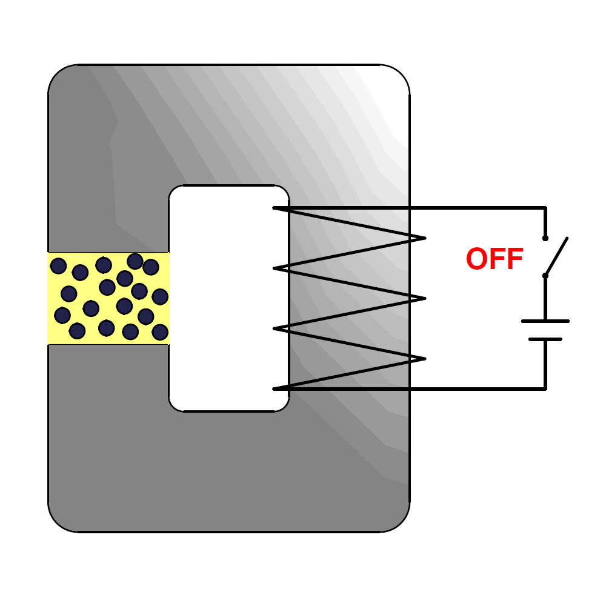 |
| Self-levelling air or hydropneumatic suspension | Luxury cars, SUVs and load-carrying vehicles | Maintains ride height and can change clearance or effective spring behaviour | Compressor/pump, valves, seals and fluid or air lines add cost, leakage risk and maintenance | 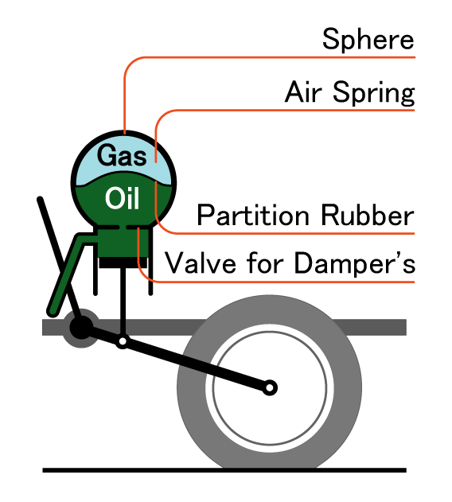 |
| Fully active individual-wheel suspension | High-end performance and luxury vehicles | Can add force at each wheel to control roll, pitch and heave during a disturbance | High power demand, actuator/control complexity, cost and safety burden | 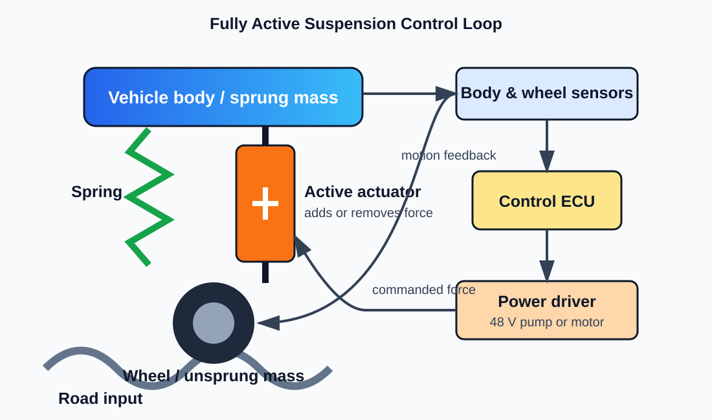 |
| Active anti-roll control | Performance cars, luxury cars and high-centre-of-gravity vehicles | Directly counters body roll in corners while reducing the need for a permanently stiff passive anti-roll bar | Adds high-force actuators, 48 V or hydraulic supply, sensors and fail-safe requirements | 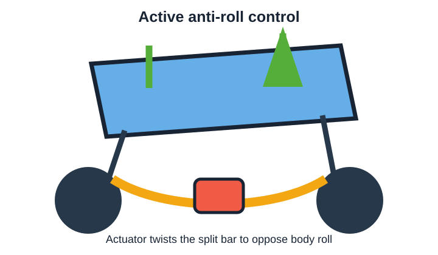 |
| Predictive road-preview suspension | Flagship luxury vehicles with camera-based chassis control | Prepares each corner before a detected bump, reducing body movement without waiting for impact | Camera visibility and road classification limit performance; sensing, calibration and actuators are expensive | 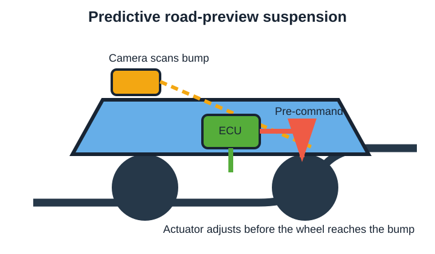 |

#### Rough parts list for a vehicle system

| Subsystem | Typical parts and purpose |
| --- | --- |
| Base suspension | Control arms or struts, joints, wheel carriers and anti-roll hardware guide the wheel and carry loads |
| Elastic elements | Coil springs, air springs or hydropneumatic spheres support vehicle weight |
| Adjustable force element | Electronically valved damper, magnetorheological damper, hydraulic actuator or electric linear actuator changes wheel/body force |
| Sensors | Body and wheel accelerometers, ride-height sensors, wheel-speed sensors, steering/brake inputs and optional road-preview camera |
| Controller | Suspension ECU estimates body motion and commands each corner |
| Power stage | Valve drivers, inverter, 12/48 V supply or high-voltage converter powers the adjustable hardware |
| Fluid/air hardware where applicable | Compressor or pump, reservoir, accumulator, manifold, filters, hoses and pressure sensors |
| Communications and safety | Wiring, CAN connection, fuses, fault monitoring and a fail-safe passive operating mode |

#### Teaching demonstrator: make or buy

| Make (3D print / laser cut) | Buy |
| --- | --- |
| Two matching quarter-car frames labelled Passive and Dynamic | Two equal coil springs and small linear guides or low-friction sliders |
| Sprung- and unsprung-mass carriers with removable weights | Low-voltage servo or linear actuator for the dynamic side |
| Eccentric cam or interchangeable bump profile to move both road platforms | Microcontroller, motor driver and protected low-voltage power supply |
| Adjustable actuator bracket and a simple lever/friction-damper mechanism | Two accelerometers and two distance or ride-height sensors |
| Sensor mounts, scale markers, electronics enclosure and transparent guards | Bearings, shafts, fasteners, emergency-stop switch and wiring |
| Mode labels and an LED/display panel for Comfort, Sport and Active | Optional data logger or computer for acceleration/displacement plots |

#### 3D printing / manufacturing easiness

- **Static cutaway or layout model — easy:** print labelled spring, damper, sensor, ECU and actuator blocks.
- **Passive quarter-car mechanism — easy to moderate:** the main work is aligning the slider, spring and bump input so it moves freely.
- **Servo-controlled semi-active analogy — moderate:** printed brackets and levers are straightforward, but sensor calibration, linkage clearance and control tuning take iteration.
- **Working air suspension — hard:** it needs airtight bellows, a compressor, valves, fittings and safe pressure control; the flexible air spring should be purchased rather than printed.
- **Working hydraulic or fully active unit — very hard:** precision bores, piston seals, low-leakage valves, accumulators and pressure-rated parts are unsuitable for ordinary FDM printing.
- **Active anti-roll or road-preview model — moderate to hard:** the linkage and sensor mounts are printable, but actuator sizing, camera/road sensing and closed-loop tuning need significant iteration.
- Printed parts are appropriate for low-speed structure, guards and linkages only. They must not be treated as road-vehicle suspension or pressure components.

#### Demonstratability

- The recommended rig needs **no external fluid**. Use a low-voltage servo-controlled friction damper or lever actuator to represent variable damping/active force.
- Drive the Passive and Dynamic road platforms from the same slow eccentric cam. Equal removable masses make the comparison fair.
- In **Comfort** mode, use a lower resisting force; in **Sport** mode, increase it; in **Active** mode, use ride-height and acceleration feedback to reduce body motion after the bump.
- Show body displacement with scale markers and plot both accelerometer signals. The dynamic side should settle faster or move less, depending on the selected control goal.
- Add or remove a mass to demonstrate self-levelling: the controller returns the dynamic body to its target height while the passive side remains lower.
- For active anti-roll, tilt the body frame with an offset load and command a servo between the two anti-roll-bar halves. For road preview, place a distance sensor ahead of the wheel and compare pre-emptive actuation with feedback-only control.
- A realistic air model needs compressed air; a realistic hydraulic model needs fluid, a pump, reservoir, accumulator, hoses and leak containment. Those additions improve realism but make a classroom demonstration less reliable and less safe.
- Guard pinch points and stored spring energy, limit actuator current and travel, and provide an emergency stop.

#### Works with what

- A complete **base suspension**: arms or struts, springs, dampers, joints, hubs, bearings and tyres.
- **Vehicle-state sensors** and a suspension ECU; dynamic hardware cannot choose a useful force without feedback and control logic.
- A reliable **electrical supply** and communications network. High-force active systems may need a 48 V or high-voltage power stage.[^23]
- **Steering, friction brakes, ABS, traction/stability control and powertrain torque control**, because all of them affect tyre force and body motion.
- The vehicle structure and subframes, which must carry actuator loads without excessive flex.
- For air/hydraulic versions: pumps or compressors, valves, reservoirs/accumulators, filters, hoses, pressure sensors and service procedures.

#### CAD easiness

- **Easy:** system block diagram or static cutaway with labelled energy and signal paths.
- **Easy to moderate:** quarter-car frame, removable masses, cam road input and adjustable sensor brackets.
- **Moderate:** servo lever, friction element, motion limits and transparent guards; check the entire suspension travel for collisions.
- **Moderate to hard:** split active anti-roll bar, actuator brackets or a camera/distance-sensor preview path because kinematics, sensing range and actuator timing all interact.
- **Hard:** air spring packaging and hose routing with realistic joints and service clearances.
- **Very hard:** vehicle-grade active strut or hydraulic valve body because sealing surfaces, fatigue, heat, pressure, noise and fail-safe behaviour must all be engineered.
- Keep the passive and dynamic modules dimensionally identical in CAD. Parameterise mass position, spring preload, actuator ratio and travel so comparisons can be changed without rebuilding the whole assembly.

#### Recommended dynamic-suspension demonstrator

Build a guarded, low-speed **side-by-side quarter-car rig**. Both sides use the same spring, moving mass and cam-driven road bump. Leave one side passive; equip the other with a ride-height sensor, accelerometer and low-voltage servo-controlled damper/actuator. Provide Comfort, Sport and Active modes plus a removable payload. This clearly demonstrates variable damping, body-motion control and self-levelling without high-pressure hydraulics, compressed air or duplicated images from the basic Steering and Suspension section.

---

### Dynamic Suspensions: Sources and Image Credits

#### Technical sources

[^21]: ZF, [Continuous Damping Control (CDC)](https://www.zf.com/products/en/cars/stories/cdc.html), explaining individual electronic damping adjustment at each wheel in fractions of a second.
[^22]: Porsche Newsroom, [Porsche Active Ride: The new dimension in suspension systems](https://newsroom.porsche.com/en/2024/innovation/porsche-active-ride-panamera-christophorus-409-34747.html), describing electrically driven hydraulic pumps at each damper, sensor feedback and actively controlled compression and rebound.
[^23]: Mercedes-Benz, [E-ACTIVE BODY CONTROL suspension](https://media.mercedes-benz.com/en/article/c5164883-505b-42b5-8aca-4fa08e6490ae), describing air springs, more than 20 sensors and four individually controlled 48 V motor-pump units.
[^32]: Porsche Newsroom, [Active Balance](https://newsroom.porsche.com/en/christophorus/porsche-christophorus-panamera-pdcc-sport-system-13424.html), explaining electromechanical anti-roll bars that twist their left and right halves in opposite directions.
[^33]: Audi MediaCenter, [Predictive active suspension in the A8](https://www.audi-mediacenter.com/en/press-releases/multifaceted-personality-predictive-active-suspension-in-the-a8-flagship-model-11905/download), describing camera road scanning and pre-emptive actuator commands.

#### Image credits

- [Magnetorheological fluid chain formation](https://commons.wikimedia.org/wiki/File:MRF_Kettenbildung.gif) by INVENTUS Engineering GmbH, CC BY-SA 3.0.
- [Hydropneumatic suspension diagram](https://commons.wikimedia.org/wiki/File:Sus_hydropneumatic_english.png) by Teccirio, CC BY 2.5.
- Fully active suspension control-loop diagram created specifically for this research document.
- Active anti-roll and predictive road-preview diagrams created specifically for this research document.
